# c语法高阶-内存管理&变量的存储类型&作用域&存储期

## 一 课程简介

- 内存管理（重要）-内存结构图

- 变量的存储形式（重要）  **自动（auto**）、静态（static）、寄存器（register）和外部（extern）
- 作用域（重要）   可以作用于那个区间
- 存储期（重要）  从什么时候存，到什么时候释放。

## 二 内存管理

### 1 c进程的内存管理

#### 1.1 进程是什么？

​      写好的程序启动一次会创建一个进程。

​	程序：就是我们写好的代码并编译完成的那个二进制文件，它被存放与磁盘中，它是死的。

​	进程：把磁盘中的二进制文件"拷贝"到内存中取执行它，让运行起来，它是活的。

  windows 单用户多进程，linux这个都是多用户多进程。他们都是多进程。

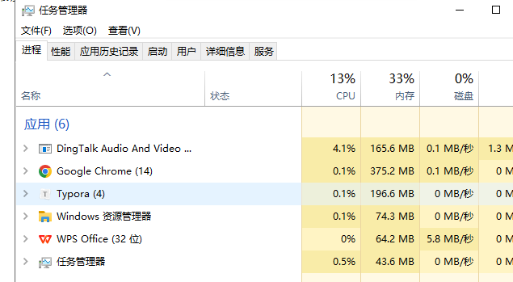、


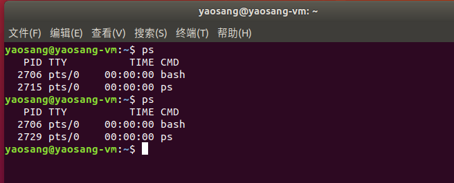


#### 1.2 进程虚拟内存

##### 1.2.1 整体概述

​       所有的程序被执行起来之后（有了进程），系统会为他分配各种资源内存，用来存放该进程中用到的

各种变量、常量、代码等等。这些不容的内容将会被存放到内存中不同的位置 （区域），不同的内存区域他的特性是有差别。----**分区域存放。**

​	每一个进程所拥有的内存都是一个虚拟的内存（为什么不是直接物理内存，要划分区域），所谓的虚拟内存是用物理内存中映射（投影）而来的，对于每一个进程而言所有的虚拟内存布局都是一样的，但是大小可以不一样。让每个进程都独自拥有了完整的内存空间。

​		物理内存（Physical Memory）

​		虚拟内存（Virtual Memory）

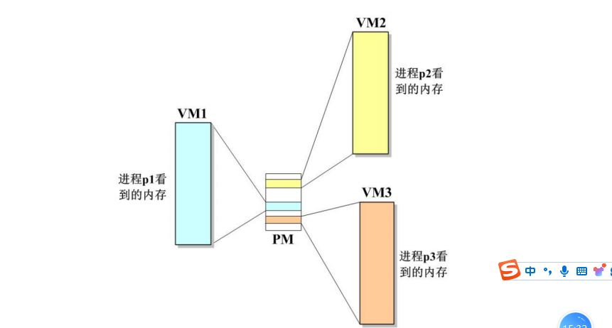

##### 1.2.2 虚拟内存的布局（区域）：

​            栈：函数被调用都创建帧

​            堆： 需要用户自己申请与释放 malloc free

​            数据段：  常量等

​           代码段：放代码

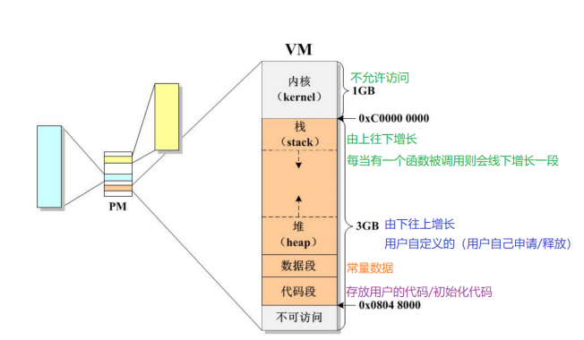


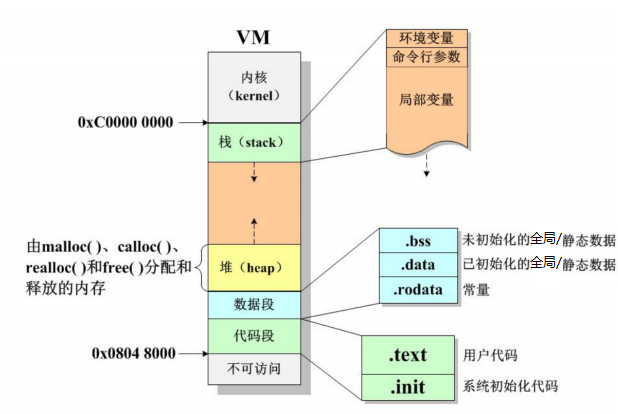

​                           


#### 1.3栈

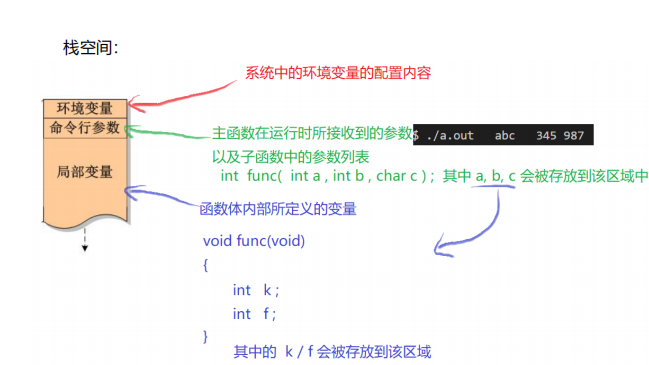

​          特点：先进后出

**空间非常有限**，尤其在嵌入式的环境下，因此我们应该尽可能少去使用

栈空间内存，特别是要存放比较大的数据。


**进栈**：每当一个函数被调用的时候， 栈空间会向下增长一段，用来存放该函数的局部变量

**出栈：**当一个函数退出的时候 ， 栈空间会向上回缩一段，该空间的所有权将归还系统

栈空间的分配与释放，用户是无法干预的， 全部由系统来完成。

#### 1.4 数据段

数据段有哪些内容：

​	bss 未初始化的静态数据（全局变量，static的局部变量） ， 会被自动初始化为0

​	.data 已初始化的静态数据（全局变量，static的局部变量）

​	.rodata 存放常量数据 "Hello Even" , 不允许修改的（只读）

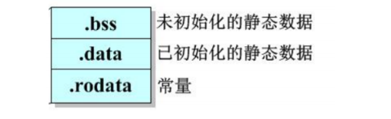


​      特点：

​		没有初始化则自动初始化为0

​		初始化语句只会被执行一次（在程序被加载的过程中已经初始化结束）

​		静态数据的内存从程序运行之初就存在，直到程序退出才会被释放（与进程

共生死）-多个函数共享

#### 1.5 代码段

代码段中有那些内容：

​	用户的代码 （比如我们自己写函数func.....main）

​	系统初始化代码，由编译器为我们添加的

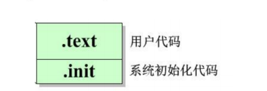


#### 1.6 堆-动态

##### 1.6.1 是什么

堆内存，又称为动态内存、自由内存、简称堆。唯一一个由开发者随意分配与释放的内存空间。具体的申请大小，使用的时长都是由我们自己来决定。

##### 1.6.2 特点

堆内存空间的基本特性：

​	1 相对与栈空间来说 ，堆空间大很多（堆的大小受限于物理内存），系统不会对对空间进行限制。

​	2 相对与栈空间来说， 堆内存是从下往上增长的。

​	3 堆空间的内存称为匿名内存， 不像栈空间那样有个名字，只能通过**指针来访问**

​	4 堆空间内存的申请与释放都是由用户自己完成，用户申请之后需要手动去释放，直到程序退出。

##### 1.6.3 操作堆空间   

​     申请：malloc（只是申请内存而已，并不会清空），calloc （会把内存进行清空），realloc (重新申请空间)

​    清空： bzero memset

   释放：free：

案例1：

```c
#include <stdio.h>
#include <memory.h>
int main(int argc, char const *argv[])
{
      //  需求： 申请5个int的空间，存五个值进去，再给他遍历出来
     int *p =   (int *)malloc(5* sizeof(int)); // 申请一个可以存放10个整型的 堆空间

     for (int i = 0; i < 5; i++)
     {
           //分别赋值
          *(p+i )= i;
     }
     
     for (int i = 0; i < 5; i++)
     {
        //获取值
            printf("%d\n",*(p+i));
     }

    //指针变量的地址，放在占空间，p是指针所指向的值，堆空间地址
     printf("%p,%p\n",&p,p);

     free(p);
    printf("==============\n");
      for (int i = 0; i < 5; i++)
     {
        //获取值
            printf("%d\n",*(p+i));
     }

    return 0;
}

```

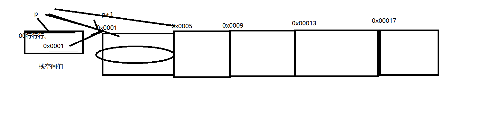


  案例2：

```c
#include <stdio.h>
#include <memory.h>
int main(int argc, char const *argv[])
{
      //  需求： 申请5个int的空间，存五个值进去，再给他遍历出来
     int *p =   (int *)calloc(5,sizeof(int));
     for (int i = 0; i < 5; i++)
     {
           //分别赋值
          *(p+i )= i;
     }
     
     for (int i = 0; i < 5; i++)
     {
        //获取值
            printf("%d\n",*(p+i));
     }

    printf("=====================\n");
     int * p1 = realloc(p,40);
        for (int i = 0; i < 5; i++)
     {
        //获取值
            printf("%d\n",*(p1+i));
     }

      for (int i = 5; i < 10; i++)
     {
        //设置剩余5个的值
         *(p1+i) = i;
     }

    printf("=====================\n");
      for (int i = 0; i < 10; i++)
     {
        //获取值
            printf("%d\n",*(p1+i));
     }


     free(p1);
    return 0;
}

```

总结：

​	使用malloc 申请内存时 ， 内存中的值时随机值(yaosang测试还是0) ， 可以使用bzero清空

​	calloc 申请内存时 ， 内存中的值会被初始化为 0

​	free 只能释放堆空间的内存，不能释放其它区域的内存

​		释放内存的含义：

​				释放内存仅仅意为着，当前内存的所有权交回给系统，系统可以再重新分配了

​				也不会改变指针的指向，需要手动把指针指向NULL ，不然就成野指针了

​				释放内存并不会清空内存的内容（发现值不对了）


  案例3：

```c
#include <stdio.h>
#include <memory.h>
#include <string.h>
void get_memory(char **p);
int main(int argc, char const *argv[])
{
    
    char *str = NULL;

    //给str分配空间---操作完成后，str指向null
    get_memory(&str);

    //把一个字符串拷贝到分配好的内存空间
    strcpy(str,"hello world");

    printf("%s\n",str);
    
    return 0;
}

void get_memory(char **p){
    *p = (char *)malloc(100);
}

//想要改变某指针的指向，自己的地址传给二级指针，里面通过一级指针来改。

```

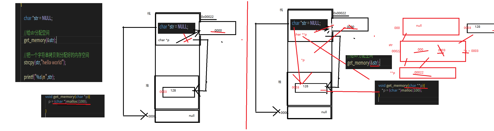

​				

### 2 变量的存储形式

- 自动的（auto）
- 静态的（static）
- 寄存器的（register）
- 外部的（extern）。

#### 2.1 局部变量

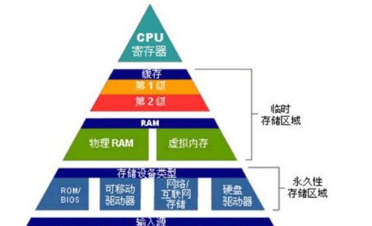

​    auto：函数中的局部变量，存放到栈里面，如果不专门声明static存储类别，都是动态地分配存储空间的，数据存储在动态存储区中。自动变量用关键字auto做存储类别声明。

​    static: 类似与全局变量。

​	函数中的局部变量的值,存放到数据区的，在函数调用结束后不消失而继续保留原值，即其占用的存储单元不释放，在下一次再调用该函数时，该变量已有值。

​    register：

提高执行效率，允许将局部变量的值放在CPU中的寄存器中，需要用时直接从寄存器取出参加运算，不必再到内存中去存取。由于对寄存器的存取速度远高于对内存的存取速度，因此这样做可以提高执行效率，这种变量叫寄存器变量，用关键字register作声明。

```c
#include <stdio.h>

void test();
void test(){
    int a = 1;
    //静态的局部变量，函数执行完了不会释放
    static int b =1;
    register int c = 1;
    printf("%d,%d,%d\n",a,b,c);
    a++;
    b++;
    c++;
}
int main(int argc, char const *argv[])
{
    test();  //1 1
    test();  //1 2
    return 0;
}

```

么会有静态变量？

​	当我们需要把一个变量引用到不同的函数内部甚至不在同一个.c 文件中，可

以全局变量来实现。

​	当我们需要一个局部变量用来记录某个值， 并希望这个值不会被重新初始

化的情况下可以使用静态的局部变

#### 2.2 全局变量

​     **存放数据段区。**

   内部全局变量： 自己定义自己用。。         自己的文件

   外部全局变量： 我用别人定义好的。         其他文件

a.c a.h

```c
a.h
void printa();
a.c
#include <stdio.h>

int a =1; //内部全局变量
int b =2;
// int main(int argc, char const *argv[])
// {

//     printf("%d,%d\n",a,b);
  
// }

void printa(){
    printf("%d,%d\n",a,b);
}


```


b.c

```c
#include <stdio.h>
#include "a.h"
//int a =11;  //外部已经定义变量，不能再定义，
//但是不能获取来使用，如果要想需要加上extern
extern int b;  //使用外部的变量,不能直接赋值，它认为是一个新的了。

int main(int argc, char const *argv[])
{
    printf("%d\n",b);
    //修改b的值
    b = 5;
    printa();
}

```


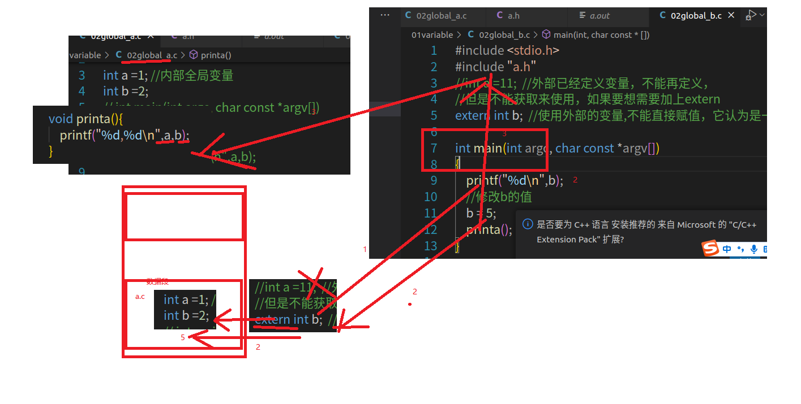

​     注意：

​       	 1 多个文件不能定义同名全局变量。

​            2 可以引用别人定义,extern,但是不能再初始化。 如果你再初始化它认为就是一个新的了。

​            3 可以修改外部变量。  你和他指向都是同一份。


   **static还可以修饰函数！！！！！**

​	**static函数，只能在当前文件中调用，缩小函数的范围。非static函数，其他文件文件中调用**

##  三 作用域

###    1 作用域

​       某个变量或者函数能够起作用的区域。在软件开发的过程中应该尽可能缩小标识符的可见范围，可以尽可能的降低同名冲突的问题。

###     2 函数相关作用域

####      2.1 申明

​        // 函数声明  

​      在源文件中：

​      	bool swap( int * , int * );

​      	int max( int a , int b , int c );

​      	只是当前文件可见。虽然写在函数体外但是并不是全局的。

​     在头文件： 

​	         只是当前文件可见。你的这次导入其他c，还是不行的。

####    2.2 函数定义作用域

#####    2.2.1 普通函数

​             其他的存文件中可以使用。  全局作用域

#####    2.2.2 static函数

​             文件中使用局部作用域。


###   3 变量相关的作用域

####   3.1 局部变量

​       auto register,形参： 函数

​       static： 全局

####    3.2 全局变量

​       默认来说：是全局，但是其他文件要用的话，使用extern

​      **static: 本文件中有效**


###   4 其他作用域

​        自定义类型申明？  局部


##  四  存储期

从存放到释放的一个过程。

### 1 变量

​		自动：函数基本

​        static：  全局，static

​        自定义： malloc free等---------------在作用范围内不一定时时刻刻都有数据。

### 2 函数

​	  从读到内内存到，程序结束释放。

### 3  字符串常量 

​     字符串常量 从读到内内存到，程序结束释放。

## 五 总结

