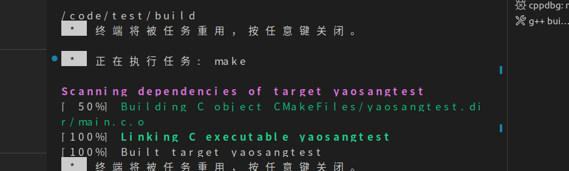

# C语言-项目实战2-HRM&俄罗斯方块-day1-项目构建make&cmake

## 一 课程内容

- 项目概述
- 项目的开发流程
- 俄罗斯方块游戏开发流程
- 项目构建（管理）工具make
-  **项目构建（管理）工具cmake**
-  **SVN代码工具**

  

## 二 项目概述

### 1 是什么

​	为实现既定的目标，在一定的资源和要求的约束下，所开展的有相关联的一次性工作。

​	一次性：每个项目都有明确的开始和结束时间。当项目目标已实现，或者应为项目的目标不能实现而导致项目被终止时，就意味着项目的结束。

​	独特性：项目创造了独特的可交付的成果，如产品、服务、特性和成果等。

​	独特完善性：逐步完善是项目伴随一次性和独特性两个概念的特点之一。逐步完善意味着分步、连续的积累。


### 2 分类

#### 2.1 看这个项目做出来是否自己用

​       自        研:公司自己的项目。  阿里开发淘宝，天猫等   

​                  5个人 30w = 150W

​       外包项目：

​               **甲方把这个项目都外包给乙方做（整包）。**-----对于甲方而言风险不可控。   50万包出去---省了100W   多包

​              甲方把部分功能给乙方做（**分包**）。----风险相对可控。   2个人 30w      30不核心功能包出去   90W

​              乙方把他们的员工派到甲方区给他们做项目（**人员外派**）。----风险完全由   2个人 30w   3个人（20,15,10）=75w

#### 2.2 是否是互联网项目（你的用户群体）

​        互联网项目： 你的用户是面向的是网友。     电商，支付宝，微信等     三高问题： 高并发，高可用，高性能

​        传统项目：  你面向的用户是企业员工。      业务复杂，慢慢的大公司越来遇到。。。高并发，高可用，高性能

​                   HRM（人力资源系统），OA（办公自动化），crm（客户关系管理系统），学生管理系统，库存管理系统。。。


#### 2.3 是否是产品。

​       项目：只给一个公司用。

​      产品：基于一些功能，然后为多个公司定制项目给他们

​     

​	

## 三 软件工程-项目开发步骤


项目通常需要多个部门协作并行开发。软件的开发流程如下： 

​		1.项目立项（有没有必要，有没有竞争力）或接项目-产品经理/市场

​		2.需求分析(产品经理) : 需求文档，概要设计，功能原型图，梳理用户的需求，分析业务流程 

​			大多数产品-不懂技术

​		3.项目经理组建团队开发:  PM( Project Management ),SE( Software Engineer ),TM=PM+SE，

​				项目经理： 项目启动会，里程碑，全员参与

​                架构师：开发人员培训(SE)，**技术架构与选型+项目原型搭建(SE**)** 开发文档

​		4.开发(开发工程师)  

​		5.测试人员迭代测试

​                    开发人员改bug

​		6.集成测试

​		7.内侧、公测

​		8.上线 运维人员

​		11.运维-留一两个人，其他人开发其他项目

## 四  俄罗斯方块游戏开发步骤

### 1 立项

​	闲鱼时间，娱乐一下。

### 2  需求分析

​     参考

### 3 项目设计与架构  


russia_block_game


​      有两个c文件，每次都需要gcc x.c y.c -o ....去编译执行，比较麻烦。所以先学一下两个项目构建工具。

make,cmake


## 五 项目工程管理器

### 1 为什么需要工程管理器

​	当我们需要编译一个比较大的项目时，编译命令会变得越来越复杂（gcc 1000个c文件），需要编译的文件越来越多。其次就是项目中并不是每一次编译都需要把所有文件都重新编译，比如没有被修改过的文件则不需要重

新编译。工程管理器就帮助我们来优化这两个问题。  常见的工具有make,cmake

### 2 工程管理器make

#### 2.1  是什么？

make是一种代码维护工具make工具会根据**makefile文件**定义的规则和步骤，完成整个软件项目的代码维护工作。一般用来简化编译工作，可以极大地提高软件开发的效率。

 **1.大量代码的关系维护**

​    **大项目中源代码比较多，手工维护、编译时间长而且编译命令复杂，难以记忆及  维护把代码维护命令及编译命令写在makefile文件中，然后再用make工具解析此文  件自动执行相应命令，可实现代码的合理编译**


  **2.减少重复编译时间**

​    **在改动其中一个文件的时候，能判断哪些文件被修改过，可以只对该文件进行重  新编译，然后重新链接所有的目标文件，节省编译时间**

#### 2.2 入门

##### 2.2.1 安装make

```
make -v 查看是否装了
sudo apt install make 安装make
make -v
```

##### 2.2.2 编写Makefile文件

语法：

​	 目标:依赖

​		     命令

注意：

​	目标必须存在

​	依赖可以没有

​	命令前面必须是一个制表符"TAB"

**一般情况下，Makefile 文件的命名一般是 Makefile没有后缀也没有前缀.但是你可以写不一样的。通过-f 来指定。但是是规范最好使用Makefile这个名称**


Makefile文件内容如下：

```makefile
task1:task2
	@echo "task1"
task2:task3
	@echo "task2"
task3:
	@echo "task3"
```


##### 2.2.3 通过make使用makefile文件进行相关操作

make： 在当前路径找一个默认文件Makefile，并且没有指定目标，就执行第一个目标（task1）。

make 目标： make task2,在当前路径找一个默认文件Makefile，指定了task2，就执行这个目标

make  -f file 目标: make -f ./Makefile task2,通过当前路径下的Makefile文件，执行task2这个目标。


#### 2.3 项目实战

##### 2.3.1 版本1


```c
game.h
void printa();
game.c
#include <stdio.h>
#include "game.h"

void printa(){
    int a =1;
    printf("%d\n",a);
}
main.c
#include "game.h"
int main(int argc, char const *argv[])
{
    printa();
    return 0;
}

```


Makefile

```makefile
./bin/main:./src/*.c
	gcc ./src/*c -o ./bin/main -I./inc
```


测试：

​    项目路径 make  ./bin/main


##### 2.3.2  版本2

**变量：**

在Makefile 中变量属于弱类型，在Makefile中变量就是一个名字（像是C语言中的宏），代表

一个文本字符串（变量的值），在Makefile的目标、依赖、命令中引用一个变量的地方。

在Makefile中变量的特征有以下几点：

1. 变量和函数的展开（除规则的命令行以外），是在make读取Makefile文件时进行

的，这里的变量包括了使**用“=”定义和使用指示符“define”定义的变量。**

2. 变量可以用来代表一个文件名列表、编译选项列表、程序运行的选项参数列表、搜

索源文件的目录列表、编译输出的目录列表和所有我们能够想到的事物。

3. 变量名不能包括“:”、“#”、“=”、前置空白和尾空白的任何字符串。需要注意的是，

尽管在GNU make中没有对变量的命名有其它的限制，但定义一个包含除字母、数字和下

划线以外的变量的做法也是不可取的，因为除字母、数字和下划线以外的其它字符可能会在

以后的make版本中被赋予特殊含义，并且这样命名的变量对于一些Shell来说不能作为环

境变量使用。

4. 变量名是大小写敏感的。变量“foo”、“Foo”和“FOO”指的是三个不同的变量。

Makefile传统做法是变量名是全采用大写的方式。推荐的做法是在对于内部定义的一般变

量（例如：目标文件列表objects）使用小写方式，而对于一些参数列表（例如：编译选项

CFLAGS）采用大写方式，这并不是要求的。但需要强调一点：对于一个工程，所Makefile

中的变量命名应保持一种风格，否则会显得你是一个蹩脚的开发者（就像代码的变量命名风

格一样），随时有被鄙视的危险。

5. 另外有一些变量名只包含了一个或者很少的几个特殊的字符（符号）。称它们为自

动化变量。像“<”、“@”、“?”、“*”、“@D”、“%F”、“^D”等等，后面会详

述之。6. 变量的引用跟Shell脚本类似，使用美元符号和圆括号，比如有个变量叫A，那么对

他的引用则是$(A)，有个自动化变量叫@，则对他的引用是$(@)，有个系统变量是CC则

对其引用的格式是$(CC)。对于前面两个变量而言，他们都是单字符变量，因此对他们引用

的括号可以省略，写成$A和$@。

测试变量的Makefille

```c
A= a  #定义一个变量A赋值一个字符串a
B=b  
C= $(B) c #$()，表示引用一个变量
test:
	@echo $(A)
	@echo $(B)
	@echo $(C)

```

```makefile
TAG =  ./bin/main
SRC= ./src/*.c
GCC=gcc
O=-o
CONFIG=-I./inc

#以下是通过变量来替换
$(TAG):$(SRC)
	$(GCC) $(SRC) $(O) $(TAG) $(CONFIG)

clean:
	rm -rf ./bin/*
```


##### 2.3.3 版本3-系统预定义变量&自动化变量

常用系统预定义变量：


自动化变量：


```makefile
TAG =  ./bin/main
SRC= ./src/game.c ./src/main.c
OBJ=$(SRC:%.c=%.o)
GCC=gcc
O=-o
CONFIG=-I./inc

#以下是通过变量来替换
$(TAG):$(OBJ) #  ./bin/main: ./src/game.o ./src/main.o
	$(GCC) $(^) $(O) $(@) $(CONFIG)

%.o:%.c
	$(GCC) $< $(O) $(@) $(CONFIG) -c
clean:
	$(RM) ./bin/* ./src/*.o
```


##### 2.3.4 版本4-加入函数

$(subst FROM,TO,TEXT)

功能：

​	将字符串 TEXT 中的字符 FROM 替换为 TO。

​	返回：

​	替换之后的新字符串。

$(wildcard PATTERN)功能：

​	获取匹配模式为 PATTERN 的文件名。

​	返回：

​	匹配模式为 PATTERN 的文件名。

​	范例：

​	 A = $(wildcard *.c)

​	假设当前路径下有两个.c 文件 a.c 和 b.c，则处理后 A 的值为：”a.c b.c”。

override

override一个变量，防止重写例如：

 override CFLAGS += -Wall


.PHONY

.PHONY 来明确地告诉 Makefile,不要对 clean 运用任何隐式规则,不能运用隐式规则的目标被称为

伪目标.

1 .PHONY:clean 

2 用来修饰 clean 清空的工作不会被误以为是一个目标来执行


```makefile
TAG =  ./bin/main
#匹配所有的c文件
SRC= $(wildcard src/*.c)
OBJ=$(SRC:%.c=%.o)
GCC=gcc
O=-o
#访问被覆盖
override CONFIG += -I./inc

#以下是通过变量来替换
$(TAG):$(OBJ) #  ./bin/main: ./src/game.o ./src/main.o
	$(GCC) $(^) $(O) $(@) $(CONFIG) 

%.o:%.c
	$(GCC) $< $(O) $(@) $(CONFIG) -c
clean:
	$(RM) ./bin/* ./src/*.o


#是要使用隐试规则
.PHONY:clean
```


### 3 工程管理器cmake


#### 3.1概述

##### 3.1.1 是什么？

​	CMake是一个开源的[构建工具](https://so.csdn.net/so/search?q=构建工具&spm=1001.2101.3001.7020)，用于自动化构建过程。它不直接构建项目，**而是生成适用于不同编译器和操作系统的构建脚本，如Makefile、Visual Studio项目文件等**。这使得开发者能够轻松地在不同平台上构建他们的项目。

##### 3.1.2 优势

1. **跨平台性：CMake能够生成针对各种操作系统（如Linux、Windows、macOS）和编译器（如GCC、Visual Studio）的构建文件，确保项目在不同环境中具有良好的可移植性。**
2. 模块化：CMake支持模块化的项目配置，使得项目的构建规则能够被组织为独立的CMake模块，方便项目的管理和维护。

1. 可扩展性：开发者可以编写自定义的CMake模块和宏来满足项目特定的需求，使CMake适用于各种项目类型。
2. 自动依赖管理：CMake能够自动检测和管理项目的依赖关系，包括库文件和头文件，简化了构建配置的过程。
5. **简化构建过程：通过CMake，开发者可以更轻松地配置构建选项、编译和安装项目。**

#### 3.2 入门

##### 3.2.1 基本概念

在使用CMake之前，需要了解一些基本概念：

CMakeLists.txt：项目根目录下的CMakeLists.txt文件包含了项目的配置信息和构建规则。它定义了项目的源文件、目标（可执行文件、库）、编译选项等。

```cmake
# 1.前提
cmake_minimum_required(VERSION 3.2) #最低camke版本需求
PROJECT(test) #创建工程，example为工程名

SET(CMAKE_BUILD_TYPE Debug) #debug模式
#SET(CMAKE_BUILD_TYPE Release) #Release模式

# 2.需要的依赖库
find_package(OpenCV 4.2)
find_package(Eigen3 3.1.0 REQUIRED)
find_package(Pangolin REQUIRED)
find_package(realsense2)

# 3.设置可执行文件与链接库保存的路径
set(EXECUTABLE_OUTPUT_PATH ${PROJECT_SOURCE_DIR}/bin)
set(LIBRARY_OUTPUT_PATH ${PROJECT_SOURCE_DIR}/lib)

# 4.设置头文件目录使得系统可以找到对应的头文件
include_directories(
${PROJECT_SOURCE_DIR}/include  #自己目录的头文件
${EIGEN3_INCLUDE_DIR}          #其他系统目录的头文件 也可以直接写路径/usr/include/eigen3
${Pangolin_INCLUDE_DIRS}
)

# 5.编译动态库并链接库文件
add_library(${PROJECT_NAME} SHARED
src/IMUPreIntergral.cpp
include/IMUPreIntergral.h
)
target_link_libraries(${PROJECT_NAME}
${OpenCV_LIBS}
${EIGEN3_LIBS}
${Pangolin_LIBRARIES}
-lboost_serialization
-lcrypto
)

# 6.生成可执行文件
#选择需要编译的源文件，有几个文件写几个
add_executable(IMUPreIntergral src/IMUPreIntergral.cpp)
target_link_libraries(IMUPreIntergral ${PROJECT_NAME})

#add_executable(IMUPreIntergral src/IMUPreIntergral.cpp)
#target_link_libraries(IMUPreIntergral ${PROJECT_NAME})
```


生成器：CMake支持不同的生成器，用于生成特定类型的构建文件。常见的生成器包括Makefile、Visual Studio、Xcode等。

构建目录：CMake的构建是out-of-source的，意味着构建文件和源代码分开存放。开发者需要创建一个单独的构建目录，并在其中运行CMake来生成构建文件。

##### 3.2.2 入门

1. 安装cmake

   cmake --version

   sudo apt  install cmake

   cmake --version 

2. 安装cmaketools

   

3. 创建cmake项目

   vscode新建目录，打开目录

   ctrl+shift+p cmake:q

   

   

   ​    后门会有一个load什么鬼，把它取消掉。

   

   

   

    

   把它的main改了不报错

4. 构建与调试项目

   按f5  选默认配置

   

   

   

   继续f5，发现项目还没有构建

   

   ctrl+shift+b构建（选lists那个文件）

   

   

   选择other

   

   

   需要拷贝一堆配置

   ```
   // tasks.json文件配置
   {
       "version": "2.0.0",
       "options": {
           "cwd": "${workspaceFolder}/build"
       },
       "tasks": [
           {
               "type": "shell",
               "label": "cmake",
               "command": "cmake",
               "args": [
                   ".."
               ]
           },
           {
               "label": "make",
               "group": {
                   "kind": "build",
                   "isDefault": true
               },
               "command": "make",
               "args": []
           },
           {
               "label": "Build",   //### launch.json中选择了这个
               "dependsOrder": "sequence",
               "dependsOn": [
                   "cmake",
                   "make"
               ]
           }
       ]
   }
   
   ```

   

   

   再次构建

   

   f5就可以执行了

   打上断点调试。

    

#### 3.3 项目实战

   先键cmake的项目，能跑起来。

​    分包管理

##### 3.3.1 结构


建好项目.并写好代码

test.h

test.c

main.c

##### 3.3.2 基本写法

```c
# 1.前提
cmake_minimum_required(VERSION 3.2) #最低camke版本需求
PROJECT(test) #创建工程，example为工程名

SET(CMAKE_BUILD_TYPE Debug) #debug模式
#SET(CMAKE_BUILD_TYPE Release) #Release模式

# 2.需要的依赖库
find_package(OpenCV 4.2)
find_package(Eigen3 3.1.0 REQUIRED)
find_package(Pangolin REQUIRED)
find_package(realsense2)

# 3.设置可执行文件与链接库保存的路径
set(EXECUTABLE_OUTPUT_PATH ${PROJECT_SOURCE_DIR}/bin)
set(LIBRARY_OUTPUT_PATH ${PROJECT_SOURCE_DIR}/lib)

# 4.设置头文件目录使得系统可以找到对应的头文件
include_directories(
${PROJECT_SOURCE_DIR}/include  #自己目录的头文件
${EIGEN3_INCLUDE_DIR}          #其他系统目录的头文件 也可以直接写路径/usr/include/eigen3
${Pangolin_INCLUDE_DIRS}
)

# 5.编译动态库并链接库文件
add_library(${PROJECT_NAME} SHARED
src/IMUPreIntergral.cpp
include/IMUPreIntergral.h
)
target_link_libraries(${PROJECT_NAME}
${OpenCV_LIBS}
${EIGEN3_LIBS}
${Pangolin_LIBRARIES}
-lboost_serialization
-lcrypto
)

# 6.生成可执行文件
#选择需要编译的源文件，有几个文件写几个
add_executable(IMUPreIntergral src/IMUPreIntergral.cpp)
target_link_libraries(IMUPreIntergral ${PROJECT_NAME})

#add_executable(IMUPreIntergral src/IMUPreIntergral.cpp)
#target_link_libraries(IMUPreIntergral ${PROJECT_NAME})

```


##### 3.3.3 项目实战

CMakeLists.txt

```cmake
#前提 指定版本和名称
cmake_minimum_required(VERSION 3.0.0)
project(game_russia_block VERSION 0.1.0 LANGUAGES C)
SET(CMAKE_BUILD_TYPE Debug) #debug模式
#SET(CMAKE_BUILD_TYPE Release) #Release模式


include(CTest)
enable_testing()


# 2.需要的依赖库 现在没有

# 3.设置可执行文件与链接库保存的路径
set(EXECUTABLE_OUTPUT_PATH ${PROJECT_SOURCE_DIR}/bin)
set(LIBRARY_OUTPUT_PATH ${PROJECT_SOURCE_DIR}/mylib)

# 4.设置头文件目录使得系统可以找到对应的头文件
include_directories(
${PROJECT_SOURCE_DIR}/inc  #自己目录的头文件
${EIGEN3_INCLUDE_DIR}          #其他系统目录的头文件 也可以直接写路径/usr/include/eigen3
${Pangolin_INCLUDE_DIRS}
)

# 5.编译动态库并链接库文件


# 6.生成可执行文件
#选择需要编译的源文件，有几个文件写几个
#add_executable(game_russia_block src/main.c src/test.c)
# 扫描src目录下的所有C文件
aux_source_directory(src SRC_FILES)
add_executable(game_russia_block ${SRC_FILES})

set(CPACK_PROJECT_NAME ${PROJECT_NAME})
set(CPACK_PROJECT_VERSION ${PROJECT_VERSION})
include(CPack)

```

launch.json

```
  "program": "${workspaceFolder}/bin/yaosangtest",
```


## 六 小结


