# 项目实战2-HRM&俄罗斯方块-day2-项目构建&SVN代码管理

## 一 课程简介

- 为什么需要代码管理工具
- 常见代码管理工具
- svn入门
- 进阶

## 二 为什么需要代码管理工具

1、代码管理混乱或者错误。

​       如果不使用，我的电脑自盘G了，代码没求得了。

​      代码放哪儿？

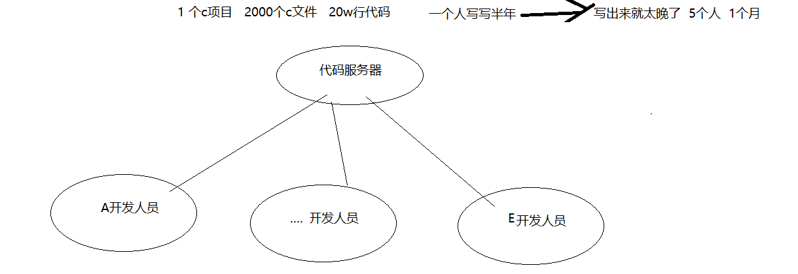

2、 解决代码冲突困难。

​	大家改同一行，通过多版本管理，代码解决。

3、 在代码整合期间引发BUG。

​	代码版本管理

4、 无法对代码的拥有者进行权限控制。

5、 项目不同版本发布困难

​       方案1：拷贝多个目录

​       打标签发布就OK

## 三 常见的代码管理工具

### 1 svn

​	SVN是Subversion的简称，是一个开放源代码的版本控制系统.是集中式代码版本管理工具的代表。

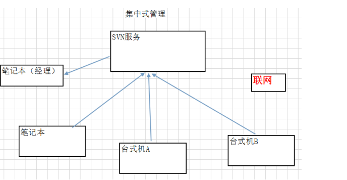

​           所有的人都提交代码到集中仓库里面，所以必须连上仓库 服务器

### 2 git

Git（读音为/gɪt/）是一个开源的[分布式](https://baike.baidu.com/item/分布式/19276232?fromModule=lemma_inlink)版本控制系统，可以有效、高速地处理从很小到非常大的项目[版本管理](https://baike.baidu.com/item/版本管理/2511538?fromModule=lemma_inlink)。 [1]也是[Linus Torvalds](https://baike.baidu.com/item/Linus Torvalds/9336769?fromModule=lemma_inlink)为了帮助管理[Linux内核](https://baike.baidu.com/item/Linux内核/10142820?fromModule=lemma_inlink)开发而开发的一个开放源码的[版本控制软件](https://baike.baidu.com/item/版本控制软件/2617766?fromModule=lemma_inlink)。

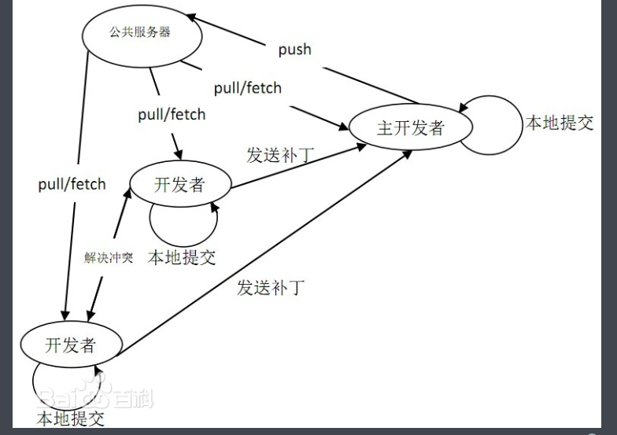

​      **先玩，svn！后面在玩git**

## 四 SVN入门操作

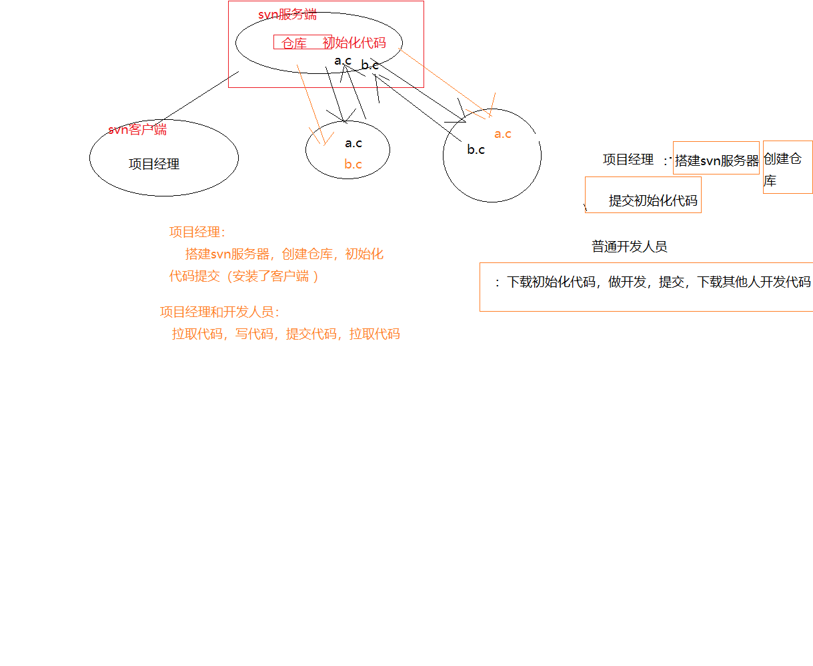

### 1 Gitee SVN服务器操作

- 选用

​       我们先不搭建服务器，用别人已经搭建好的服务。  **gitee**是git的中国的仓库，但是支持svn。

​	官网：https://gitee.com/

- 创建仓库

  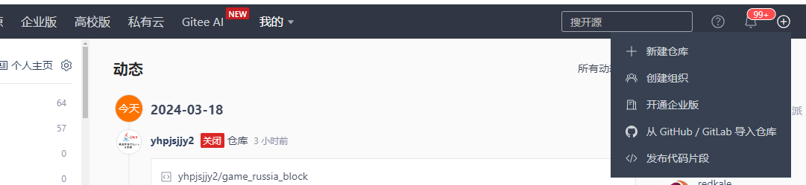

  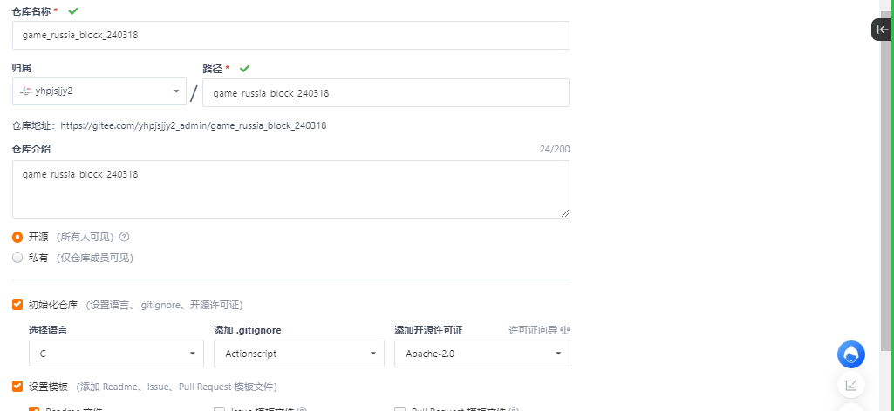

- 开启svn支持

  ​	点击右上角管理

  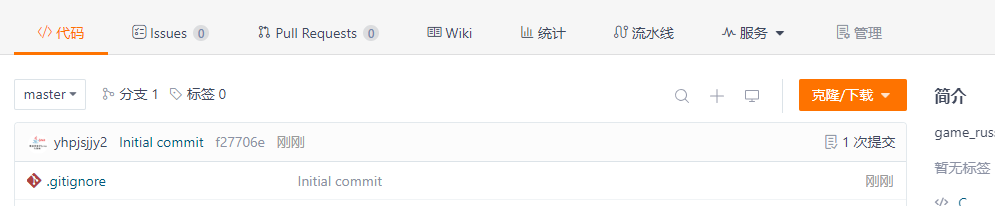

​         启动svn支持

​	    

- 分配权限。。。

  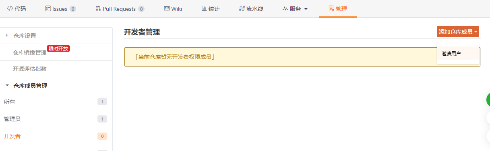

- 提交初始化代码-安装客户端

### 2 windows客户端操作 torosesvn(小乌龟)

   以后有可能在企业里面使用是vs studio，所以有可能要使用windows的svn客户端操作。

#### 2.1 安装

1. 安装小乌龟客户端

     傻瓜式

2. 安装小乌龟客户端的汉化包

   傻瓜式

3. 小乌龟客户端里面设置汉化

   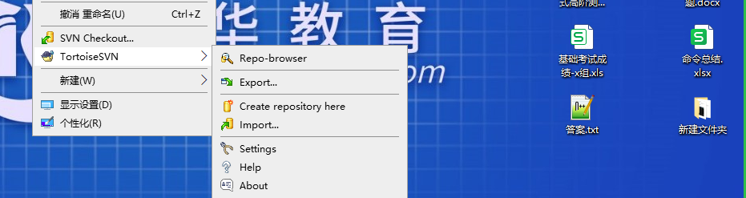

   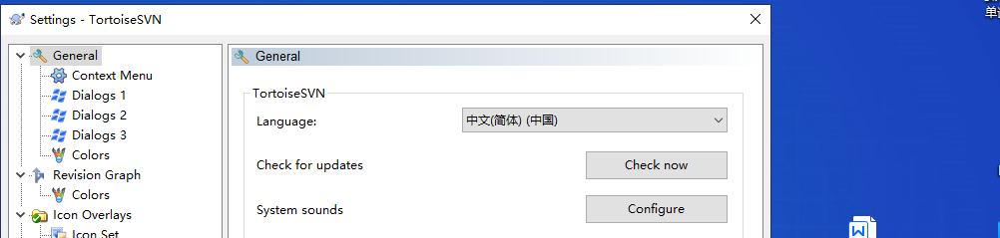

   

#### 2.2 使用 

#### 2.2.1 项目经理 

​      下载空仓库，提交初始化代码，提交，下载。。。

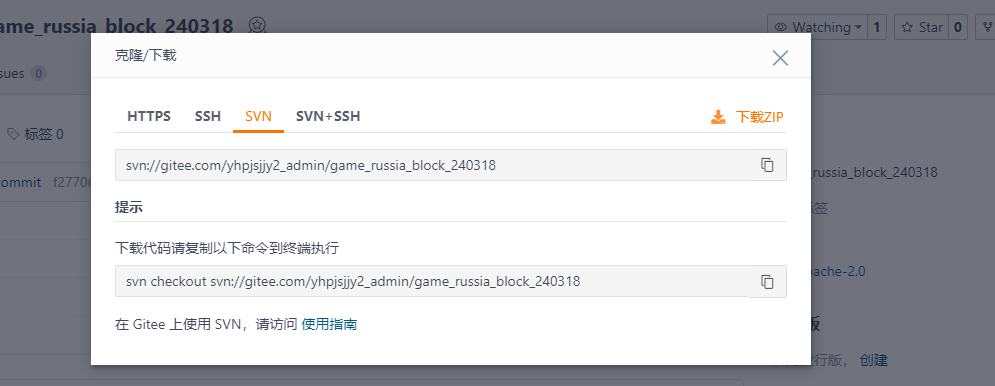

右键：

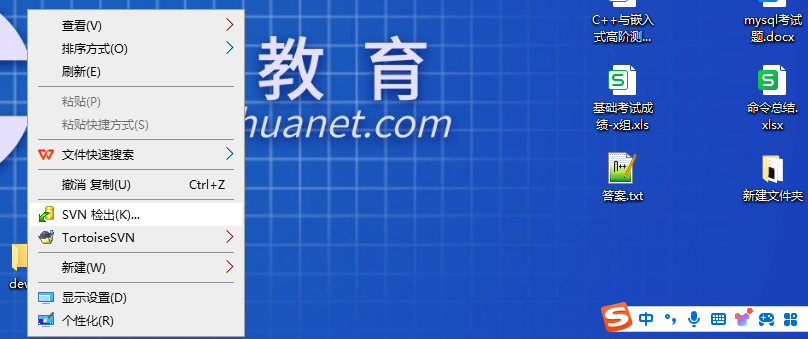

   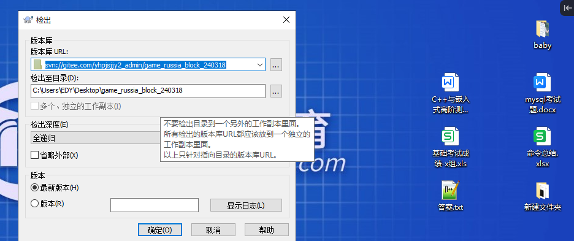

   拷贝代码放入目录

   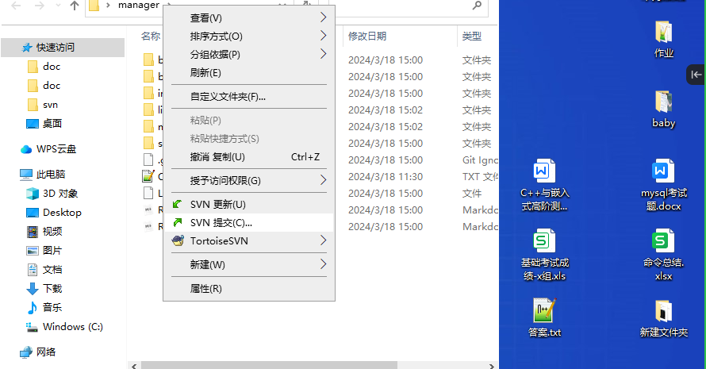

​     注意1: 不能是空目录

​     注意2： bin（打出来的东西） build不提交

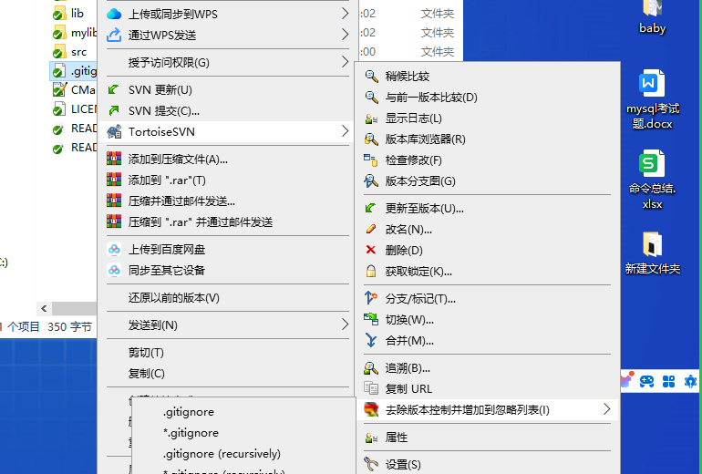

#### 2.2.2 项目开发人员

​      下载代码：

​      **写代码，**

​     **提交代码。**

​    **更新代码**

​     解决冲突，提交

​          提交代码，要更新，发现冲突。  

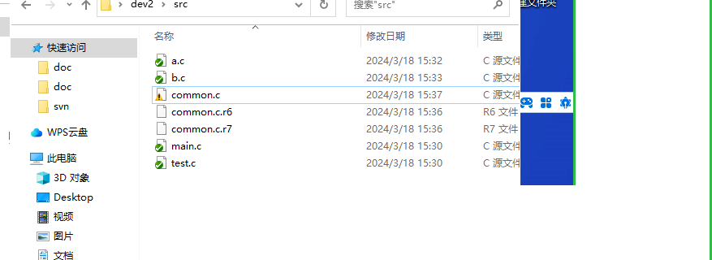

​        把代码冲突解决，标记为已解决

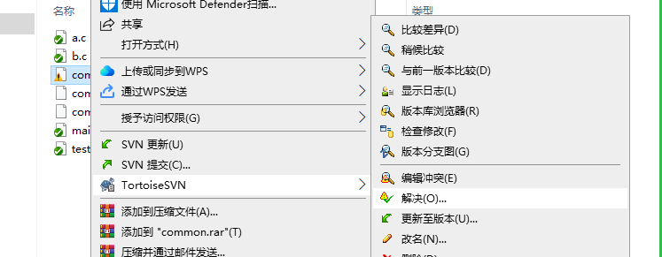

​     再提交代码。

### 3 ubuntu客户端操作

#### 3.1 命令操作

- 安装

  svn --version

  sudo apt install subversion

  svn --version

- 检出

  svn checkout svn://gitee.com/yhpjsjjy2_admin/game_russia_block_240318 --username=yhpjsjjy2_admin --password=admin1234

   输入密码

- 写代码

  新建的文件：svn add *.c

- 提交

  svn commit -m "commit"

- 更新代码

  svn update

   还有很多命令，不要记忆。到时候直接查。

#### 3.2 图形客户端（RabbitVCS）操作

##### 3.2.1 安装

1. 在Ubuntu源中加入rabbitvcs

执行：sudo gedit /etc/apt/sources.list ，在其最后添加：

deb http://ppa.launchpad.net/rabbitvcs/ppa/ubuntu karmic main

 2.更新ubuntu系统

执行：sudo apt-get update 更新源，如果出现公匙导入失败，可执行如下代码：

sudo apt-key adv --keyserver keyserver.ubuntu.com --recv-keys 34EF4A35

sudo apt-get update

3 执行

sudo apt-get install rabbitvcs-nautilus
sudo reboot

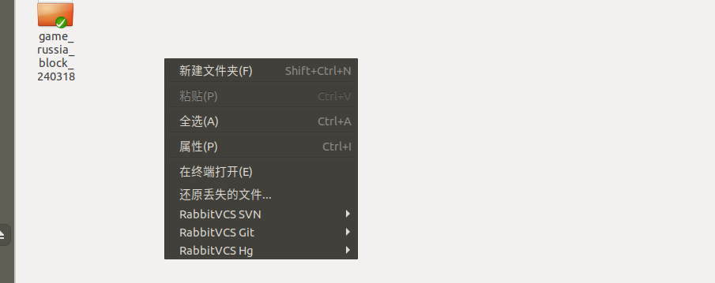

##### 3.2.2  操作

   checkout

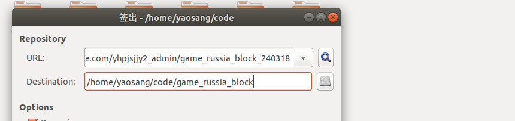

   add

  commit

 update

## 五 搭建自己的svn服务器（项目经理）

   不是重点，是了解性！以后在企业里面，要么用网上别人搭建好的服务，要么就是项目经理已经搭建好了，

我们只需要获取地址，账号能使用就OK

### 1 windows上面

VisualSVN Server

创建仓库

创建用户

分配权限

==========

http://localhost:8080/svn/game_russia_block   yaosang yaosang

### 2 linux上面搭建

https://cloud.tencent.com/developer/article/2047950?areaSource=102001.6&traceId=bDsqIAt3TUno9KWi7POI_

## 六 总结