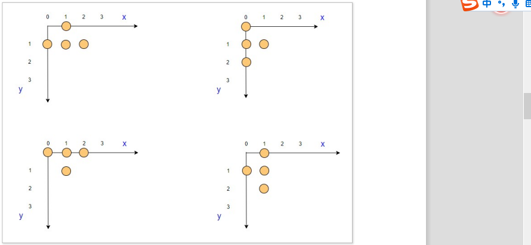

# C语言-项目实战2-HRM&俄罗斯方块-day4-项目开发

## 一 课程简介

- **搭建自己svn服务器**
- vt100介绍
- 绘制方块
- 控制方块

## 二 vt100 控制码介绍

### 1 是什么

​	vt100 是⼀个古⽼的终端定义，⽬前⼏**乎⼤部分的终端都兼容这种终端**。VT100 控制码是⽤来在终端扩 

展显示的代码。所有的控制符全部以 \ 033 打头 (即 ESC 的 ASCII 码)，⽤输出语句来输出，可以输 

出不同颜⾊的字符。在 C 语⾔程序中，⼀般⽤ printf 来输出 VT100 的控制字符。

printf("\033....")

### 2 基本操作

#### 2.1 颜色      

```
\033[0m 关闭所有属性
\033[1m 设置⾼亮度
\033[4m 下划线
\033[5m 闪烁
\033[7m 反显
\033[8m 消隐
\033[30m -- \33[37m 设置字体颜⾊
\033[40m -- \33[47m 设置背景⾊
\033[字体背景⾊;字体颜⾊m
40:⿊
41:深红
42:绿
43:⻩⾊
44:蓝⾊
45:紫⾊
46:深绿
47:⽩⾊
30:⿊
31:红
32:绿
33:⻩
34:蓝⾊
35:紫⾊
36:深绿
37:⽩⾊
```

```c
int main()
{
 printf("\033[43;31m");
 printf("hello world\n");
 printf("\033[0m");
 return 0;
}
```

#### 2.2 光标


```
\033[nA 光标上移n⾏
\033[nB 光标下移n⾏
\033[nC 光标右移n⾏
\033[nD 光标左移n⾏
\033[y;xH 设置光标位置
\033[2J 清屏
\033[K 清除从光标到⾏尾的内容
\033[s 保存光标位置
\033[u 恢复光标位置
\033[?25l 隐藏光标
\033[?25h 显示光标
```

```
int main()
{
 printf("\033[2J"); 
 printf("\033[20;14H"); 
 
 printf("\033[43;31m");
 printf("hello world\n");
 printf("\033[?25l"); 
 printf("\033[0m"); 
 return 0;
}
```

#### 2.3 练习

要求⼤家实现在 (5,10) 坐标的位置输出红⾊的字体

## 三 绘制方块

### 1 理论介绍

#### 1.1 方格组成

​	俄罗斯⽅块⼏乎每个下朋友的童年，应该都经历过。那么我们学习了编程之后，就可以通过编程来构思
俄罗斯⽅块是如何实现的呢？俄罗斯⽅块的初始状态有下图的 7 种类型。然后再经过变化得到。


#### 1.2  设计理论

俄罗斯⽅块共有 7 种图形，每种图形最多有 4 种变化，可以有上，下，左，右四种变
化⽅向。我们设计 4 * 4 的⽅格表示⽅块的形状后期为了防⽌图形碰撞，这边把图形距右侧和下侧距离 4 * 4 格⼦的距离也计算进来了。

图形可以通过三维数组类存储。
7 代表⽅块有 7 种基本的变化形状。
4 代表有 4 个旋转⽅向 (上, 下，左，右)
18 代表每⾏有 18 个元素，其中前 16 个数据代表图形的形状，第 17 个数据代表距离
右侧边界距离，第 18 个数据代表

### 2 坐标表示

#### 1.2.1 田坐标表示

我们以 4 * 4 的⽅格为最⼤的单位，⽅格中的 1 个点代表我们的⼩⽅块。若是使⽤到了该坐标点， 其值为 1，否则为 0. (以⾏为单位排列) 

 第 1 ⾏ 第 2 ⾏ 第 3 ⾏ 第 4 ⾏ 

坐标值 = {1,1,0,0, 1,1,0,0, 0,0,0,0 ,0,0,0,0}  图形距离右侧距离为 2 图形距离下侧距离为 2 


#### 1.2.2 竖坐标表示


坐标值 1 = {1,1,1,1, 0,0,0,0, 0,0,0,0 ,0,0,0,0}
图形距离右侧距离为 3
图形距离下侧距离为 0


坐标值 2 = {1,0,0,0, 1,0,0,0, 1,0,0,0 ,1,0,0,0}
图形距离右侧距离为 0

图形距离下侧距离为 3

#### 1.2.3 凸坐标表示



坐标值 1 = {0,1,0,0, 1,1,1,0, 0,0,0,0, 0,0,0,0}
图形距离右侧距离为 1
图形距离下侧距离为 2
坐标值 2 = {1,0,0,0, 1,1,0,0, 1,0,0,0, 0,0,0,0}
图形距离右侧距离为 2
图形距离下侧距离为 1
坐标值 3 = {1,1,1,0, 0,1,0,0, 0,0,0,0, 0,0,0,0}
图形距离右侧距离为 1
图形距离下侧距离为 2
坐标值 4 = {0,1,0,0, 1,1,0,0, 0,1,0,0, 0,0,0,0}
图形距离右侧距离为 2
图形距离下侧距离为 1

#### 1.2.4  其他

其他依次类推，⾃⼰把每个对应的坐标值和 4 * 4 对应边界的距离画出来

### 2 坐标数据存储

#### 2.1 三维数组表示


```
int shape[7][4][18]; //7代表其中图形，4表示四种变化，18表示16个各自，剩余的2表示距离右边的距离。

int shape[7][4][18] = 
{
 {
 {1,1,0,0, 1,1,0,0, 0,0,0,0, 0,0,0,0, 2,2}, 
 {1,1,0,0, 1,1,0,0, 0,0,0,0, 0,0,0,0, 2,2}, 
 {1,1,0,0, 1,1,0,0, 0,0,0,0, 0,0,0,0, 2,2}, 
 {1,1,0,0, 1,1,0,0, 0,0,0,0, 0,0,0,0, 2,2}, 
 },
 {
 {1,0,0,0, 1,0,0,0, 1,0,0,0, 1,0,0,0, 3,0}, 
 {1,1,1,1, 0,0,0,0, 0,0,0,0, 0,0,0,0, 0,3}, 
 {1,0,0,0, 1,0,0,0, 1,0,0,0, 1,0,0,0, 3,0}, 
 {1,1,1,1, 0,0,0,0, 0,0,0,0, 0,0,0,0, 0,3}, 
 },
 {
 {0,1,0,0, 1,1,1,0, 0,0,0,0, 0,0,0,0, 1,2}, 
 {1,0,0,0, 1,1,0,0, 1,0,0,0, 0,0,0,0, 2,1}, 
 {1,1,1,0, 0,1,0,0, 0,0,0,0, 0,0,0,0, 1,2}, 
 {0,1,0,0, 1,1,0,0, 0,1,0,0, 0,0,0,0, 2,1} 
 },
 {
 {1,1,0,0, 0,1,1,0, 0,0,0,0, 0,0,0,0, 1,2}, 
 {0,1,0,0, 1,1,0,0, 1,0,0,0, 0,0,0,0, 2,1}, 
 {1,1,0,0, 0,1,1,0, 0,0,0,0, 0,0,0,0, 1,2}, 
 {0,1,0,0, 1,1,0,0, 1,0,0,0, 0,0,0,0, 2,1}, 
 },
 {
 {0,1,1,0, 1,1,0,0, 0,0,0,0, 0,0,0,0, 1,2}, 
 {1,0,0,0, 1,1,0,0, 0,1,0,0, 0,0,0,0, 2,1}, 
 {0,1,1,0, 1,1,0,0, 0,0,0,0, 0,0,0,0, 1,2}, 
 {1,0,0,0, 1,1,0,0, 0,1,0,0, 0,0,0,0, 2,1}, 
 },
 {
 {0,0,1,0, 1,1,1,0, 0,0,0,0, 0,0,0,0, 1,2}, 
 {1,0,0,0, 1,0,0,0, 1,1,0,0, 0,0,0,0, 2,1}, 
 {1,1,1,0, 1,0,0,0, 0,0,0,0, 0,0,0,0, 1,2}, 
 {1,1,0,0, 0,1,0,0, 0,1,0,0, 0,0,0,0, 2,1} 
 },
 {
 {1,0,0,0, 1,1,1,0, 0,0,0,0, 0,0,0,0, 1,2}, 
 {1,1,0,0, 1,0,0,0, 1,0,0,0, 0,0,0,0, 2,1}, 
 {1,1,1,0, 0,0,1,0, 0,0,0,0, 0,0,0,0, 1,2}, 
 {0,1,0,0, 0,1,0,0, 1,1,0,0, 0,0,0,0, 2,1}}, 
};
```

#### 2.2 全部输出图形

print.c

```c

#include <stdio.h>
#include <sys/time.h>
#include <stdlib.h>
#include <signal.h>

int shape[7][4][18] = 
{
 {
 {1,1,0,0, 1,1,0,0, 0,0,0,0, 0,0,0,0, 2,2}, 
 {1,1,0,0, 1,1,0,0, 0,0,0,0, 0,0,0,0, 2,2}, 
 {1,1,0,0, 1,1,0,0, 0,0,0,0, 0,0,0,0, 2,2}, 
 {1,1,0,0, 1,1,0,0, 0,0,0,0, 0,0,0,0, 2,2}, 
 },
 {
 {1,0,0,0, 1,0,0,0, 1,0,0,0, 1,0,0,0, 3,0}, 
 {1,1,1,1, 0,0,0,0, 0,0,0,0, 0,0,0,0, 0,3}, 
 {1,0,0,0, 1,0,0,0, 1,0,0,0, 1,0,0,0, 3,0}, 
 {1,1,1,1, 0,0,0,0, 0,0,0,0, 0,0,0,0, 0,3}, 
 },
 {
 {0,1,0,0, 1,1,1,0, 0,0,0,0, 0,0,0,0, 1,2}, 
 {1,0,0,0, 1,1,0,0, 1,0,0,0, 0,0,0,0, 2,1}, 
 {1,1,1,0, 0,1,0,0, 0,0,0,0, 0,0,0,0, 1,2}, 
 {0,1,0,0, 1,1,0,0, 0,1,0,0, 0,0,0,0, 2,1} 
 },
 {
 {1,1,0,0, 0,1,1,0, 0,0,0,0, 0,0,0,0, 1,2}, 
 {0,1,0,0, 1,1,0,0, 1,0,0,0, 0,0,0,0, 2,1}, 
 {1,1,0,0, 0,1,1,0, 0,0,0,0, 0,0,0,0, 1,2}, 
 {0,1,0,0, 1,1,0,0, 1,0,0,0, 0,0,0,0, 2,1}, 
 },
 {
 {0,1,1,0, 1,1,0,0, 0,0,0,0, 0,0,0,0, 1,2}, 
 {1,0,0,0, 1,1,0,0, 0,1,0,0, 0,0,0,0, 2,1}, 
 {0,1,1,0, 1,1,0,0, 0,0,0,0, 0,0,0,0, 1,2}, 
 {1,0,0,0, 1,1,0,0, 0,1,0,0, 0,0,0,0, 2,1}, 
 },
 {
 {0,0,1,0, 1,1,1,0, 0,0,0,0, 0,0,0,0, 1,2}, 
 {1,0,0,0, 1,0,0,0, 1,1,0,0, 0,0,0,0, 2,1}, 
 {1,1,1,0, 1,0,0,0, 0,0,0,0, 0,0,0,0, 1,2}, 
 {1,1,0,0, 0,1,0,0, 0,1,0,0, 0,0,0,0, 2,1} 
 },
 {
 {1,0,0,0, 1,1,1,0, 0,0,0,0, 0,0,0,0, 1,2}, 
 {1,1,0,0, 1,0,0,0, 1,0,0,0, 0,0,0,0, 2,1}, 
 {1,1,1,0, 0,0,1,0, 0,0,0,0, 0,0,0,0, 1,2}, 
 {0,1,0,0, 0,1,0,0, 1,1,0,0, 0,0,0,0, 2,1}}, 
};
void print_mode_shape(int n,int m,int x,int y,int c) 0 1  0,0
{
 int i = 0;
 int xx = x;
 int yy = y;
    // {1,1,0,0, 1,1,0,0, 0,0,0,0, 0,0,0,0, 2,2},
 for(i = 0;i < 16;i++)
 {
 
     if(i != 0 && i%4 == 0)
     {
         yy += 1;
         xx = x;
     }
     if(shape[n][m][i] == 1)
     {

         printf("\033[%d;%dH",yy,xx); //2,0

         printf("\033[%dm[]",c);

         printf("\033[0m");
     }

     xx += 2;
 }
}


```

main.c

```c
int main()
{
 
 printf("\033[2J");
 int x = 6;
 int y = 6,
 k = 0;
 int i = 0;
 for(k = 0;k < 7;k++)
 {
     for(i = 0;i < 4;i++)
     {
         print_mode_shape(k,i,x,y,43);
         x = x + 12;
     }
     x = 6;
     y = y + 4;
     printf("\n");
     getchar();
 }
 printf("\33[?25h");
 return 0;
}
```


## 四 按钮控制方块

### 1 按键获取

#### 1.1 测试


我们通过输⼊键盘上的↑,↓，←，→发现被识别为上述字符，并且还有光标信息。我们需要想办法剔
除不需要的数据

#### 1.2 实现思路

**关闭光标的回显**   不显示出我们按的字符
去除调⽤不必要的 ^[[
通过判断最终数据值为 A,B,C,D，获取⽤户的输⼊信息。

#### 1.3 相关函数

man termios.h

- tcgetattr

  ```c
  #include<termios.h>
  #include <unistd.h>
  int tcgetattr(int fd, struct termios *termios_p);
  
  功能：⽤于获取与终端相关的参数
  参数：
  
  @fd 终端的⽂件描述符，0 表示获取输⼊的信息。
  
  @termios_p termios结构体描述参数信息。
  
   struct termios
   {
   tcflag_t c_iflag;
   tcflag_t c_oflag; 
   tcflag_t c_cflag; 
   tcflag_t c_lflag; 
   cc_t c_cc[NCCS]; 
   }；
  返回值：
  成功返回0，识别返回-1
  
  ```

- cfmakeraw

  ```c
  #include <termios.h>
  #include <unistd.h>
  void cfmakeraw(struct termios *termios_p);
  功能：获得⽤户输⼊的⼀些原始模式的属性，会默认关闭回显。
  ```

  

- tcsetattr

  ```c
  #include <termios.h>
  #include <unistd.h>
   
  int tcsetattr(int fd, int optional_actions,const struct termios *termios_p);
  
  功能：将配置参数写到终端中。
  参数:
  @fd 终端的⽂件描述符，0 表示获取输⼊的信息。
  
  @optional_actions 
      TCSANOW 配置⽴即⽣效
  
   TCSADRAIN 配置在所有写⼊ fd 的输出都传输完毕之后⽣效
  
   TCSAFLUSH 所有已接收但未读取的输⼊都将在配置⽣效之前被丢弃
  
  @termios_p 配置参数
  返回值：
  调⽤成功时返回 0；失败将返回-1
  
  ```
```c
  
### 1.4 实现
  
control.c
  int getch()
  {
   struct termios tm,tm_old;
   
   //用户输入，带回显
   tcgetattr(0,&tm_old);
   
   //关闭回显
   cfmakeraw(&tm);
   
   //把用户输入写入立即生效
   tcsetattr(0,0,&tm);
   
   //获取字符
   int ch = getchar();
   
   //老的终端重置回去
   tcsetattr(0,0,&tm_old);
   return ch;
  }
  void key_control()
  {
       int ch;
       while(1){
           ch = getch(); 
           if(ch == 'q' || ch == 'Q')
           {
           	break;
           }else if(ch == '\r'){
          	 printf("down\n");
           }else if(ch == '\33')
           {
               ch = getch(); 
               if(ch == '['){
                   ch = getch(); 
                   switch(ch){
                       case 'A': 
                           printf("up\n");
                           break;
                       case 'B': 
                           printf("down\n");
                           break;
                       case 'C': 
                           printf("right\n");
                           break;
                       case 'D': 
                           printf("left\n");
                           break;
                       default:
                      	 break;
                   }
               }
           }
       }
  }
  int main()
  {
   key_control();
   return 0;
  
```

### 2 按键控制方块

1 随机产生一个图

​     **随机产生一种图（0-6之间的随机数），任意一种变换方式（0-3之间的随机数），颜色定死。把图形打出来就OK**

2 用方向键控制它   

​      往左，向下，像右：图形都是一样的，只是擦除原来的，通过新坐标产生一个信息。

​       向上： 图形要变。  还是把原来擦出，把新的图形画出来。

#### 2.1 函数准备

```c
#include <time.h>
time_t time(time_t *tloc);

功能：获得从1970年到现在所经过的秒数。
⼀般⽤法：

time_t t = time(NULL);
void srandom (unsigned int seed);

功能：srandom设置产⽣⼀系列伪随机数发⽣器的起始点，⼀般常⽤时间作为起始点。

 ⽣成随机数种⼦。
参数:
@seed 随机数产⽣器的初始值(种⼦值)。

long int random();

功能：会随机⽣成⼀个位于 0 ~ RAND_MAX 之间的整数。

RAND_MAX 是 <stdlib.h> 头⽂件中的⼀个宏，它⽤来指明 rand() 所能返回的随机数的最⼤值。
不同的系统RAND_MAX的值不同。linux中它的值⾮常的⼤，⼤于是 16 * ((2^31) -1)。
```

```c
#include <stdio.h>
#include <stdlib.h>
#include <time.h>
int main()
{
     int i = 0，k = 0;

     srandom((unsigned int)time(NULL));

     for(i = 0;i < 10;i++)
     {
         k = random() % 200; //
         printf("k = %d\n",k);
     }

     return 0;
}

```

#### 2.2 控制

```c
#include <stdio.h>
#include <sys/time.h>
#include <stdlib.h>
#include <signal.h>
#include <termios.h>
#include <unistd.h>
#include <time.h>
int shape[7][4][18] = 
{
 {
 {1,1,0,0, 1,1,0,0, 0,0,0,0, 0,0,0,0, 2,2}, 
 {1,1,0,0, 1,1,0,0, 0,0,0,0, 0,0,0,0, 2,2}, 
 {1,1,0,0, 1,1,0,0, 0,0,0,0, 0,0,0,0, 2,2}, 
 {1,1,0,0, 1,1,0,0, 0,0,0,0, 0,0,0,0, 2,2}, 
 },
 {
 {1,0,0,0, 1,0,0,0, 1,0,0,0, 1,0,0,0, 3,0}, 
 {1,1,1,1, 0,0,0,0, 0,0,0,0, 0,0,0,0, 0,3}, 
 {1,0,0,0, 1,0,0,0, 1,0,0,0, 1,0,0,0, 3,0}, 
 {1,1,1,1, 0,0,0,0, 0,0,0,0, 0,0,0,0, 0,3}, 
 },
 {
 {0,1,0,0, 1,1,1,0, 0,0,0,0, 0,0,0,0, 1,2}, 
 {1,0,0,0, 1,1,0,0, 1,0,0,0, 0,0,0,0, 2,1}, 
 {1,1,1,0, 0,1,0,0, 0,0,0,0, 0,0,0,0, 1,2}, 
 {0,1,0,0, 1,1,0,0, 0,1,0,0, 0,0,0,0, 2,1} 
 },
 {
 {1,1,0,0, 0,1,1,0, 0,0,0,0, 0,0,0,0, 1,2}, 
 {0,1,0,0, 1,1,0,0, 1,0,0,0, 0,0,0,0, 2,1}, 
 {1,1,0,0, 0,1,1,0, 0,0,0,0, 0,0,0,0, 1,2}, 
 {0,1,0,0, 1,1,0,0, 1,0,0,0, 0,0,0,0, 2,1}, 
 },
 {
 {0,1,1,0, 1,1,0,0, 0,0,0,0, 0,0,0,0, 1,2}, 
 {1,0,0,0, 1,1,0,0, 0,1,0,0, 0,0,0,0, 2,1}, 
 {0,1,1,0, 1,1,0,0, 0,0,0,0, 0,0,0,0, 1,2}, 
 {1,0,0,0, 1,1,0,0, 0,1,0,0, 0,0,0,0, 2,1}, 
 },
 {
 {0,0,1,0, 1,1,1,0, 0,0,0,0, 0,0,0,0, 1,2}, 
 {1,0,0,0, 1,0,0,0, 1,1,0,0, 0,0,0,0, 2,1}, 
 {1,1,1,0, 1,0,0,0, 0,0,0,0, 0,0,0,0, 1,2}, 
 {1,1,0,0, 0,1,0,0, 0,1,0,0, 0,0,0,0, 2,1} 
 },
 {
 {1,0,0,0, 1,1,1,0, 0,0,0,0, 0,0,0,0, 1,2}, 
 {1,1,0,0, 1,0,0,0, 1,0,0,0, 0,0,0,0, 2,1}, 
 {1,1,1,0, 0,0,1,0, 0,0,0,0, 0,0,0,0, 1,2}, 
 {0,1,0,0, 0,1,0,0, 1,1,0,0, 0,0,0,0, 2,1}}, 
};
int n_x = 6;
int n_y = 6;
int n_num,n_mode,n_color;
int getch()
{
 struct termios tm,tm_old;
 
 tcgetattr(0,&tm_old);
 
 cfmakeraw(&tm);
 
 tcsetattr(0,0,&tm);
 
 int ch = getchar();
 
 tcsetattr(0,0,&tm_old);
 return ch;
}
void print_mode_shape(int n,int m,int x,int y,int c)
{
 int i = 0;
 int xx = x;
 int yy = y;
 for(;i < 16;i++)
 {
 
 if(i != 0 && i%4 == 0)
 {
 yy += 1;
 xx = x;
 }
 if(shape[n][m][i] == 1){
 printf("\033[%d;%dH\033[%dm[]\033[0m",yy,xx,c);
 }
 xx += 2;
 }
 fflush(NULL);
}
void init_shape()
{

 srandom(time(NULL));
 n_num = random()%7; 
 n_mode = random()%4; 
 n_color = random()%7+40; 
 
 print_mode_shape(n_num,n_mode,n_x,n_y,n_color);
 fflush(NULL);
}
void eraser_shape(int n,int m,int a,int b)
{
 int i = 0;
 int xx = a;
 int yy = b;
 for(i = 0;i < 16;i++){
 if(i != 0 && i%4 == 0){
 yy++;
 xx = a;
 }
 if(shape[n][m][i] == 1){
 printf("\033[%d;%dH \033[0m",yy,xx);
 }
 xx += 2;
 }
 fflush(NULL);
}
int change_shape()
{
 int m = (n_mode+1)%4;
 eraser_shape(n_num,n_mode,n_x,n_y);
 n_mode = m;
 print_mode_shape(n_num,n_mode,n_x,n_y,n_color);
}
int move_left(int n,int m)
{
 
 eraser_shape(n,m,n_x,n_y);
 n_x -= 2;
 print_mode_shape(n,m,n_x,n_y,n_color);
 
 return 0;
}
int move_right(int n,int m)
{
 
 eraser_shape(n,m,n_x,n_y);
 n_x += 2;
 print_mode_shape(n,m,n_x,n_y,n_color);
 return 0;
}
int move_down(int n,int m)
{
 
 eraser_shape(n,m,n_x,n_y);
 n_y++;
 print_mode_shape(n,m,n_x,n_y,n_color);
 return 0;
}
void key_control()
{
 int ch;
 while(1){
 ch = getch();
 if(ch == 'q' || ch == 'Q'){
 break;
 }else if(ch == '\r'){
 printf("down\n");
 }else if(ch == '\033'){
 ch = getch();
 if(ch == '['){
 ch = getch();

 switch(ch){
 case 'A': 
 change_shape();
 break;
 case 'B': 
 move_down(n_num,n_mode); 
 break;
 case 'C': 
 move_right(n_num,n_mode);
 break;
 case 'D': 
 move_left(n_num,n_mode);
 break;
 default:
 break;
 }
 }
 }
 }
}
int main()
{
 printf("\033[2J");
 printf("\033[?25l");
 init_shape(); 
 key_control();
 printf("\033[?25h");
 return 0;
}
```


## 五 总结


