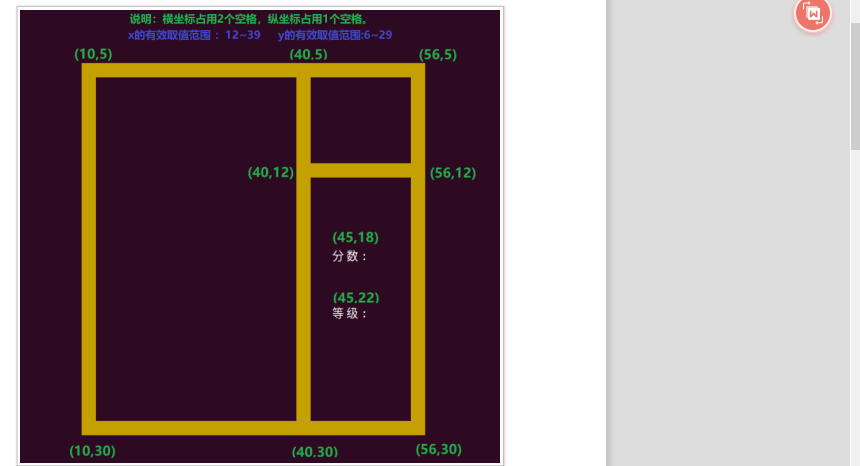
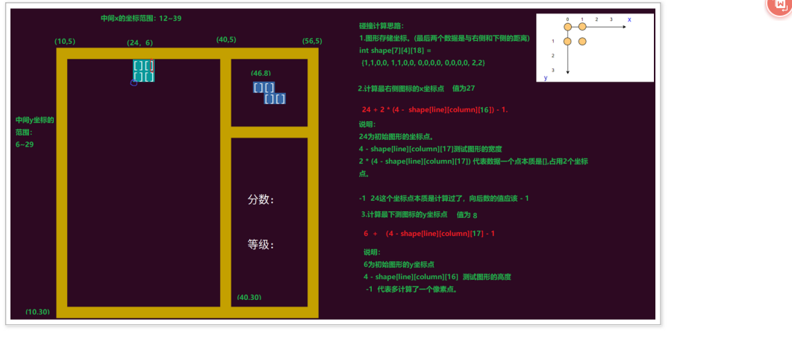
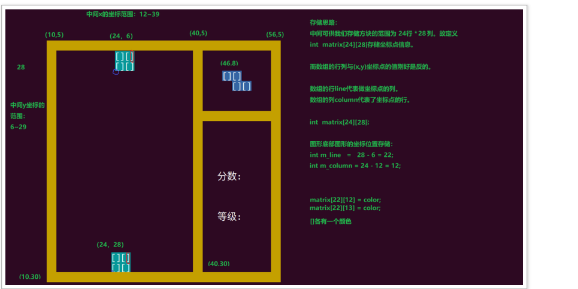

# C语言-项目实战2-HRM&俄罗斯方块-day4-项目开发

## 一 课程简介

- 主界面画
- 方块自动下落
- 方块触底
- 游戏结束
- 按键控制俄罗斯方块
- 消行
- 分数  级别（扩展）  音乐

## 二 图形界面绘制

### 1 主界面整体结构



### 2 主界面代码实现

main.c

```c
#include <stdio.h> 
#include <termios.h>
#include <signal.h> 
#include <time.h>
#include <sys/time.h>
#include <stdlib.h>
int score_x = 45; 
int score_y = 18; 
int level_x = 45; 
int level_y = 22; 
int getch()
{
 struct termios tm,tm_old;
 
 tcgetattr(0,&tm_old);
 
 cfmakeraw(&tm);

 tcsetattr(0,0,&tm);
 
 int ch = getchar();
 
 tcsetattr(0,0,&tm_old);
 return ch;
}
void print_start_ui()
{
 
     printf("\33[2J");
     int i;

    //画上下两恒
     for(i = 0;i < 47;i++){
         printf("\33[%d;%dH\33[43m \33[0m",5,i+10);
         printf("\33[%d;%dH\33[43m \33[0m",30,i+10);
     }

    //画三束
     for(i = 0;i < 26;i++){
         printf("\33[%d;%dH\33[43m \33[0m",i+5,10);
         printf("\33[%d;%dH\33[43m \33[0m",i+5,40);
         printf("\33[%d;%dH\33[43m \33[0m",i+5,56);
     }

    //画短横
     for(i=0;i < 17;i++){
    	 printf("\33[%d;%dH\33[43m \33[0m",12,40+i);
     }
    //画分数和等级
     printf("\33[%d;%dH分数:\33[0m",score_y,score_x);
     printf("\33[%d;%dH等级:\33[0m",level_y,level_x);
     fflush(NULL);
}
void init_game_ui()
{
 
 print_start_ui();
 
 
 getch();
}
int main()
{
 init_game_ui();
 return 0;
}
```

### 3 加入图形


使用cmake编译

```
# 设置 C 编译器为 gcc，并设置 C99 标准选项
set(CMAKE_C_COMPILER gcc)
```


global.c

```c
//一些全局变量
// 新产生方块的初始坐标
int init_x = 24;
int init_y = 6;

//下一个图形
int next_type = -1;
int next_change_type;
int next_x = 46;
int next_y = 7;

int score_x = 45; 
int score_y = 16; 
int level_x = 45; 
int level_y = 20; 
//存放方块的数组
int shape[7][4][18] =
    {
        {
            {1, 1, 0, 0, 1, 1, 0, 0, 0, 0, 0, 0, 0, 0, 0, 0, 2, 2},
            {1, 1, 0, 0, 1, 1, 0, 0, 0, 0, 0, 0, 0, 0, 0, 0, 2, 2},
            {1, 1, 0, 0, 1, 1, 0, 0, 0, 0, 0, 0, 0, 0, 0, 0, 2, 2},
            {1, 1, 0, 0, 1, 1, 0, 0, 0, 0, 0, 0, 0, 0, 0, 0, 2, 2},
        },
        {
            {1, 0, 0, 0, 1, 0, 0, 0, 1, 0, 0, 0, 1, 0, 0, 0, 3, 0},
            {1, 1, 1, 1, 0, 0, 0, 0, 0, 0, 0, 0, 0, 0, 0, 0, 0, 3},
            {1, 0, 0, 0, 1, 0, 0, 0, 1, 0, 0, 0, 1, 0, 0, 0, 3, 0},
            {1, 1, 1, 1, 0, 0, 0, 0, 0, 0, 0, 0, 0, 0, 0, 0, 0, 3},
        },
        {{0, 1, 0, 0, 1, 1, 1, 0, 0, 0, 0, 0, 0, 0, 0, 0, 1, 2},
         {1, 0, 0, 0, 1, 1, 0, 0, 1, 0, 0, 0, 0, 0, 0, 0, 2, 1},
         {1, 1, 1, 0, 0, 1, 0, 0, 0, 0, 0, 0, 0, 0, 0, 0, 1, 2},
         {0, 1, 0, 0, 1, 1, 0, 0, 0, 1, 0, 0, 0, 0, 0, 0, 2, 1}},
        {
            {1, 1, 0, 0, 0, 1, 1, 0, 0, 0, 0, 0, 0, 0, 0, 0, 1, 2},
            {0, 1, 0, 0, 1, 1, 0, 0, 1, 0, 0, 0, 0, 0, 0, 0, 2, 1},
            {1, 1, 0, 0, 0, 1, 1, 0, 0, 0, 0, 0, 0, 0, 0, 0, 1, 2},
            {0, 1, 0, 0, 1, 1, 0, 0, 1, 0, 0, 0, 0, 0, 0, 0, 2, 1},
        },
        {
            {0, 1, 1, 0, 1, 1, 0, 0, 0, 0, 0, 0, 0, 0, 0, 0, 1, 2},
            {1, 0, 0, 0, 1, 1, 0, 0, 0, 1, 0, 0, 0, 0, 0, 0, 2, 1},
            {0, 1, 1, 0, 1, 1, 0, 0, 0, 0, 0, 0, 0, 0, 0, 0, 1, 2},
            {1, 0, 0, 0, 1, 1, 0, 0, 0, 1, 0, 0, 0, 0, 0, 0, 2, 1},
        },
        {{0, 0, 1, 0, 1, 1, 1, 0, 0, 0, 0, 0, 0, 0, 0, 0, 1, 2},
         {1, 0, 0, 0, 1, 0, 0, 0, 1, 1, 0, 0, 0, 0, 0, 0, 2, 1},
         {1, 1, 1, 0, 1, 0, 0, 0, 0, 0, 0, 0, 0, 0, 0, 0, 1, 2},
         {1, 1, 0, 0, 0, 1, 0, 0, 0, 1, 0, 0, 0, 0, 0, 0, 2, 1}},
        {{1, 0, 0, 0, 1, 1, 1, 0, 0, 0, 0, 0, 0, 0, 0, 0, 1, 2},
         {1, 1, 0, 0, 1, 0, 0, 0, 1, 0, 0, 0, 0, 0, 0, 0, 2, 1},
         {1, 1, 1, 0, 0, 0, 1, 0, 0, 0, 0, 0, 0, 0, 0, 0, 1, 2},
         {0, 1, 0, 0, 0, 1, 0, 0, 1, 1, 0, 0, 0, 0, 0, 0, 2, 1}},
};
```


game.h

```
#ifndef _USER_PRINT_H_
#define _USER_PRINT_H_
    #include <stddef.h>
    //引用全局变量
    extern  int init_x ;
    extern int init_y;
    extern int  shape[7][4][18] ;
    extern int next_type;
    extern int next_change_type;
    extern int next_x;
    extern int next_y;

    extern int score_x ; 
    extern int score_y; 
    extern int level_x; 
    extern int level_y ; 
    //函数申明
    void print_mode_shape(int type,int change_type,int x,int y,int color);
    void print_next_shape();
    void clear_mode_shape(int type,int change_type,int x,int y);
#endif
```

game.c

```c
#include "game.h"
/**
 * 输出一个图形
 */
void print_mode_shape(int type,int change_type,int x,int y,int color)
{
    //不能直接用xy，改完值就不能充值下面的了
    int xx =x;
    int yy=y;
    for (int i = 0; i < 16; i++)
    {
        //每画完四个要换行，x重置到最开始。y+1
        if (i!=0 && i%4==0)
        {
            yy = yy+1;
            xx =x;
        }
        if (shape[type][change_type][i]==1)
        {
            printf("\033[%d;%dH",yy,xx);
            printf("\033[%dm[]",color);
            printf("\033[0m");
        }
        //每画一个，xx就要移动2个字符
        xx+=2;
    }
}

/**
 * 输出一个图形
 */
void print_next_shape()
{
    //清除原来
    if (next_type!=-1)
    {
       clear_mode_shape(next_type,next_change_type,next_x,next_y);
    }
    
    //打新的
    next_type = random() %7;
    next_change_type = random() %4;
    print_mode_shape(next_type,next_change_type,next_x,next_y,33);

}


/**
 * 打一个格子出来
 */
void clear_mode_shape(int type,int change_type,int x,int y)
{
    //不能直接用xy，改完值就不能充值下面的了
    int xx =x;
    int yy=y;
    for (int i = 0; i < 16; i++)
    {
        //每画完四个要换行，x重置到最开始。y+1
        if (i!=0 && i%4==0)
        {
            yy = yy+1;
            xx =x;
        }
        if (shape[type][change_type][i]==1)
        {
            printf("\033[%d;%dH",yy,xx);
            printf("  ");
            printf("\033[0m");
        }
        //每画一个，xx就要移动2个字符
        xx+=2;
    }
    fflush(NULL);
}
```

main.c

```c
#include <stdio.h>
#include "game.h"
void init_game_ui();
void print_start_ui();
int main(int argc, char const *argv[])
{
    init_game_ui();
    return 0;
}

void init_game_ui(){
    //打出主界面
    print_start_ui();
    //按回车才出初始化图形
    getchar();
    //显示初始图形和下一个图形
     srandom(time(NULL));
    int  type   = random() %7;
    int  change_type = random() %4;
    print_mode_shape(type,change_type,init_x,init_y,33);

    print_next_shape();

    //隐藏光标
     printf("\33[?25l");
}

void print_start_ui(){
    printf("\33[2J");
    
    //1 画上下两横
    for (int i = 0;i < 47;i++)
    {
        printf("\33[%d;%dH\033[43m \033[0m",5,10+i);
        printf("\33[%d;%dH\033[43m \033[0m",30,10+i);
    }
    
    //2 画三竖
    for (int i = 0; i < 26; i++)
    {
        printf("\33[%d;%dH\033[43m  \033[0m",5+i,10);
        printf("\33[%d;%dH\033[43m  \033[0m",5+i,40);
        printf("\33[%d;%dH\033[43m  \033[0m",5+i,56);
    }
    //3 画中间短横
    for (int i = 0; i < 17; i++)
    {
        printf("\33[%d;%dH\033[43m \033[0m",12,40+i);
    }
    //4 画分数和等级
      printf("\33[%d;%dH\033[37m分数为:\033[0m",score_y,score_x);
      printf("\33[%d;%dH\033[37m等级为:\033[0m",level_y,level_x);
    
    fflush(NULL);
}

```

### 4 集成按键控制

```c
#include <termios.h>
#include <unistd.h>

int main(int argc, char const *argv[])
{
    //初始化界面
    init_game_ui();


    //键盘控制
    key_contrl();

    return 0;
}
void key_contrl(){
    int  ch;
    while (1) //死循环  游戏一直进行
    {
       ch = getch();
       //如果按了q或者Q，退出游戏
       if (ch=='q'||ch=='Q')
       {
            break;
       }else if (ch=='\r')
       {
            //表示按了回车
            printf("prcess enter!\n");
       } else if (ch == '\33')
       {
            ch = getch(); //[
            if (ch=='[')
            {
                ch = getch(); //A B C D
                switch (ch)
                {
                    case 'A':
                        //printf("print up!\n");
                        change();
                        break;
                      case 'B':
                        //printf("print down!\n");
                        move_down();
                        break;
                     case 'C':
                        //printf("print right!\n");
                        move_right();
                        break;
                     case 'D':
                        //printf("print left!\n");
                        move_left();
                        break;
                    default:
                        break;
                }
                
            }
            
       }   
    }
    
}
int  getch(){
    //定义两个终端
    struct termios term,term_old;

    //获取用户的输入带回显
    tcgetattr(0,&term_old);

    //关闭新终端回显
    cfmakeraw(&term);

    //把获取到写入新终端
    tcsetattr(0,0,&term);

   //获取不带回显的字符
    int result = getchar();

    //重置老终端回去
    tcsetattr(0,0,&term_old); 

    return result;

}
```


game.c

```c
void move_down(){
    clear_mode_shape(dynamic_type,dynamic_change_type,dynamic_x,dynamic_y);
    dynamic_y+=1;
    print_mode_shape(dynamic_type,dynamic_change_type,dynamic_x,dynamic_y,33);
}

void move_left(){
    clear_mode_shape(dynamic_type,dynamic_change_type,dynamic_x,dynamic_y);
    //下轴占两个字符
    dynamic_x-=2;
    print_mode_shape(dynamic_type,dynamic_change_type,dynamic_x,dynamic_y,33);
}

void move_right(){
    clear_mode_shape(dynamic_type,dynamic_change_type,dynamic_x,dynamic_y);
    //下轴占两个字符
    dynamic_x+=2;
    print_mode_shape(dynamic_type,dynamic_change_type,dynamic_x,dynamic_y,33);
}

void change(){
    clear_mode_shape(dynamic_type,dynamic_change_type,dynamic_x,dynamic_y);
    //变换类型  0-1 1-2 2-3 3-0 
    dynamic_change_type = (dynamic_change_type+1)%4;
    print_mode_shape(dynamic_type,dynamic_change_type,dynamic_x,dynamic_y,33);
}
```


### 5  重构代码

#### 5.1 理论介绍

​      下代码过程中，需要考虑“高内聚，低耦合”；我们在写函数的时候，不要依赖于外部东西（全局变量，指针。。。）。 外部的东西发生改变以后，里面的逻辑会变。

```c
int i =1;

change(){
	i =2;
}

chanange2(){
  i =2;
}

change();
chanange2();
=================
int i =1;

change(int i){
	i =2;
}

chanange2(int i){
  i =2;
}

change(i);
change(i);

```

扩展性：

  print_mode_shape(type,change_type,dynamic_x,dynamic_y,33); 以后只能用33，用变量想用啥就传入啥就OK


#### 5.2 重构后的代码如下：

global.c

```c
//一些全局变量
// 新产生方块的初始坐标
int  glabal_color =33;
int init_x = 24;
int init_y = 6;

int dynamic_x;
int dynamic_y;
int dynamic_type;
int dynamic_change_type;

int interval_value = 800000;


//下一个图形
int next_type = -1;
int next_change_type;
int next_x = 46;
int next_y = 7;

int score_x = 45; 
int score_y = 16; 
int level_x = 45; 
int level_y = 20; 
//存放方块的数组
int shape[7][4][18] =
    {
        {
            {1, 1, 0, 0, 1, 1, 0, 0, 0, 0, 0, 0, 0, 0, 0, 0, 2, 2},
            {1, 1, 0, 0, 1, 1, 0, 0, 0, 0, 0, 0, 0, 0, 0, 0, 2, 2},
            {1, 1, 0, 0, 1, 1, 0, 0, 0, 0, 0, 0, 0, 0, 0, 0, 2, 2},
            {1, 1, 0, 0, 1, 1, 0, 0, 0, 0, 0, 0, 0, 0, 0, 0, 2, 2},
        },
        {
            {1, 0, 0, 0, 1, 0, 0, 0, 1, 0, 0, 0, 1, 0, 0, 0, 3, 0},
            {1, 1, 1, 1, 0, 0, 0, 0, 0, 0, 0, 0, 0, 0, 0, 0, 0, 3},
            {1, 0, 0, 0, 1, 0, 0, 0, 1, 0, 0, 0, 1, 0, 0, 0, 3, 0},
            {1, 1, 1, 1, 0, 0, 0, 0, 0, 0, 0, 0, 0, 0, 0, 0, 0, 3},
        },
        {{0, 1, 0, 0, 1, 1, 1, 0, 0, 0, 0, 0, 0, 0, 0, 0, 1, 2},
         {1, 0, 0, 0, 1, 1, 0, 0, 1, 0, 0, 0, 0, 0, 0, 0, 2, 1},
         {1, 1, 1, 0, 0, 1, 0, 0, 0, 0, 0, 0, 0, 0, 0, 0, 1, 2},
         {0, 1, 0, 0, 1, 1, 0, 0, 0, 1, 0, 0, 0, 0, 0, 0, 2, 1}},
        {
            {1, 1, 0, 0, 0, 1, 1, 0, 0, 0, 0, 0, 0, 0, 0, 0, 1, 2},
            {0, 1, 0, 0, 1, 1, 0, 0, 1, 0, 0, 0, 0, 0, 0, 0, 2, 1},
            {1, 1, 0, 0, 0, 1, 1, 0, 0, 0, 0, 0, 0, 0, 0, 0, 1, 2},
            {0, 1, 0, 0, 1, 1, 0, 0, 1, 0, 0, 0, 0, 0, 0, 0, 2, 1},
        },
        {
            {0, 1, 1, 0, 1, 1, 0, 0, 0, 0, 0, 0, 0, 0, 0, 0, 1, 2},
            {1, 0, 0, 0, 1, 1, 0, 0, 0, 1, 0, 0, 0, 0, 0, 0, 2, 1},
            {0, 1, 1, 0, 1, 1, 0, 0, 0, 0, 0, 0, 0, 0, 0, 0, 1, 2},
            {1, 0, 0, 0, 1, 1, 0, 0, 0, 1, 0, 0, 0, 0, 0, 0, 2, 1},
        },
        {{0, 0, 1, 0, 1, 1, 1, 0, 0, 0, 0, 0, 0, 0, 0, 0, 1, 2},
         {1, 0, 0, 0, 1, 0, 0, 0, 1, 1, 0, 0, 0, 0, 0, 0, 2, 1},
         {1, 1, 1, 0, 1, 0, 0, 0, 0, 0, 0, 0, 0, 0, 0, 0, 1, 2},
         {1, 1, 0, 0, 0, 1, 0, 0, 0, 1, 0, 0, 0, 0, 0, 0, 2, 1}},
        {{1, 0, 0, 0, 1, 1, 1, 0, 0, 0, 0, 0, 0, 0, 0, 0, 1, 2},
         {1, 1, 0, 0, 1, 0, 0, 0, 1, 0, 0, 0, 0, 0, 0, 0, 2, 1},
         {1, 1, 1, 0, 0, 0, 1, 0, 0, 0, 0, 0, 0, 0, 0, 0, 1, 2},
         {0, 1, 0, 0, 0, 1, 0, 0, 1, 1, 0, 0, 0, 0, 0, 0, 2, 1}},
};
```


game.h

```c
#ifndef _USER_PRINT_H_
#define _USER_PRINT_H_
    #include <stddef.h>
    //引用全局变量
    extern int  glabal_color ;
    extern  int init_x ;
    extern int init_y;
    extern int dynamic_x;
    extern int dynamic_y;
    extern int dynamic_type;
    extern int dynamic_change_type;
    extern int  shape[7][4][18] ;
    extern int next_type;
    extern int next_change_type;
    extern int next_x;
    extern int next_y;


    extern int interval_value ;
    extern int score_x ; 
    extern int score_y; 
    extern int level_x; 
    extern int level_y ; 
    //函数申明
    void print_mode_shape(int type,int change_type,int x,int y,int color);
    void print_next_shape(int color);
    void move_down(int type,int change_type,int color);
    void move_left(int type,int change_type,int color);
    void move_right(int type,int change_type,int color);
    void change(int type,int color);
    void clear_mode_shape(int type,int change_type,int x,int y);
   
#endif
```


game.c

```c
#include "game.h"
/**
 * 输出一个图形
 */
void print_mode_shape(int type,int change_type,int x,int y,int color)
{
    //不能直接用xy，改完值就不能充值下面的了
    int xx =x;
    int yy=y;
    int i;
    for (i= 0; i < 16; i++)
    {
        //每画完四个要换行，x重置到最开始。y+1
        if (i!=0 && i%4==0)
        {
            yy = yy+1;
            xx =x;
        }
        if (shape[type][change_type][i]==1)
        {
            printf("\033[%d;%dH",yy,xx);
            printf("\033[%dm[]",color);
            printf("\033[0m");
        }
        //每画一个，xx就要移动2个字符
        xx+=2;
    }
    fflush(NULL);
}

/**
 * 显示下一个图形
 */
void print_next_shape(int color)
{
    //清除原来
    if (next_type!=-1)
    {
       clear_mode_shape(next_type,next_change_type,next_x,next_y);
    }
    
    //打新的
    next_type = random() %7;
    next_change_type = random() %4;
    print_mode_shape(next_type,next_change_type,next_x,next_y,color);

}

void move_down(int type,int change_type,int color){
    clear_mode_shape(type,change_type,dynamic_x,dynamic_y);
    dynamic_y = dynamic_y+1;
    print_mode_shape(type,change_type,dynamic_x,dynamic_y,color);
}

void move_left(int type,int change_type,int color){
    clear_mode_shape(type,change_type,dynamic_x,dynamic_y);
    //下轴占两个字符
    dynamic_x-=2;
    print_mode_shape(type,change_type,dynamic_x,dynamic_y,color);
}

void move_right(int type,int change_type,int color){
    clear_mode_shape(type,change_type,dynamic_x,dynamic_y);
    //下轴占两个字符
    dynamic_x+=2;
    print_mode_shape(type,change_type,dynamic_x,dynamic_y,color);
}

void change(int type,int color){
    clear_mode_shape(type,dynamic_change_type,dynamic_x,dynamic_y);
    //变换类型  0-1 1-2 2-3 3-0 
    dynamic_change_type = (dynamic_change_type+1)%4;
    print_mode_shape(type,dynamic_change_type,dynamic_x,dynamic_y,color);
}


/**
 *  清除图形
 */
void clear_mode_shape(int type,int change_type,int x,int y)
{
    //不能直接用xy，改完值就不能充值下面的了
    int xx =x;
    int yy=y;
    for (int i = 0; i < 16; i++)
    {
        //每画完四个要换行，x重置到最开始。y+1
        if (i!=0 && i%4==0)
        {
            yy = yy+1;
            xx =x;
        }
        if (shape[type][change_type][i]==1)
        {
            printf("\033[%d;%dH",yy,xx);
            printf("  ");
            printf("\033[0m");
        }
        //每画一个，xx就要移动2个字符
        xx+=2;
    }
    fflush(NULL);
}
```


main.c

```c
#include <stdio.h>
#include "game.h"
#include <termios.h>
#include <unistd.h>
#include <sys/time.h>
#include <signal.h>
void init_game_ui();
void print_start_ui();
void signal_handler(int signum);
void alarm_us(int interval_value);
int main(int argc, char const *argv[])
{
    //初始化界面
    init_game_ui();
    // 绑定信号u处理函数函数
    signal(SIGALRM,signal_handler);
    // 多长时间通知我一次  定义一个全局变量，后面等级不一样可以改这个值
    alarm_us(interval_value);
    //键盘控制
    key_contrl();
    return 0;
}

void signal_handler(int signum)
{
      move_down(dynamic_type,dynamic_change_type,glabal_color);
}

void alarm_us(int init_interval)
{
     struct itimerval value ;//=  {{1,0},{1,0}};
     value.it_value.tv_usec = init_interval;
     value.it_value.tv_sec =0;
     value.it_interval.tv_usec=init_interval;
     value.it_interval.tv_sec=0;
     setitimer(ITIMER_REAL,&value,NULL);
}
void key_contrl(){
    int  ch;
    while (1) //死循环  游戏一直进行
    {
       ch = getch();
       //如果按了q或者Q，退出游戏
       if (ch=='q'||ch=='Q')
       {
            break;
       }else if (ch=='\r')
       {
            //表示按了回车
            printf("prcess enter!\n");
       } else if (ch == '\33')
       {
            ch = getch(); //[
            if (ch=='[')
            {
                ch = getch(); //A B C D
                switch (ch)
                {
                    case 'A':
                        change(dynamic_type,glabal_color);
                        break;
                      case 'B':
                        //printf("print down!\n");
                        move_down(dynamic_type,dynamic_change_type,glabal_color);
                        break;
                     case 'C':
                        //printf("print right!\n");
                        move_right(dynamic_type,dynamic_change_type,glabal_color);
                        break;
                     case 'D':
                        //printf("print left!\n");
                        move_left(dynamic_type,dynamic_change_type,glabal_color);
                        break;
                    default:
                        break;
                }
                
            }
            
       }   
    }
    
}
int  getch(){
    //定义两个终端
    struct termios term,term_old;

    //获取用户的输入带回显
    tcgetattr(0,&term_old);

    //关闭新终端回显
    cfmakeraw(&term);

    //把获取到写入新终端
    tcsetattr(0,0,&term);

   //获取不带回显的字符
    int result = getchar();

    //重置老终端回去
    tcsetattr(0,0,&term_old); 

    return result;

}
void init_game_ui(){
    //打出主界面
    print_start_ui();
    //点回车才k开始
    //getch();
    //显示初始图形和下一个图形
     srandom(time(NULL));
    int  type   = random() %7;
    int  change_type = random() %4;

    //做下左右移动的时候，不能直接改init_x,init_y，这两个产生新图的时候要用。
    dynamic_x = init_x;
    dynamic_y = init_y;
    //做变换和新图产生的时候也有动态值。
    dynamic_type = type;
    dynamic_change_type = change_type;

    print_mode_shape(type,change_type,init_x,init_y,glabal_color);

    print_next_shape(glabal_color);

    //隐藏光标
     printf("\33[?25l");
     
}

void print_start_ui(){
    printf("\33[2J");
    
    //1 画上下两横
    for (int i = 0;i < 47;i++)
    {
        printf("\33[%d;%dH\033[43m \033[0m",5,10+i);
        printf("\33[%d;%dH\033[43m \033[0m",30,10+i);
    }
    
    //2 画三竖
    for (int i = 0; i < 26; i++)
    {
        printf("\33[%d;%dH\033[43m  \033[0m",5+i,10);
        printf("\33[%d;%dH\033[43m  \033[0m",5+i,40);
        printf("\33[%d;%dH\033[43m  \033[0m",5+i,56);
    }
    //3 画中间短横
    for (int i = 0; i < 17; i++)
    {
        printf("\33[%d;%dH\033[43m \033[0m",12,40+i);
    }
    //4 画分数和等级
      printf("\33[%d;%dH\033[37m分数为:\033[0m",score_y,score_x);
      printf("\33[%d;%dH\033[37m等级为:\033[0m",level_y,level_x);
    
    fflush(NULL);
}


```


## 三 方块自动下落

### 1 相关函数

```c
#include <unistd.h>

unsigned int alarm（unsigned int seconds); 

功能：设置⼀个闹钟时间，经过seconds秒后，发送⼀个SIGALRM信号给当前进程。 

 多次调⽤会刷新闹钟时间。 参数： 

@seconds 设置经过seconds秒后发送SIGALRM信号 返回值：如果调⽤此alarm（）前，进程已经设置了闹钟时间， 

 则返回上⼀个闹钟时间的剩余时间，否则返回0。 


#include <sys/time.h>

 int setitimer(int which, const struct itimerval *new_value,struct itimerval *old_value); 

功能：设置内核定时器 参数： 

@which   
    ITIMER_REAL ⽤系统实时的时间计算,时间减1，减到0发送SIGALRM信号 

   ITIMER_VIRTUAL 当前进程⽤户态计数， 计数完成发送SIGVTALRM信号 

   ITIMER_PROF ⽤户态和内核态同时计数，计数完成发送SIGPROF信号 

@new_value 当前设置的新值 

 struct itimerval  {  //{{1,1},{2,2}}
     struct timeval it_interval;   
     struct timeval it_value;   
 }； 

     毫秒是一种较为微小的时间单位，符号为ms，1秒 == 1000 毫秒 ；1 毫秒 = 1000微秒；1微秒 = 1000纳秒；1纳秒 = 1000皮秒。典型照相机的最短曝光时间为一毫秒。 1秒=1000000微妙  800000
 struct timeval  {   //{1,2}
     long tv_sec;  //毫秒
     long tv_usec;   //微妙
 }； 

@old_value 保存旧的状态 示例⽤法： 

struct itimerval val = {{0,500000},{1,0}}; 
setitimer{ITIMER_REAL, &val, NULL}; 


#include <signal.h>

 typedef void (*sighandler_t)(int); 
sighandler_t signal(int signum, sighandler_t handler); 

功能： 采⽤异步的⽅式捕捉signum的信号，并调⽤信号处理函数来处理。 参数： 

@signum 信号 

@handler 对信号的处理⽅式 

 SIG_IGN 忽略信号 

 SIG_DFL 默认处理 

 void (*handler)(int) ⽤户设置信号处理函数，⾃⾏处理 返回值： 成功，返回信号处理函数的地址. 

失败，返回SIG_ERR
```


```c
#include <stdio.h>
#include <unistd.h>
#include <signal.h>
#include <sys/time.h>
void sig_handler(int signum)

{
     printf("recv signal\n"); 
     return ;
}

int main(int argc, const char *argv[])
{
     //准备接收信号，有信号就调用sig_handler
     if(signal(SIGALRM,sig_handler) == SIG_ERR)
     {
         printf("signal call is error!\n"); 
         return -1;
     }

    //发信号
     struct itimerval val = {{5,0},{1,0}};
     setitimer(ITIMER_REAL,&val,NULL);
     while(1);

     return 0;
}
```


### 2 代码实现

```c
int main(int argc, char const *argv[])
{
    //初始化界面
    init_game_ui();
    // 绑定信号u处理函数函数
    signal(SIGALRM,signal_handler);
    // 多长时间通知我一次  定义一个全局变量，后面等级不一样可以改这个值
    alarm_us(interval_value);
    //键盘控制
    key_contrl();
    return 0;
}
void signal_handler(int signum)
{
    move_down(dynamic_type,dynamic_change_type,glabal_color);
}

void alarm_us(int init_interval)
{
     struct itimerval value ;//=  {{1,0},{1,0}};
     value.it_value.tv_usec = init_interval;
     value.it_value.tv_sec =0;
     value.it_interval.tv_usec=init_interval;
     value.it_interval.tv_sec=0;
     setitimer(ITIMER_REAL,&value,NULL);
}
```


## 四 方块触底处理

### 1 直接到底






```c

void move_down(int type,int change_type,int color){ 

    //1 触底，一路畅通直到底，被其他的方块拦住
    int dynamic_down_y= dynamic_y + 1*(4-shape[type][change_type][17])-1;
    //判断下一个是否被占用了
    if (dynamic_down_y>=29)
    {
         //1 把不能动的图报错到二维数组中
         store_current_shape(dynamic_type,dynamic_change_type,color);
         //2 初始化一个新图（type_changeType为下一个图的图像）
         init_new_shape(color);
         //3 产生一个新的下一个
         print_next_shape(color);
        return;
    }
    clear_mode_shape(type,change_type,dynamic_x,dynamic_y);
    dynamic_y = dynamic_y+1;
    print_mode_shape(type,change_type,dynamic_x,dynamic_y,color);
}


void store_current_shape(int type,int change_type,int color){

   //获取y坐标作为数组行，但是要减6
    int m_line = dynamic_y - 6;
    int m_column = dynamic_x -12;
    for (int i = 0; i < 16; i++)
    {
        //执行完四个，行号+1
        if (i!=0 && i%4==0)
        {
            m_line+=1;
            m_column = dynamic_x -12;
        }
    
       if (shape[type][change_type][i] == 1)
       {
            matrix[m_line][m_column] = color; //其实这个位置，可以放1也可以
            matrix[m_line][m_column+1] = color;
       }
       m_column+=2;
    }
}


//画一个新的图形出来
void init_new_shape(int color){
        int type =next_type;
        int change_type = next_change_type;
        int x = init_x;
        int y = init_y;
        
        //换新图四个值都要变
        dynamic_type = type;
        dynamic_change_type =change_type;
        dynamic_x = x;
        dynamic_y = y;
        print_mode_shape(type,change_type,x,y,color);
}

/**
 * 显示下一个图形
 */
void print_next_shape(int color)
{
    //清除原来
    if (next_type!=-1)
    {
       clear_mode_shape(next_type,next_change_type,next_x,next_y);
    }
    
    //打新的
    next_type = random() %7;
    next_change_type = random() %4;
    print_mode_shape(next_type,next_change_type,next_x,next_y,color);

}
```


### 2 方块碰撞到底触底

```c
void move_down(int type,int change_type,int color){ 

    //1 触底，一路畅通直到底，被其他的方块拦住
    int dynamic_down_y= dynamic_y + 1*(4-shape[type][change_type][17])-1;
    //判断下一个是否被占用了
    if (dynamic_down_y>=29 || check_shape(type,change_type,dynamic_x,dynamic_y+1))
    {
         //1 把不能动的图报错到二维数组中
         store_current_shape(dynamic_type,dynamic_change_type,color);
         //2 初始化一个新图（type_changeType为下一个图的图像）
         init_new_shape(color);
         //3 产生一个新的下一个
         print_next_shape(color);
        return;
    }
    clear_mode_shape(type,change_type,dynamic_x,dynamic_y);
    dynamic_y = dynamic_y+1;
    print_mode_shape(type,change_type,dynamic_x,dynamic_y,color);
}

// y 已经加了1了,准备移动，判断里面是否有被占了。
int check_shape(int type,int change_type,int x,int y){
    //获取y坐标作为数组行，但是要减6
    int m_line = y - 6;
    int m_column = x -12;
    for (int i = 0; i < 16; i++)
    {
        //执行完四个，行号+1
        if (i!=0 && i%4==0)
        {
            m_line+=1;
            m_column = x -12;
        }
    
       if (shape[type][change_type][i] == 1)
       {
            if (matrix[m_line][m_column] !=0)
            {
                return 1;
            }
       }
       m_column+=2;
    }
    return 0;
}

```


## 五 游戏结束设置

```c
void signal_handler(int signum)
{
      move_down(dynamic_type,dynamic_change_type,glabal_color);
      //判断游戏是否结束了   有列顶满就结束-->有行是空的，再取反
      if (check_game_over()==1)
      {
            //输出游戏结束了
            game_over();
            //进程退出
            exit(0);
      }
}

void game_over(){
        printf("\33[32;9H********** Game Over ********\33[0m");
        printf("\33[?25h");
        printf("\n\n");
    }

int check_game_over(){
    //只要有空行就能玩
    for (int i = 0; i < 24; i++)
    {

            if(check_line_blank(i)){
                return 0;
            }
    }
    return 1;
}

/**
 * 判断空行
*/
int check_line_blank(int line){
    for (int i = 0; i < 28; i++)
    {
        //所有的都判断完了，为null才为null
        if(matrix[line][i]!=0){
            return 0;
        }
    }
    return 1;
}

```


## 六 按键控制俄罗斯方块

```c
void full_down(int dynamic_type,int dynamic_change_type,int glabal_color){
    while (1)
    {
        int  result = move_down(dynamic_type,dynamic_change_type,glabal_color);
        if (result) //一直调用往下，触底就返回
            return;
    }
    
}

void move_left(int type,int change_type,int color){

    //边界问题
    if (dynamic_x<=12)
    {
       return;
    }

    //左边碰撞
    if(check_shape(type,change_type,dynamic_x-2,dynamic_y)) 
            return;
    clear_mode_shape(type,change_type,dynamic_x,dynamic_y);
    //下轴占两个字符
    dynamic_x-=2;
    print_mode_shape(type,change_type,dynamic_x,dynamic_y,color);
}

void move_right(int type,int change_type,int color){
    int dynami_right_x = dynamic_x+2*(4-shape[type][change_type][16])-1;

    //边界
    if (dynami_right_x>=39)
    {
        return;
    }
    
     //右边碰撞
    if(check_shape(type,change_type,dynamic_x+2,dynamic_y)) 
            return;
    clear_mode_shape(type,change_type,dynamic_x,dynamic_y);
    //下轴占两个字符
    dynamic_x+=2;
    print_mode_shape(type,change_type,dynamic_x,dynamic_y,color);
}

void change(int type,int color){
  //变换类型  0-1 1-2 2-3 3-0 
    int change_type = (dynamic_change_type+1)%4;
    //获取变换的图形来判断
    //三种越界   左右下

    clear_mode_shape(type,dynamic_change_type,dynamic_x,dynamic_y);
    dynamic_change_type = change_type;
    print_mode_shape(type,dynamic_change_type,dynamic_x,dynamic_y,color);
}
```


## 七  方块消行

  判断二维数组，有行全是1，清楚那一行。。。数据已经消了，但是界面还在，重新绘制色所有图形。

```c
int move_down(int type,int change_type,int color){ 

    //1 触底，一路畅通直到底，被其他的方块拦住
    int dynamic_down_y= dynamic_y + 1*(4-shape[type][change_type][17])-1;
    //判断下一个是否被占用了
    if (dynamic_down_y>=29 || check_shape(type,change_type,dynamic_x,dynamic_y+1))
    {
         //1 把不能动的图报错到二维数组中
         store_current_shape(dynamic_type,dynamic_change_type,color);
         //2 初始化一个新图（type_changeType为下一个图的图像）
         init_new_shape();
         // 3 消除行
         clear_full_lines();
         //4 产生一个新的下一个
         print_next_shape();
        return 1;
    }
    clear_mode_shape(type,change_type,dynamic_x,dynamic_y);
    dynamic_y = dynamic_y+1;
    print_mode_shape(type,change_type,dynamic_x,dynamic_y,color);

    return 0;
}

void clear_full_lines(){

    //遍历所有的行，分别判断是否已经满了，满了才消除
    int i,j,k,m;
    int flag = 0;
    for (i = 0; i < 24; i++)
    {

        //需要得到一个结果，看这行是否满了
        flag =1; //认为这行已经满了
        for (j = 0; j < 28; j++)
        {
             // 只要有一个没有满就没满，跳出循环
             if (matrix[i][j]==0)
             {
                 flag =0;
                 break;
             }
             
        }

      if (flag)
      {
            //清除数组类里面的哪行，并且上面的行整体下移
            for (k = i; k >= 0; k--)
            {
         
               if (k!=0)
               {
                    //非0行赋值它的上以行的值。
                   for (m = 0; m< 28; m++)
                    {
                        //就是把列分别赋值就ok
                         matrix[k][m]=  matrix[k-1][m];
                    }
               }else{
                    // 0行其实把里面的列赋值为0
                    for (m = 0; m< 28; m++)
                    {
                         matrix[k][m]=0;
                    }
               }  
            }
            
            //加分+动态计算等级
            score+=10;
            if (score!=0&& score%100==0)
            {
                level+=1;
                interval_value/=2;
                //重新设置下落速度
                alarm_us(interval_value);
            }
            
            //重新输出图形
            print_matrix();

            //并且打出来
            print_score_level();

      }  
    }
    
}


void print_score_level(){
    printf("\33[%d;%dH\033[37m分数为:%d\033[0m",score_y,score_x,score);
    printf("\33[%d;%dH\033[37m等级为:%d\033[0m",level_y,level_x,level);
 }

 void  print_matrix(){
        int i,j;
        for (i = 0; i < 24; i++)
        {
           for ( j = 0; j < 28; j=j+2)
           {
                int x = j +12;
                int y = i +6;
                int color = matrix[i][j];
                if (color==0)
                {
                    //清除
                    printf("\033[%d;%dH",y,x);
                    printf("\033[%dm  ",color);
                    printf("\033[0m");
                }else{
                    //重绘
                    printf("\033[%d;%dH",y,x);
                    printf("\033[%dm[]",color);
                    printf("\033[0m");
                }
           }  
        }
        fflush(NULL);
 }
```


## 八 其他功能

消行加上音乐   

