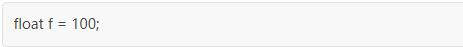
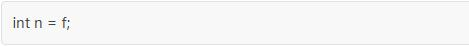
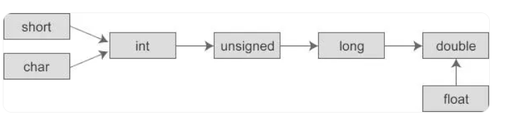
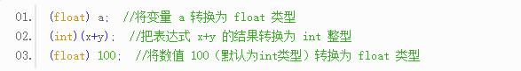
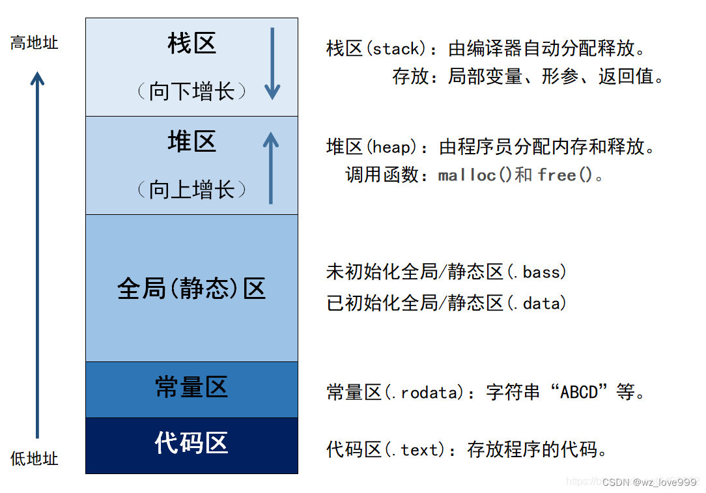
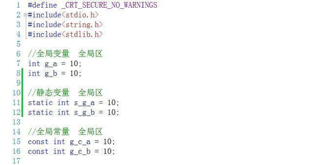
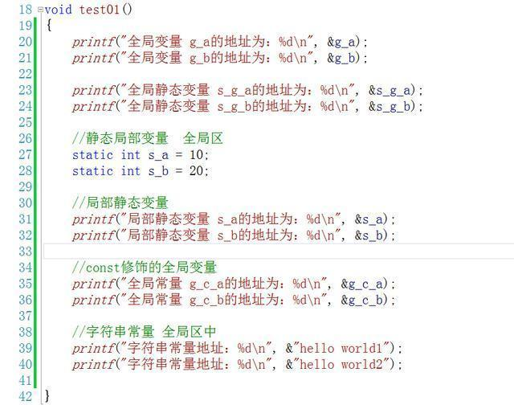
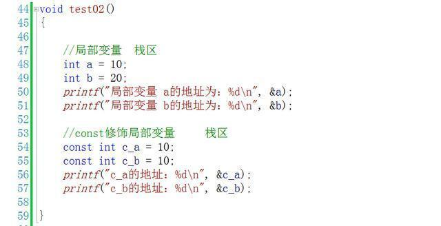
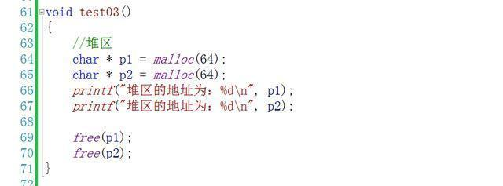

# C语法基础-变量类型&表达式&类型转换&运算符

## 一 课程介绍

- 接受用户键盘输入【掌握】
- 变量分类【掌握】
- 数据类型转换【掌握】昨天讲的数据类型之间转换
-  运算符【掌握】

## 二  变量的分类

变量按照声明的位置或作用范围分为全局变量和局部变量。

### 1 **全局变量**

#### 1.1. 概念【掌握】

​	全局变量声明在函数体外，全局变量与函数是平级的

#### 1.2 作用【了解】

​	全局变量用来定义公共的一些变量给多个函数可以使用

#### 1.3 特点【掌握】

1.  作用域范围： 

   在整个文件中中都可以使用全局变量。

2. 全局变量如果没有赋予初始值，系统自动分配默认值，分配的默认值根据数据类型的不同而不同；

   ​		整型数据默认值为  0；

   ​		浮点数类型默认值为  0.0；

   ​		布尔类型默认值为  false;

   ​		字符类型默认值为  /u0000；(表示空的意思)

   


### 2 **局部变量**

#### 2.1 概念【掌握】

​	局部变量声明在函数内部或花括号结构体中，如main方法中。

#### 2.2  作用

​	局部变量就是为了辅助完成一个函数的功能

#### 2.3 特点

1. 作用域范围： 在声明位置下方，到***\*}\****结束，都可以使用局部变量
2. 局部变量没有默认值，因此使用之前必须要赋予初始值，如果不使用可以不赋予值，但这样声明的局部变量没有任何意义，只会占用内存空间；

### 3 **局部变量与成员变量区别**

​	1.声明位置

​	成员变量声明在文件中，局部变量声明在方法或花括号结构体中；

​	2.作用范围

   全局变量在整个文件结构中均可使用，局部变量只能在当前声明的花括号结构体中有效；

​	3.初始值

   成员变量使用之前可以不赋予初始值，系统根据数据类型分配默认值，

   局部变量使用之前必须赋予初始值，没有默认值

   注意事项:

​	同一个类中，如果全局变量与局部变量重名，实际使用到的是就近的局部变量的值

练习：

交换2个变量里面的数据，例如 变量 a= 3;b=5; 交换后则变成：a=5,b=3;


### 4 代码案例1

```c
#include <stdio.h>

/**
 * 2 全局变量：
 *   2.1 是什么
 * 全局变量声明在函数体外，全局变量与函数是平级的。
 *  2.2 作用
 *     全局变量用来定义公共的一些变量给多个函数可以使用
 * 2.3 特点
 *    作用范围：整个文件中函数都能使用
 *    全局变量没如果不赋值，会赋予初始值0，''等，一般都要赋值。
*/
int b ;
/**
 * 变量按照声明的位置或作用范围分为全局变量和局部变量。
*/
int main(int argc, char const *argv[])
{
    //变量按照声明的位置或作用范围分为全局变量和局部变量。
    // 1局部变量
    /*
       1.1 是什么
          声明在函数内部或花括号结构体中，如main函数中。
        1.2 作用
                局部变量就是为了辅助完成一个函数的功能
       1. 3 作用范围：从定义开始，到这个函数结束。
       1.4  局部变量没如果不复制，会赋予初始值0，''等，如果不使用可以不赋予值，
       但这样声明的局部变量没有任何意义，只会占用内存空间；
    */
    int a = b+1 ;
    printf("%d",a);
    return 0;
}

void test(){
        printf("%d",b);
}

int c = 2;


```

### 5 代码案例2-就近原则

```c
#include <stdio.h>

/**
 * 全局变量和局部变量同名。  函数内使用的是那个。遵循就近原则！
 *  1 同一个范围变量是不能重复的。
 *  2 在函数内部，照变量。先看局部有没有，如果有直接使用。否则照全局的。 找到就OK，找不到并且没有引入其他的就报错
*/
int b = 1;
int main(int argc, char const *argv[])
{
    int b = 2 ;
    printf("%d",b); //就近原则！先找到int b = 2 ;
    return 0;
}

void test(){
        printf("%d",b); //就近原则！int b = 1;
}


```


### 6 小结

​        **全局变量存放在内存的全局区。  局部变量放在栈里面。** 

##  三  基础数据类型转换

### 1  类型转换概念

​	数据类型转换就是将数据（变量、数值、表达式的结果等）从一种类型转换为另一种类型。

### 2  类型转换作用

​	1.节约内存空   lang:1    short:1

​     2.将一些类型转换为项目所需要的格式

### 3 类型转换分类

#### 3.1 自动隐式转换

**定义：**自动类型转换就是编译器默默地、隐式地、偷偷地进行的数据类型转换，这种转换不需要程序员干预，会自动发生。

#### **3.2 自动转换示例**

1) 将一种类型的数据赋值给另外一种类型的变量时就会发生自动类型转换，例如：



100 是 int 类型的数据，需要先转换为 float 类型才能赋值给变量 f。再如：



f 是 float 类型的数据，需要先转换为 int 类型才能赋值给变量 n。

**在赋值运算中，赋值号两边的数据类型不同时，需要把右边表达式的类型转换为左边变量的类型，这可能会导致数据失真，或者精度降低；所以说，自动类型转换并不一定是安全的。对于不安全的类型转换，编译器一般会给出警告。**

2) 在不同类型的混合运算中，**编译器也会自动地转换数据类型，将参与运算的所有数据先转换为同一种类型，然后再进行计算**。转换的规则如下：  float+int

- 转换按数据长度增加的方向进行，以保证数值不失真，或者精度不降低。例如，int 和 long 参与运算时，先把 int 类型的数据转成 long 类型后再进行运算。
- 所有的浮点运算都是以双精度进行的，即使运算中只有 float 类型，也要先转换为 double 类型，才能进行运算。
- char 和 short 参与运算时，必须先转换成 int 类型。




  运行结果：
s1=78, s2=78.539749

在计算表达式`r*r*PI`时，r 和 PI 都被转换成 double 类型，表达式的结果也是 double 类型。但由于 s1 为整型，所以赋值运算的结果仍为整型，舍去了小数部分，导致数据失真。  


```c
#include <stdio.h>

/**
 * 数据类型转换：
 *   1 是什么？ 一种类型转换为另一个种类型。
 *   2 什么时候能用？ 节约，做计算保持精度，别人给我的不是我想要的。
 *   3 分类：
 *        自动转换
 *        手动强转
 *   优秀实践： 
 *       把小的转成大的，不会损失精度。但是如果把大的转成小的，虽然不报错，但是损失了精度，最好不要这样做
*/

int main(int argc, char const *argv[])
{

/**
 * 1在赋值运算中，赋值号两边的数据类型不同时，需要把右边表达式的类型转换为左边变量的类型，这可能会导致数据失真，或者精度降低；所以说，自动类型转换并不一定是安全的。对于不安全的类型转换，编译器一般会给出警告。**
*/

      float pi = 3.1415927f; //π
      int i =1;
      int ipi = pi;  // = 赋值自动转，小转大不会丢失精度，
      printf("%d\n",ipi);  //3 
      float ppi  = i; // = 赋值自动转，但是大转小会丢失精度。
     printf("%f\n",ppi);  //1.0

      printf("=============================\n");  

    /*2混合运算的时候自动转，转成一种类型再来做运算。*/
      int  r = 5; //半径
      double s2  =  r * r *  pi; //double类型面积,pi,r都转换为double
      printf("%lf\n",s2); 
      int s1 = r * r *  pi ;  //int类型面积,pi,r都转换为double，
      //计算完后是doule，但是赋值给int，还要转为int
        printf("%d\n",s1); 
      
     
    return 0;
}

```


#### 3.3 强制转换

  自动类型转换是编译器根据代码的上下文环境自行判断的结果，有时候并不是那么“智能”，不能满足所有的需求。如果需要，程序员也可以自己在代码中明确地提出要进行类型转换，这称为强制类型转换。

自动类型转换是编译器默默地、隐式地进行的一种类型转换，不需要在代码中体现出来；强制类型转换是程序员明确提出的、需要通过特定格式的代码来指明的一种类型转换。换句话说，自动类型转换不需要程序员干预，强制类型转换必须有程序员干预。
  强制类型转换的格式为：

```
(type_name) expression
```

`type_name`为新类型名称，`expression`为表达式。例如：



示例:

```c
#include <stdio.h>

/**
 * 数据类型转换：
 *   1 是什么？ 一种类型转换为另一个种类型。
 *   2 什么时候能用？ 节约，做计算保持精度，别人给我的不是我想要的。
 *   3 分类：
 *        自动转换
 *        手动强转
 *   优秀实践： 
 *       把小的转成大的，不会损失精度。但是如果把大的转成小的，虽然不报错，但是损失了精度，最好不要这样做
*/

int main(int argc, char const *argv[])
{

/**1自动转换
 * 1.1在赋值运算中，赋值号两边的数据类型不同时，需要把右边表达式的类型转换为左边变量的类型，这可能会导致数据失真，或者精度降低；所以说，自动类型转换并不一定是安全的。对于不安全的类型转换，编译器一般会给出警告。**
*/

      float pi = 3.1415927f; //π
      int i =1;
      int ipi = pi;  // = 赋值自动转，小转大不会丢失精度，
      printf("%d\n",ipi);  //3 
      float ppi  = i; // = 赋值自动转，但是大转小会丢失精度。
        printf("%f\n",ppi);  //1.0

      printf("=============================\n");  

    /*1.2混合运算的时候自动转，转成一种类型再来做运算。*/
      int  r = 5; //半径
      double s2  =  r * r *  pi; //double类型面积,pi,r都转换为double
      printf("%lf\n",s2); 
      int s1 = r * r *  pi ;  //int类型面积,pi,r都转换为double，
      //计算完后是doule，但是赋值给int，还要转为int
        printf("%d\n",s1); 

         printf("=============================\n");  
         //2 强转 (type)exprision
        int  a = 1;
        double d = (double)a;
        float c = (float)100;
        int b  = (int)(10.1+1);
        printf("%lf,%f,%d\n",d,c,b); 
       return 0;
    
}

```


### 类型转换只是临时性的

无论是自动类型转换还是强制类型转换，都只是为了本次运算而进行的临时性转换，转换的结果也会保存到临时的内存空间，不会改变数据本来的类型或者值。

### 自动类型转换 VS 强制类型转换

在C语言中，有些类型既可以自动转换，也可以强制转换，例如 int 到 double，float 到 int 等；而有些类型只能强制转换，不能自动转换，例如以后将要学到的 void * 到 int *，int 到 char * 等。

**可以自动转换的类型一定能够强制转换，但是，需要强制转换的类型不一定能够自动转换。**现在我们学到的数据类型，既可以自动转换，又可以强制转换，以后我们还会学到一些只能强制转换而不能自动转换的类型。

可以自动进行的类型转换一般风险较低，不会对程序带来严重的后果，例如，int 到 double 没有什么缺点，float 到 int 顶多是数值失真。只能强制进行的类型转换一般风险较高，或者行为匪夷所思，例如，char * 到 int * 就是很奇怪的一种转换，这会导致取得的值也很奇怪，再如，int 到 char * 就是风险极高的一种转换，一般会导致程序崩溃。

使用强制类型转换时，程序员自己要意识到潜在的风险。

## 四.运算符

### 1 什么是运算符

​	运算符是一种告诉编译器执行特定的数学或逻辑操作的**符号**。C 语言内置了丰富的运算符，并提供了以下类型的运算符：

- 算术运算符
- 关系运算符
- 逻辑运算符
- 位运算符
- 赋值运算符 = 
- 杂项运算符 逗号，三目（选择）

### 2 常用的运算符

#### 2.1. 算术运算符

| **运算符** |     **术语**      | **示例** | **结果** |
| :--------: | :---------------: | :------: | :------: |
|     +      |       正号        |    +3    |    3     |
|     -      |       负号        |    -3    |    -3    |
|     +      |        加         |  10 + 5  |    15    |
|     -      |        减         |  10 - 5  |    5     |
|     *      |        乘         |  10 * 5  |    50    |
|     /      |        除         |  10 / 5  |    2     |
|     %      | 取余(取模 Modulo) |  10 % 3  |    1     |

```c
// 目标：掌握算数运算的基本语法
int main(void)
{
	int m = +3;
	int n = -3;
	printf("m=%d, n=%d\n", m, n);

	int a = 10, b = 5;
	printf("a+b=%d\n", a + b);
	printf("a-b=%d\n", a - b);
	printf("a*b=%d\n", a * b);
	printf("a/b=%d\n", a / b);
	printf("10%%3=%d\n", 10 % 3);  // 在printf的格式串中显示 %号, 需要使用 %%

	// 3 % 10 取余结果是多少呢?
	printf("3%%10=%d\n", 3 % 10);  // 3
    
	return 0;
}
```

##### 注意事项

1. 先 * / %，后 + -。
2. 除法
   - 两整数相除，结果整数（舍小数部分）
   - 两浮点数相除，结果 double 浮点数
   - 整数和实数相除，自动类型转换为实型
   - 不允许 除 0（与数学一样）
3. 取模（取余）
   - 运算数必须是整型
   - 对负数取余，结果为余数的绝对值
   - 不允许 除 0（与数学一样）

```c
// 目标: 掌握算术运算符使用特性
int main(void)
{
	// 先乘除后加减
	printf("%d\n", 4 + 6 % 5);	// 5

	// 两整数相除，结果整数（舍小数部分）
	printf("%d\n", 19 / 10);	// 1

	// 两浮点数相除，结果 double 浮点数, 默认保留 6 位小数
	printf("%lf\n", 3.6 / 1.3);	// 2.769231

	// 整数和实数相除，自动类型转换为实型
	printf("%lf, %llu\n", 6 / 2.0, sizeof(6/2.0));  // 表达式结果占 8 字节, double 类型.

	// 除 0 不允许
	printf("%d\n", 6 / 0);  // 被零除或对零取余 错误.

	// 取余运算,参与运算的操作数,必须为整数
	printf("%d\n", 7.3 % 2);	// 表达式必须包含整数 错误.

	// 对负数取余，结果为余数的绝对值
	printf("%d\n", 7 % -5);		// 2

	// 对 0 取余不允许
	printf("%d\n", 6 % 0);  // 被零除或对零取模 错误.

	return 0;
}
```

##### 总结

算数运算符有哪些？

- 先 * / %，后 + -。

/ 运算注意什么？

- 两整数相除得整数。 运算表达式遵循类型转换规则

% 运算注意什么？

- 运算数必须是整数。 负数取余结果为正。


#### 2.2. 比较运算符

##### 基础语法

| **运算符** |      **作用**       | **示例** | **结果**        |
| :--------: | :-----------------: | :------: | :-------------- |
|     <      |      判断 小于      |  4 < 3   | 不成立（假）：0 |
|     <=     | 判断 小于**或**等于 |  4 <= 3  | 不成立（假）：0 |
|     >      |      判断 大于      |  4 > 3   | 成立（真）：1   |
|     >=     | 判断 大于**或**等于 |  4 >= 4  | 成立（真）：1   |
|     ==     |      判断 相等      |  4 == 3  | 不成立（假）：0 |
|     !=     |     判断 不相等     |  4 != 3  | 成立（真）：1   |

**注意：**判断 “相等”，使用 “==”， 不能使用 “=”（赋值符）


##### 优先级   算数>比较>赋值

1. 整体，比算术运算符 低。 int i = 4<3+2
2. 整体，比赋值运算符 高。
3. \>  >=  <  <= 高于 == !=

```c
// 目标: 掌握 比较运算符语法 和 优先级 
int main(void)
{
	// 成立 1, 不成立 0
	printf("10 > 10: %d\n", 10 > 10); //0
	printf("10 >= 10: %d\n", 10 >= 10);//1
    
	int a = 10;
	printf("10 <= a: %d\n", 10 <= a);//1
	printf("10 < a: %d\n", 10 < a);//0
	
	printf("a != 10: %d\n", a != 10);//0
	printf("a == 10: %d\n", a == 10); //1  // 不要将 == 错写成 = 
	
	// 整体，低于 算术运算符
	printf("a >= 3 + 7: %d\n", a >= 3 + 7); //1  // 先算 +, 再判断 >=
	printf("7 == 3 + 4: %d\n", 7 == 3 + 4); //1  // 先算 +, 再判断 =

	// 整体, 高于 赋值运算符
    int b;
	b = 4 > a;				// 先算 4 > a, 再赋值
	printf("b = %d\n", b);
	printf("b = %d\n", b = 7 != a);		 // 先算 7 != a, 再赋值.
    printf("b = %d\n", b = 7 != a + 1);  // 先算 a+1, 再判断 7 != a+1, 再赋值.

	// > >= < <= 高于 == !=
	printf("%d\n", 7 > 5 != 3 <= 4); //0
	
	return 0;
}	
```


##### 总结

- 关系运算的比较结果只有两种：1（成立、真）、0（不成立、假）
- 计算机中判等，需使用 “==”
- 优先级，高于赋值，低于算数。 \>  >=  <  <= 高于 == !=


#### 2.3. 赋值运算符

目标：会使用赋值运算符表达式**

包括：基本赋值运算符 和 复合赋值运算符（ = 与算数运算符 组合而成）。

作用：给变量赋值。 结合性：**自右向左**。 


##### 基础语法

  = 赋值运算     int b = 1; 意思是把1这个int类型的常量赋值给b这个int类型的变量。

  int b =1;

  b = b+2;  < ---->b+=2

| **运算符** | **术语** |             **示例**              | **结果** |
| :--------: | :------: | :-------------------------------: | :------: |
|     +=     |  加等于  | int a=1;  a+=2;（等同于a = a+2）  | a值为 3; |
|     -=     |  减等于  | int a=5;  a-=3;（等同于a = a-3）  | a值为 2; |
|     *=     |  乘等于  | int a=2;  a*=2;（等同于a = a\*2） | a值为 4; |
|     /=     |  除等于  | int a=4;  a/=2;（等同于a = a/2）  | a值为 2; |
|     %=     |  模等于  | int a=3;  a%=2;（等同于a = a%2）  | a值为 1; |

**注意：**赋值运算符，会修改变量的原始值。 赋值符左侧，必须可修改（变量）。

```c
int main(void)
{
	// = 赋值符, 自右向左
	int a = 2, b = 1, c = 0;
    
	a = a + b;
	printf("a = %d\n", a);		
	b = a < c;
	printf("b = %d\n", b);  // 直接 打印 b = a < c
	a = b = c = 8;  // c= 8;b=c;a=b
	printf("a = %d, b = %d, c = %d\n", a, b, c);

	// += -= 复合赋值符。需求：微信钱包有 15.8 元， 发 2.9 元红包，收 13.6 元红包。
	double money;
    money = 15.8;
	money += 2.9;		// 等价于: money = money + 2.9;
	printf("money = %lf\n", money);
	
	// 需求: 发红包
	money -= 13.6;		// 等价于: money = money - 13.6;
	printf("money = %lf\n", money);

    // 其他 复合赋值符。
	int i, j;
    i = 10, j = 5;
	//i *= j;	// 等价于:i = i * j;
	//i /= j;	// 等价与:i = i / j;
	//i %= j;	// 等价与:i = i % j;
	printf("i = %d\n", i);

	// 思考:
	i %= j - 2;			// 等价于 i = i % (j - 2);  %= 右侧看做一个整体.
	printf("i = %d\n", i);
    
    // 注意：赋值符，左侧必须可修改
    3 += 2; 

	return 0;
}
```

 

##### 总结

- 先运算，后赋值。方向，自右向左
- += 可实现累加，将别人的数据累加给自己。
- 所有赋值运算符，都会修改变量原始值。


#### 2.4. 自增减运算符

**目标：实现数据的增 1、减1运算**

自增自减运算也叫 增 1 减 1 运算，都是单目运算。

作用：

- 自增 ++， 放在变量前面或后面，对变量自身值+1。
- 自减 --， 放在变量前面或后面，对变量自身值-1。 
- 方便实现变量的 +1 或 -1 运算。

应用场景：

- 点赞 和 取消点赞。

| **运算符** | **术语** |                 **示例**                  | **结果**  |
| :--------: | :------: | :---------------------------------------: | :-------: |
|     ++     |   自增   |  int a=1;  a++ 或 ++a;（等同于a = a+1）   | a 值为 2; |
|     --     |   自减   | int b=5;   b--  或  --b;（等同于b = b-1） | b 值为 4; |

##### 自增自减语法

++ 对变量值 +1。  -- 对变量值 -1。

```c
// 目标: 掌握 ++ 自增1, -- 自减1 特性
int main(void)
{
	int a = 10;

	//a++; // a = a + 1;
	++a; // a = a + 1;		与 a++ 效果相同

	printf("a = %d\n", a);
	//a--; // a = a -1;
	--a; // a = a -1;		与 a-- 效果相同

	printf("a = %d\n", a);

	return 0;
}
```


##### 前缀后缀区别

**注意：++ 和 -- 如果 ==不是单独使用==（如：用在表达式中），前缀和后缀 ==差异巨大==** 

- 放在变量前，先 +1、-1 再取值使用。

  ```c
  int a = 10;
  int res = ++a;  // 先 +1，再取 a 值给 res。 （先加再用）
  ```

- 放在变量后，先 取值用，再  +1、-1 

  ```c
  int b = 10;
  int res2 = b--; // 先取 b 值给 res2， 而后 b 再 -1  （先用再减）
  ```

代码验证：

```c
// 目标: 掌握 ++/-- 前缀后缀差异
int main(void)
{
	int a = 10;
	int res = ++a;	// 先+1,再用
	printf("res = %d\n", res);

	int b = 10;
	//printf("b = %d\n", b--);	// 先用,再-1
	printf("b = %d\n", --b);	// 先-1,再用
	printf("b = %d\n", b);		// 查看b值

	return 0;
}
```


##### 注意事项

1. 不能用于常量
2. 不能用于表达式
3. 优先级：整体高于算数运算符（必然高于比较、赋值）；后缀高于前缀
4. 不要在一个表达式中，对同一变量 多次 ++、-- 运算。可读性差，且不用编译系统结果不同。

```c
// 目标: 掌握 ++/-- 使用注意事项
int main(void)
{
	// 1. 不能用于常量
	//printf("%d\n", 10++);

	// 2. 不能用于表达式
	int a = 10;
	// (a - 1)++;
	// ++(-a);

	// 3. 全部 高于算数运算
	//int b = ++a * 3;
	int b = a-- * 3;
	printf("b = %d\n", b);

	// 3. 后缀高于前缀
	printf("a = %d\n", -a++);  

	// 对同一变量 多次 ++、-- 运算。可读性差，且不同编译系统结果不同。
	int i = 10;
	int j = 5;

	int res = i++ + ++i - --j - ++j + 3 + i--;
	printf("res = %d\n", res);	// 26  --- Linux下gcc编译器: 28
	printf("i = %d\n", i);		// 11
	printf("j = %d\n", j);		// 5

	return 0;
}
```


##### 总结

- ++ 自增 1， --自减 1
- 单独使用，前缀后缀没区别； 
- 非单独使用：前缀，先+1、-1，再用； 后缀，先用，再+1、-1
- 只适用变量，不能用于常量、表达式。
- 优先级，高于算数、比较、赋值。后缀高于前缀。

#### 2.5. 逻辑运算符

作用：

- 用程序解决 类似 或者、并且 这种 含有逻辑关系的 情况。

应用场景：

- 去京东买手机。 筛选条件： 128G 并且 120w 快充 。 后台 怎么做？ 用 与 运算判断，满足展示，不满足不展示。如果用户 就想买 华为 或者 小米手机，后台用 或 运算，筛选厂商对应的手机。


##### 基础语法

- 将多个条件放在一起运算，最终返回 真（1）或  假（0）

| **运算符** | **术语** |   **示例**   | **结果**                                             | 速记     |
| :--------: | :------: | :----------: | ---------------------------------------------------- | -------- |
|     &&     |    与    |  2>1 && 3>2  | &&两边同为真，结果为真，否则为假。                   | 同真为真 |
|    \|\|    |    或    | 2>1\|\|3 > 5 | \|\|两边有一个为真，结果为真，二者同为假，结果为假。 | 有真为真 |
|     !      |    非    |   ! (2>1)    | 取反！表达式为假，加 ! 为真；表达式为真，加 ! 为假。 | 真非为假 |

 案例1 ： 需求，手机存储大于 128，手机屏幕尺寸大于等于 6.35**

```c
// 目标: 掌握逻辑运算符语法特性
int main(void)
{
	int storage = 256;		// 手机存储
	double size = 6.3;		// 屏幕尺寸

	// 需求1: 手机存储大于128, 同时 屏幕尺寸大于等于6.7
	printf("%d\n", storage > 128 && size >= 6.7);  // && 同真为真

	// 需求2: 手机存储大于128, 或者 屏幕尺寸大于等于6.7
	printf("%d\n", storage > 128 || size >= 6.7);	// || 有真为真

	// !非，取反的意思
	printf("%d\n", !6);			// 非真为假
	printf("%d\n", !0);			// 非假为真
	printf("%d\n", !(7 < 9));	// 思考结果是什么?  --> 0
    
    //（使用时特殊情况）判断 20 是介于 10 和 30 之间的数
    // 错误写法
	printf("%d\n", 30 > 20 > 10); 	// C 语言不支持，数学中连续判断的语法

	// 正确写法
	printf("%d\n", 30 > 20 && 20 > 10);

	return 0;
}
```

**案例2 ： 判断 20 是介于 30 和 10 之间的数。**

```c
// 错误写法
printf("%d\n", 30 > 20 > 10); 	// C 语言不支持，数学的这种连续判断的语法

// 正确写法
printf("%d\n", 30 > 20 && 20 > 10);
```


##### 短路运算 *****

​		逻辑运算符的特性，导致实际应用中一部分表达式不执行，也能得出整个表达式结果。这一特点经常作为考点出现在计算机二级、期末考试题中。

在程序中：

- 判断 表达式 a && (b+c) 的结果：
  - 当 a 为假时，不必计算 b+c，可直接得出表达式为假的结论。
- 判断 表达式 a || (b+c) 的结果：
  - 当 a 为真时，则不必计算 b+c，就能判断出表达式的值为 真。   

**概念：逻辑表达式 运算过程中，只运算左边表达式，就能直接得出整个逻辑表达式的结果。—— 短路运算  **

###### 短路运算作用

​		在代码中利用短路运算，可 **避免不必要运算，提高程序执行效率**。 比如有如下代码：

```c
int a = 5, b = 28;
int c = (a > 3) || ((b / 7)*4 % 2 != 0)
printf("c = %d\n", c);
```

​		现要计算 c 值。= 右侧表达式含有逻辑或 || 运算符，运算特性 有真为真。|| 左边表达式很容易判断为 真，可确定整个表达式结果为 真。 右侧 b 相关的 复杂表达式 不需要计算 。

###### 短路运算特性

​		**左表达式能直接得逻辑表达式结果，右表达式不执行。**

**案例 1：**以下代码执行后，a、b、c 的值依次是多少？

```c
// 目标: 掌握运算特性
int main(void)
{
	int a = 1, b = 2, c = 3;
	(a = b + c) || (++b) ;   	
	printf("a=%d, b=%d, c=%d\n", a, b, c);
    
    return 0;
}
```

​		简单分析代码。 很可能得出结论： a = 5，b = 3，c = 3

​		但，实际上这里的 b 并没有完成自增运算，值还是 2。 为什么 有前缀 ++ 自增，b 值还是 2 呢？ 因为 **短路运算**！++b 并未执行。 

​		逻辑 || 运算符，运算特性有真为真。 左侧 a = b+c 赋值表达式很容易得出结果为真。 因此 整个 表达式得出结论为真，右侧 ++b 并不需要执行。 因此，即使是 前缀自增，b 没有执行机会，值依然为 2。

​		正确输出结果：a = 5，b = 2，c = 3

**案例 2：**分析代码，推测 a, x, y 的值分别是什么？

```c
// 目标: 掌握运算特性
int main(void)
{
	int x = 1, y = 5, a;
	a = --x && ++y;  
	printf("a=%d, x=%d, y=%d\n", a, x, y);  
    
    return 0;
}    
```

​		同样是逻辑运算表达式，逻辑与&& 运算符，运算特性 同真为真。 x 初值为 1，前缀 --x 执行 结果为 0，假。依然会触发短路运算特性。右侧 ++y 不执行。

​		因此，输出结果为：a=0, x=0, y=5 

**案例 3：** 依然上述案例 2代码，将 --x 修改为 x--，输出结果为何？

```c
// 目标: 掌握运算特性
int main(void)
{    
    int x = 1, y = 5, a;
	a = x-- && ++y;  
	printf("a=%d, x=%d, y=%d\n", a, x, y);  
    
    return 0;
}
```

​		修改后，x-- 由于是 后缀，因此 先取值 1 为真（而后再-1），所以没有触发 短路运算，继续运算 右侧 ++y，将 y 值自增为 6。 1 && 6 结果为真， a 值为 1。

​		因此，输出结果为：a=1, x=0, y=6 

**小知识：合理利用短路运算特性，提高程序执行效率**

- 编写含**==&&==**表达式时，&& 同真为真，左表达式值为假时，右表达式不计算， 建议将 **==易假 值放左边==**。
- 编写含**==||==**表达式时，|| 有真为真，左表达式值为真时，右表达式不计算。 建议将 **==易真 值放左边==**。


##### 总结

- &&：同真为真； ||：有真为真； ! ：真非为假
- 判断一个数在另两个数范围内，用 && 实现
- 短路特性：运算符左侧表达式可直接得结论，则右侧表达式不执行
- 利用短路特性：&&，将易假表达式放左侧；||，将易真表达式放左侧


#### 2.6. 条件运算符(三目运算符)

##### 基础语法

**语法：表达式1  ？表达式 2：表达式 3**

- 表达式 1 一定起 判别 作用。表达式 2 和 表达式 3 只能有一个执行。
- 三目运算的结果，必须被使用。


**运算规则：**

- 判断 表达式 1 的结果：
  - 为真，整个三目运算的结果为 表达式 2
  - 为假，整个三目运算的结果为 表达式 3

能解决什么问题呢？比如，查询成绩系统中，根据成绩判定是否及格？可以用 三目运算来进行判断。

案例 1：接收学生成绩，判断是否 及格，给出 Y/N 结果。**

```c
// 目标: 掌握 三目运算语法特性
int main(void)
{
	double score;
    
	printf("请输入成绩:");
	scanf("%lf", &score);

	char res = score >= 60 ? 'Y' : 'N'; // 三目运算结果 赋值给 res 变量

	printf("是否及格? %c\n", res);
	return 0;
}
```

**案例 2：找出两个数中的较小值**

```c
// 目标: 掌握 三目运算语法特性
int main(void)
{
	int a = 10;
    int b = 20;

	printf("较小值为：%d\n", a < b ? a : b);	// 三目运算结果在 printf 中使用
	return 0;
}
```


##### 特性和嵌套应用

​		嵌套条件运算符的写法，在实际编程中较少见，因为代码可读性低。 但，**计算机考试中，经常出做考点。**

​		辨别技巧是，当 表达式中 有 2 个以上问号、冒号，一定是发生了 三目运算嵌套。

​		处理方法是，先将位于右边的 “?” 与它后面最近一个 “:” 配对。因为，条件运算符的结合性，自右向左。

​		优先级，高于赋值运算符，低于算数、逻辑、比较运算符。


**案例 1：**

```c
int res = w < x ? x + w : x < y ? x : y   	//  w < x ? x + w :（x < y ? x : y）
```

​	将 右侧的 ？与后面的 ：配对，x < y ? x : y 看做一组 三目运算表达式，作为另外一组 三目运算的 表达式 3。

 **案例 2：** 

```c
int res = a > b ? c > d ? e : f : g		// a > b ? （c > d ? e : f ）: g
```

​	将 右侧的 ？与后面的 ：配对，c > d ? e : f 看做一组 三目运算表达式，作为另外一组 三目运算的 表达式 2。

​	这种嵌套写法，看其他人写的程序时，能看懂即可。我们不要这样写。

##### 总结

- **语法规则：**
  - 表达式1  ？表达式 2：表达式 3
  - 表达式 1 为真，整个取表达式 2； 为假，整个取表达式 3
  - 结果必须被使用
- **嵌套三目运算：**
  - 出现 两个以上 ？: ，说明有嵌套。
  - 自右向左，找 “?” 与它后面最近一个 “:” 配对
- **优先级：**
  - 高于 赋值运算符，低于 算数、逻辑、比较运算符。


##### 验收案例

练习1：分析程序，执行结束后 a、b、res 的值分别是多少？**

```c
int main(void)
{    
	int a = 3, b = 4, c = 5, d = 6;
    
	int res = a > b ? a++ : c > d ? ++a : b++;
    
	printf("a = %d, b = %d, res = %d\n", a, b, res);
    
    return 0;
}
```

练习2：使用三目运算符，编写程序实现找出三个数中的最大值。**

```c
// 方法 1：
int main(void)
{
	int a = 11;
	int b = 22;
	int c = 35;
	int ab_max = a > b ? a : b;
	
	int max = c > ab_max ? c : ab_max;

	printf("abc最大值为:%d\n", max);
	return 0;
}

// 方法 2：
int main(void)
{
	int a = 1, b = 2, c = 3;
	
	int max = c > (a > b ? a : b) ? c : a > b ? a : b;

	printf("abc最大值为:%d\n", max);
	return 0;
}
```

#### 2.7 逗号运算符

C语言中，逗号也是一种运算符。 用逗号将多个表达式连接起来，组成逗号表达式。一般形式为：

**表达式 1，表达式 2，表达式 3，....，表达式 n**

如：a+3, b+4, c+5  是一个 逗号表达式。

求解过程是 自左向右 依次求解。 整个逗号表达式的值，为最后一个表达式 n 的值。

逗号运算符的优先级，是所有运算符中最低的。

练习：分析下面代码执行过程。res 值为多少？

```c
int i = 3;
int res = (i++, ++i, i + 5);  
printf("res = %d\n", res);
```


##### 总结

取整个逗号表达式值的做法，在实际编程中不常用到。 但，计算机考试中，经常出做考点。记住两句话就好了：

- **整个逗号表达式的值，为最后一个表达式 的值。**
- **逗号运算符优先级最低（比赋值还低）**

##### 练习

分析下列程序执行，i 值为多少？

```c
#include <stdio.h>

// 逗号表达式 表达式1，表达式2，....,表达式n
//1 - **整个逗号表达式的值，为最后一个表达式 的值。
//2 逗号运算符优先级最低（比赋值还低）
int main(void)
{

	int i =1;
	int j = (i++,++i,i+5); //比赋值符号优先级还低，用了（）提升优先级
	printf("%d\n",j);

   int 	a =3;
    int b = ((a=a*3,a=a*4),a + 5); //14

	printf("%d\n",b);
	
	return 0;
}	
```


#### 2.9 运算符优先级

| 运算符 | 名称                                                         |
| ------ | ------------------------------------------------------------ |
| [ ]    | 数组下标                                                     |
| ()     | 圆括号                                                       |
| -      | 负号                                                         |
| ++、-- | 自增、自减<br />windows：先++优于后++ <br />mac、Linux从左到右依次计算 |
| &      | 取地址运算符                                                 |
| ！     | 逻辑非                                                       |
| (类型) | 强制类型转换                                                 |
| sizeof | 长度运算符                                                   |
| *      | 乘                                                           |
| /      | 除                                                           |
| %      | 取余                                                         |
| +      | 加                                                           |
| -      | 减                                                           |
| >      | 大于                                                         |
| >=     | 大于等于                                                     |
| <      | 小于                                                         |
| <=     | 小于等于                                                     |
| ==     | 等于                                                         |
| !=     | 不等于                                                       |
| &&     | 逻辑与                                                       |
| \|\|   | 逻辑或                                                       |
| ? :    | 条件运算符                                                   |
| =      | 赋值运算符                                                   |
| /=     | 除后赋值                                                     |
| *=     | 乘后赋值                                                     |
| %=     | 取余后赋值                                                   |
| +=     | 加后赋值                                                     |
| -=     | 减后赋值                                                     |
| ,      | 逗号运算符                                                   |


逗号<赋值<逻辑（没有非）<比较<算术

**案例 1：** 分析下面代码执行过程。res 值为多少？

```c
int a = 0;
scanf("%d", &a);
int res = a < -10 || a >= 10, a > -10 && a <= 10;
```


**案例 2：** 分析下面代码执行过程。res 值为多少？

```c
int x = 0, y = 1;
int res = x++ != !y;
printf("res = %d\n", res);
```


**案例 3：** 分析下面代码执行过程。res 值为多少？

```c
int i = 35, a = 3, b = 5, c = 7;
int res = i % 7 == 0 && (a != b && b != c && c != a)
```

## 五 .表达式

​		是一个式子（一串代码）。由变量，常量+符号组成。 会有一个值，可以把他赋值给变量。

​           int a =1；

​          **a+++1>5**

## 六.接收用户键盘输入(重点、难点，后面讲)

### 1  什么时候键盘输入

1. 当该题中**有未知的数时**，则就可以编写为键盘输入完成

      获取输入

      赋值给变量

2. 也就是：在使用时值相对更灵活

### 2 字符输入输出

C 语言提供了专门的函数，方便在程序中 获取、输出 字符数据。

- **getchar()：获取用户从键盘写入的一个字符。**

  1. 程序执行到 getchar() 会暂停，等待用户键入字符数据。 
  2. 一次 getchar() 调用，只读取一个字符。如用户键入多个字符，需要多次调用 getchar()读取。
  3. 函数调用完成，会返回实际读到的字符 对应的 ASCII 值。
  4. 用户键入字符结束，敲的回车键，对应‘\n’ 字符，也可以使用 getchar() 读取。

  ```c
  int ret = getchar();
  ```

- **putchar(ch)：将 ch 对应的字符，输出到屏幕。**

  1. ch 可以是变量也可以是常量。
  2. 一次 putchar() 调用，只写出一个字符（不含换行符 ‘\n’）。
  3. 函数调用完成，会返回实际写出的字符 对应的 ASCII 值。

  ```c
  char ch = 'A';
  int ret = putchar(ch);
  ```

- ### 验收案例

​    编写程序，使用 getchar接收用户输入的 字符 a 和回车符。只使用一个 prinf 函数打印 ‘a’ 和 回车符的 ASCII 值，使用 tab 符隔分数据。

> 目标：接收用户输入数据

​	


```c
#include <stdio.h>

/**
 *  编写程序，使用 getchar接收用户输入的 字符 a 和回车符。
 * 只使用一个 prinf 函数打印 ‘a’ 和 回车符的 ASCII 值，使用 tab 符隔分数据。
*/
int main(int argc, char const *argv[])
{
    //1 define two viriable
    //2 recive user input，= two viriable
     printf("请输入字符后按回车键：");
    int  a = getchar(); //执行到这个函数调用，会在这儿组赛登录用户输入！
    int  b= getchar();

    //3 use printf output ASCII  of tab sepretor
       printf("%c字符ASCII 为:%d,回车符字符ASCII 为:%d\n",a,a,b);

    return 0;
}
```


我们可以借助 getchar() 读取用键入的字符数据的assii码。 如果想要读取其他数据怎么办呢？C语言提供了 scanf() 函数，可以结合 格式符 读取各种类型数据。

### 3   scanf 键盘收入

#### 3.1 基础信息

- 作用：从标准输入设备（键盘）上按格式获取数据。

- 语法：scanf("格式控制字符串“, ......); 需指定头文件 #include <stdio.h>

  - 参 1： 必须是字符串，且必须包含 格式说明符（占位符）
    - 格式符 与 数据类型中使用方式一致。 常用的有 %d、%c、%f、%lf 等。
  - 后续参数（变参）：个数，直接受 参 1 格式匹配符影响。
    - 对应 格式符的 必须是 变量地址（&变量名，可取变量地址），代表数据存放位置。

- 示例：

  ```c
  #include <stdio.h>
  
  /**
   *  scanf(foarmat,变量地址1...)
  */
  int main(int argc, char const *argv[])
  {
      printf("请输入一个数字：");
      int num1 = 0;
      //&num1,&地址符号，整体标识num1这个变量的地址。
      scanf("%d",&num1);
  
      printf("这个数字为:%d\n",num1);
  
      printf("=============================================\n");
      printf("请输入2个数字，中间用逗号分隔：");
      int num2 = 0;
       int num3 = 0;
       scanf("%d,%d",&num2,&num3);//,好是分隔符
       printf("2个数字之和为:%d.\n", num2+num3);
  
      return 0;
  }
  
  ```

#### 3.2注意事项

1. 不要在 scanf 的参 1 中，添加类似 printf() 的提示字符串和 \n 换行符。

2. 键入数据时，数据个数、类型、顺序，必须与参 1 中占位符一一对应。

3. 键入数据时，数据间的分割符，必须与 参 1 中 占位符的分割符一致。

4. scanf 的返回值，代表格式符成功匹配数据的次数。（较少使用）

5. VS2019 以后的版本编译时，会将 scanf 划为 “不安全函数”，爆出C4996 错误，推荐你使用 s_scanf() 函数。

   但，学习、练习、测试时，直接使用 scanf 很方便，可暂时屏蔽该错误。

   - **方法 1：**在项目中设置：工程名→右键→属性→C/C++→预处理器→预处理器定义→编辑→将  _CRT_SECURE_NO_WARNINGS 加入“预处理定义” 中
   - **方法 2：**在每个.c文件开头（第一行）添加宏：#define _CRT_SECURE_NO_WARNINGS

## 七课程总结

今天所学知识均为c课程中，非常常用的结构，在日后的工作中需要用到所学结构来处理相关逻辑问题，特别重要。切记每天负债，每天的知识及时消化吸收。

### **1重点**

运算符 自增自减

### **2 难点**

自增自减

## 八. 课后练习

  

2. 求出下面的变量值

```java
int a = 7;
int b = 3;
int c = a++ + ++b;
int d = c-- + --c;
求a/b/c/d的值
```

3.说一下=和==的区别

4.说一下 ++i i++的区别

5.用三目运算判断一个int类型变量a是奇数还是偶数。

6. 通过键盘输入做一个两个数的加法（后面做）

 

## 九. 面试题

 ```

 ```


## 十. 扩展知识与课外阅读推荐



**1 代码区 .text**

存放 CPU 执行的机器指令。通常代码区是可共享的（即另外的执行程序可以调用它），使其可共享的目的是对于频繁被执行的程序，只需要在内存中有一份代码即可。代码区通常是只读的，使其只读的原因是防止程序意外地修改了它的指令。另外，代码区还规划了局部变量的相关信息。

总结：你所写的所有代码都会放入到代码区中，代码区的特点是共享和只读。

**2 全局区**

全局区中主要存放的数据有：全局变量、静态变量、常量（如字符串常量）

全局区的叫法有很多：全局区、静态区、数据区、全局静态区、静态全局区

这部分可以细分为data区和bss区

2.1 data区

data区里主要存放的是已经初始化的全局变量、静态变量和常量

2.2 bss区

bss区主要存放的是未初始化的全局变量、静态变量，这些未初始化的数据在程序执行前会自动被系统初始化为0或者NULL

2.3 常量区

常量区是全局区中划分的一个小区域，里面存放的是常量，如const修饰的全局变量、字符串常量等

在VS下运行结果如下：






总结：全局区存放的是全局变量、静态变量和常量

在程序运行后由产生了两个区域，栈区和堆区

**3 栈区（stack）**

栈是一种先进后出的内存结构，由编译器自动分配释放，存放函数的参数值、返回值、局部变量等。在程序运行过程中实时加载和释放，因此，局部变量的生存周期为申请到释放该段栈空间。

vs运行效果如下




**4 堆区（heap）**

堆是一个大容器，它的容量要远远大于栈，但没有栈那样先进后出的顺序。用于动态内存分配。堆在内存中位于BSS区和栈区之间。一般由程序员分配和释放，若程序员不释放，程序结束时由操作系统回收。

vs运行效果如下：




当我们把几个案例放在一起执行，就可以看到内存将每个区域划分的很有条理。每个区域互不干涉，区域中的数据地址也是非常接近的


https://blog.csdn.net/qq_51963665/article/details/132714058


## 十一. 每日一练

