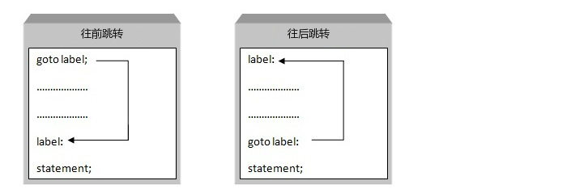

# C语法基础-程序流程控制有三大结构(顺序结构&选择结构&**循环结构**)   水仙花，九九乘法表，冒泡排序

## 一 课程介绍

-  程序流程控制有三大结构概述（了解）
-  选择结构if（掌握）
-  选择结构switch（掌握）
-  循环结构while【掌握】
-  循环结构do-while【掌握】
-  循环结构for【重点掌握】
-  goto
-  循环控制语句【掌握】  continue,break,return

## 二 程序流程控制有三大结构概述

​	在计算机，我们需要控制多句代码执行顺序的。此时就需要流程控制，在c中主要支持以下三种流程控制。

1. 顺序结构：按照顺序从上至下逐行进行执行

2.  选择结构：选择结构用于判断给定的条件，根据判断的结果判断某些条件，根据判断的结果来控制程序的流程。

3. 循环结构：进行循环执行的。

    其他我们前面讲的代码，就是按照写代码的顺序执行的，也就是说三大结构中，我们已经学过一个了，接下来我们就学习选择结构和循环结构

## 三  选择结构

​	选择结构用于判断给定的条件，如果添加满足才执行来控制程序的流程。主要有两大类if和switch

### 2.1 **if选择结构**

#### 2.1.1 **基本的if结构**

 **基本语法：**

```java
if(判断条件){
   执行语句;
}			
```

  判断条件:  布尔类型的值或者表达式   非0（true） 0（false）

  执行语句：当条件满足时执行（可以是一条语句，也可以是一组语句）

​	示例：

```java
//判断一个成绩分数 如果成绩分数大于90 输出  优秀
		//定义成绩
        int  score = 98;
		//判断成绩是否满足
        if(score>=90){
            printf("优秀");
        } 
```

```c
#include <stdio.h>
#include<stdbool.h>

int main(int argc, char const *argv[])
{
    //1 If(bool值){   }  可以是bool常量，可以是变量，可以是表达式
    // bool常量
    if (2)
    {
        printf("条件满足，执行了1。。。。\n");
    }

       if (true)
    {
        printf("条件满足，执行了2。。。。\n");
    }

    //变量
    int i = 2;
      if (i)
    {
        printf("条件满足，执行了3。。。。\n");
    }

    bool j = true;
       if (j)
    {
        printf("条件满足，执行了4。。。。\n");
    }

     int k = 3;
    if (!(++k<3 && --k<4))

    {
      printf("条件满足，执行了5。。。。\n");
    }
    


    
    return 0;
}

```


#### 2.1.2 **if ...else结构**       a>b?a:b;

  **基本语法**：

```java
if(判断条件){
	执行语句;
}else{
	执行语句;
}		
```

​	 判断条件:  布尔类型的值或者表达式

 	执行语句：当条件满足时执行if中的语句  其他情况执行else中的语句

示例：

```c

 // 判断一个成绩分数 如果成绩分数大于90 输出  优秀 其它输出  继续努力

		//定义成绩
        int  score = 68;
		//判断成绩是否满足
        if(score>=90){
            printf("优秀");
        }else{
            printf("继续努力");
        }	
```

#### 2.1.3 **if...else if结构**

**基本语法**：

```java
if(判断条件){
	执行语句;
}else if(判断条件){	
	 执行语句;
}else if(判断条件){
	执行语句;
}else{
    
}
```

​	判断条件:  布尔类型的值或者表达式

​    执行语句：所有条件只能满足一个 条件互斥 因此执行语句只能有一条被执行到

示例：

```c

// 判断一个成绩分数 如果成绩分数大于90 输出  优秀 80~90良好  70~80中等  60~70  及格

		//定义成绩
        int  score = 68;
		//判断成绩是否满足
        if(score>90){
            printf("优秀");
        }else if(score>80&&score<=90){
            printf("良好");
        }else if(score>70&&score<=80){
            printf("中等");
        }else if(score>60&&score<=70){
            printf("及格");
        }
```


 

#### 2.1.4 **if...else if...else结构**

**基本语法**：

```java
if(判断条件){
	执行语句;
}else if(判断条件){	
	 执行语句;
}.....else if(判断条件){
	执行语句;
}else{
	执行条件;
}		
```

​	判断条件:  布尔类型的值或者表达式

​    执行语句：所有条件只能满足一个 条件互斥 因此执行语句只能有一条被执行到  如果条件都不满足 则执行else中的语句。

示例:

```c
/*
   判断一个成绩分数 如果成绩分数大于90 输出  优秀 80~90良好  70~80中等  60~70  及格  其他的输出  需要	好好加油啦
*/
		//定义成绩
        int  score = 68;
		//判断成绩是否满足
        if(score>90){
            printf("优秀");
        }else if(score>80&&score<=90){
            printf("良好");
        }else if(score>70&&score<=80){
            printf("中等");
        }else if(score>60&&score<=70){
            printf("及格");
        }else{   
            printf("继续加油啦");
        }
```


#### 2.1.5 **特例**

1. 如果 if或else的执行语句只有一句执行语句 花括号可省略。

```c

 // 判断一个成绩分数 如果成绩分数大于90 输出  优秀 其它输出  继续努力

		//定义成绩
        int  score = 68;
		//判断成绩是否满足
        if(score>=90) printf("优秀");
        else printf("继续努力");
```


  2.if条件后可以需要花括号  但需要分号做结束标志 没有实际意义。

​		if(true);

#### 2.1.6 **练习**

1.求出2个变量中的最大值  if(a>=b){ a}else{b}

2.判断一个数是否是3的倍数 a%3==0

3.小明c 考试成绩 按等级分A B C D ，判断变量值在不同的范围的，打印输出不同的等级  if else if else if elese

90~100  A等。

80-89   B等。

70-79   C等。

60-69   D等。

60以下  E等。

### 3. **Swtich 选择结构**

**基本语法：**

```c
switch(key){
	 case  v1: 
		执行语句;
		break;
 	 case  v2: 
		执行语句;
		break;
................
 	default: 
		执行语句;
		break;
}
```

**key：** 限定类型的局部变量或常量


执行原理：

​	将key的值与case中列举的值进行匹配  如果匹配 执行 执行语句 **找到break**  跳出选择结构  如果都没有匹配上的值 则执行default中的执行语句，找到break 跳出选择结构；

示例:

```c
/*
	一周 七天   星期一到星期六上班  星期天休息
*/
        int number = 7;
        switch (number) {
            case 1:
                printf("上班");
                break;
            case 2:
                printf("上班");
                break;
            case 3:
                printf("上班");
                break;
            case 4:
                printf("上班");
                break;
            case 5:
                printf("上班");
                break;
            case 6:
                printf("上班");
                break;
            default:
                printf("今天不用上班，休息");
                break;
        }
```


注意事项： 

1. 每个case之间顺序可以交换 不影响代码运行
2. default不一定放在末尾 在所有case失效的时候就会被执行到
3. ​	case中值与 key类型必须一致
4. 最后一个break可以省略，但不建议
5. break可以省略，但会导致后续case条件判断失效 按照从上到下顺序 直到找到第一个break跳出选择结构 如果没有找到  执行到末尾 自动跳出选择结构
6.  //1/匹配到条件，执行case遇到break退出，
         //如果没有break，从上到下执行case，直到遇到break
         //2. 没有匹配到条件执行default遇到break退出，一个都没有匹配上执行到最后结束。
         //如果没有break，从上到下执行case，直到遇到break，一个都没有匹配上执行到最后结束。

 

## 四 循环结构

### **4.1 循环定义**

​	定义：循环是计算机科学运算领域的用语，也是一种常见的控制流程。循环是一段在程序中只出现一次，但可能会连续运行多次的代码。循环中的代码会运行特定的次数，或者是运行到特定条件成立时结束循环，或者是针对某一集合中的所有项目都运行一次。

​	**可以理解位重复的去执行某件事情，但需要有一个终止条件，否则会形成死循环，导致内存溢出;**

### **4.2 循环分类**

#### **4.2.1 while循环**

**基本语法：**

while(循环条件){

​	执行语句;

}

**循环条件：**布尔类型的值或者表达式,需要不断变化，如果是一个常量或者固定不变的值，则称为没有意义的循环或者死循环;

*\*执行语句：当循环条件为true时执行语句，false终止循环，不执行语句

*\*执行流程：

 1) 第一次判断条件true，继续执行

2) 第二次判断条件true，继续执行

3) 第三次判断条件true，继续执行

4) 。。。。。

5) 直到第n次判断条件false，终止循环

示例：

```c
/*打印1到10之间的数字*/
int i = 1;
while(i<11){
    printf(i);
    i++;
}
---------------------------------
/*打印1到10之间的偶数*/
int j = 1;
while(i<11){
    if(j%2==0){
        printf(j);
    }
    j++;
}
```


 

#### **4.2.2 do...while循环**

基本语法:

do{

 执行语句；

}while(循环条件);

 

**循环条件：**布尔类型的值或者表达式,需要不断变化，如果是一个常量或者固定不变的值，则称为没有意义的循环或者死循环;

 

**执行语句：**当循环条件为true时执行语句，false终止循环，不执行语句

**执行流程：**

1. 首先执行do后面结构体中的执行语句

2. 判断循环条件是否为true，如果true，执行do后执行语句，如果为false终止循环

示例:

```c
/*打印1到10之间的数字*/
int i =1;
do{
    printf(i);
    i++;
}while(i<11);
```


练习:

1.求出10以内2的倍数的数字 和 个数。

​    int i = 1;

   int sum = 0;

​	while(i<=10){

​     if(i%2==0){

​	sum ++; //sum = sum+1;

​    }

 }

2.求出 1-10的所有偶数的和

#### **4.2.3 for循环**

基本语法：

for(初始化条件A;判断条件B;循环后语句C){

​	 执行语句D;

}

初始化条件A：初始化一个值，用来作为B中的判断条件

判断条件B：布尔类型的值或者表达式

执行语句D：当B中的判断条件满足，为true执行D，false，则不执行

循环后语句C：循环后执行的代码，目的是为了改变初始条件A的值，使B中条件不是一个固定的值 


执行流程：

​		 第一次：A--》B(true)--》D--》C

​		 第二次：   B(true)--》D--》C

​		 第三次：   B(true)--》D--》C

​			…

​		 第n次：   B(false)  结束整个循环

示例：

```c
/*打印1到10之间的数字*/
for(int i=1;i<11;i++){
    printf(i);
}
```


注意事项：

**1.** 特殊写法：

```c
//死循环
for(;;){
    printf("Hello");
}
```


**2.** 初始条件中变量的作用域

```c
/*打印1到10之间的数字*/
for(int i=1;i<11;i++){
    printf(i);
}
printf(i);//报错，i只作用于循环结构体中
```


练习:

**1.** 用for循环计算1-10的 积(即10的阶乘)1\*2\*3\*。。。10

**2.** 以下两个示例中 最后i的值是多少 判断执行了几次 循环几次 代码的最终的输出结果是多少？

```c
1.
for(int i = 1;i<=10;i+=2){ 1 3 5 7 9
	printf("i="+i);
}
-------------------------------------------
2.

for(int j = 1;j++<=10;j+=2){ //1(2) 4(5) 7(8) 10(11)
	printf("j="+j);
}
```


嵌套for循环

```c
#include <stdio.h>
int main(int argc, char const *argv[])
{
   /*1
   1 2
   1 2 3 
   ....
   1 2 3 ..9*/
   for (int i = 1; i <= 9; i++) //控制行
   {
        for (int j = 1; j <=i; j++) 
        {
            if (i==j)  //是最后一个就回车
            {
                printf("%d\n",j);
            }else{ //不是最后一个加上空格
                printf("%d ",j);
            }
        } 
  
   }
   
    return 0;
}

```


### 4.4 goto

C 语言中的 **goto** 语句允许把控制无条件转移到同一函数内的**被标记的语句**。

**注意：**在任何编程语言中，都不建议使用 goto 语句。因为它使得程序的控制流难以跟踪，使程序难以理解和难以修改。任何使用 goto 语句的程序可以改写成不需要使用 goto 语句的写法。



```c
#include <stdio.h>
int main(int argc, char const *argv[])
{
    //通过go实现循环  1+2+3+...+10
    //定义一坨语句
    int i = 1;
    int sum =  0;

    sum_state:  //定义一个语句块，名字随便取
        sum =  sum +i; 
        i++;

    //如果满足条件就跳转，可以让他多次跳转就形成循环了。  最终要跳出
    if (i<=10)
    {
       goto sum_state; //跳转执行语句
    }
    

    printf("%d,%d",i,sum);

    return 0;
}

```


### **4.5 循环控制语句**

#### **4.5.1 定义**

对整个循环流程进行控制，可提前终止或跳出循环。 break，continue，goto,return

#### **4.5.2 控制语句分类**

##### **4.5.2.1 break**

作用：终止当前循环

示例：

```c
/*  一个循环 如果循环中出现了6 则终止循环 后面的也不再执行*/
for(int i=1;i<8;i++){
    if(i==6){
      break;
	}
    printf(i);
}
```

##### **4.5.2.2 continue**

作用：跳出当前循环

示例：

```c
/*  一个循环 如果循环中出现了6 则跳过循环 后面的继续执行*/
for(int i=1;i<8;i++){
    if(i==6){
        continue;
    }
    printf(i);
}
```


 

##### **4.5.2.3 return**

作用：终止当前方法

示例：

```c
/*  一个循环 如果循环中出现了6  终止当前的方法 后面的循环也不会被执行 循环外面的语句也不会被执行到*/
for(int i=1;i<8;i++){
    if(i==6){
        return;
    }
    printf(i);
}
printf("www.ronghuanet.cn");
```


```c
#include <stdio.h>
int main(int argc, char const *argv[])
{
    for (int i = 0; i < 10; i++)
    {
          printf("%d ",i);
        //干预循环 6的时候结束
        if (i==6)
        {
            break; //中断，跳出本循环
        }
           
    }
    printf("\n==================\n ");
     for (int i = 0; i < 10; i++)
    {
        //干预循环 6的时候不执行
        if (i==6)
        {
            continue; //跳出这个循环本次执行情况
        }
        printf("%d ",i);    
    }
  printf("\n==================\n ");
  /*
    for (int i = 0; i < 10; i++)
    {
          printf("%d ",i);
        //干预循环 6的时候结束
        if (i==6)
        {
            return 0; //函数返回了，函数都结束了，里面for自然结束了。
        }
           
    }
    */
 printf("\n==================\n ");
 for (int i = 1; i <=9; i++)
 {
    for (int j = 1; j <=i; j++)
    {
        if (i==6)
        {
           return 0;  //break和return都能中断循环，有区别break是中断本循环，外层循环或者循环外的后续代码要执行。retrun外层循环和循环外的后续代码都不执行了
        }
        
        if (i==j)  //是最后一个就回车
        {
            printf("%d\n",j);
        }else{ //不是最后一个加上空格
            printf("%d ",j);
        }
    }
    
 }
 
    
}

```


**4.5.2.4 goto**

```c
#include <stdio.h>
int main(int argc, char const *argv[])
{
    for (int i = 0; i < 10; i++)
    {
          printf("%d ",i);
        //干预循环 6的时候结束
        if (i==6)
        {
           goto g_stat;
        }
           
    }

    g_stat:
        printf("跳出循环了！");

    
}
```

```c
#include <stdio.h>
 
int main ()
{
   /* 局部变量定义 */
   int a = 10;
 
   /* do 循环执行 */
   LOOP:do
   {
      if( a == 15)
      {
         /* 跳过迭代 continue*/
         a = a + 1;
         goto LOOP;
      }
      printf("a 的值： %d\n", a);
      a++;
     
   }while( a < 20 );
 
   return 0;
}
```


## **5.课程总结**

今天所学知识均为c课程中，非常常用的结构，在日后的工作中需要用到所学结构来处理相关逻辑问题，特别重要。切记每天负债，每天的知识及时消化吸收。

### **5.1 重点**

for循环结构 

### **5.2 难点**

for循环结构的执行流程 嵌套循环

## 6. **课后练习**

 

1. 今天所有的课堂代码 5个

2. 求出20以内3的倍数的数字和个数。

3. 10到30之间所有奇数的和（用for实现）。

   for (int i = 10; i < 30; i++)

4. 分析以下程序运行结果。

```java
A：
int x=1,y=1;
if(x++ == 2 && ++y==2){//false
   x=7;
}
printf("x="+x+",y="+y);
----------------------------------------------
B：
int x=1,y=1;
if(x++==1 || ++y==1){
  x=7;
}

printf("x="+x+",y="+y);
```


6. 用if-else语句判断一个数是奇数还是偶数。

   

7. 用if-else if else实现通过变量age的值判断，如果age小于18打印“父母负责”，age大于等于18并且小于60打印自己负责，age大于登录60大于“子女负责”

 

8. 分析以下代码最终结果（请勿拷贝值程序中运行）

```java
A. 
int x=2,y=3;
switch(x){
	default:y++;
	case 3:y++;break;
	case 4:y++;
}
printf("y="+y);
--------------------------------------------------
B.
#include <stdio.h>
int main(int argc, char const *argv[])
{
   int i = 10, j = 18, k = 30; 
   switch (j - i) { 
      case 8: k++; 
      case 9: k += 2; 
      case 10: k += 3; 
      default: k /= j;    //上面都没有break，要执行的
      printf("%d",k); 
   }

    return 0;
}

---------------------------------------------------
c.
switch (5) {  
	default:  print(5);   
	case 0:   print(0);  
	case 1:   print(1);  break;  
	case 2:   print(2);   break; 
}
```

- **求1-5的 的阶乘和(1!+2!+3!+4!+5!)（用for实现）**

- 九九乘法表

- 扩展： **自己在菜鸟，看一下数组入门，做冒泡排序！**   数组入门+算法+双for

  


## 7. **面试题**

return continue break三者的区别是什么？

## **8. 扩展知识与课外阅读推荐**

## **9. 每日一练**