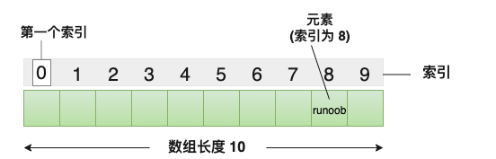
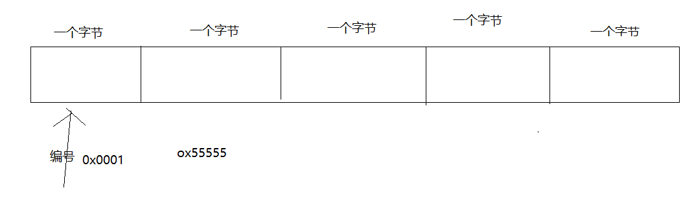
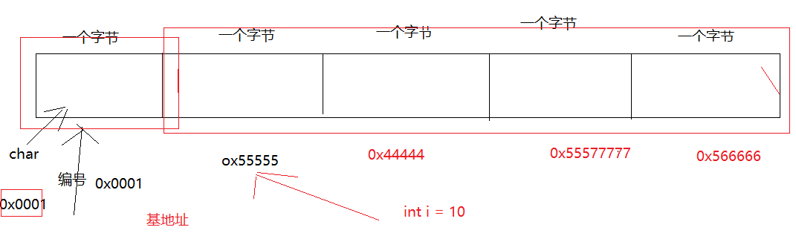
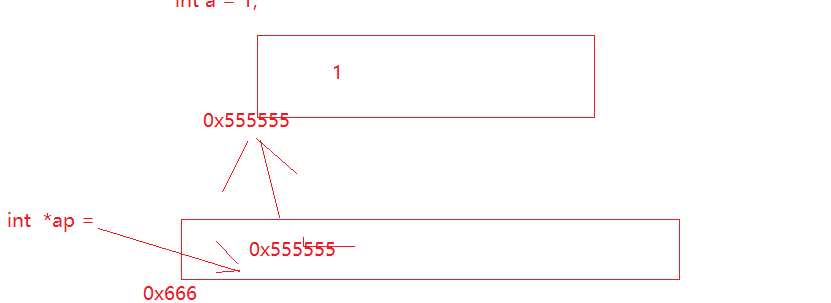
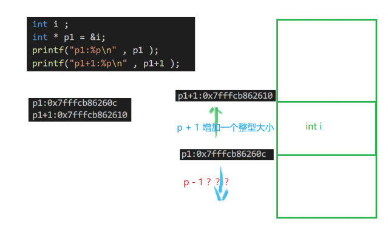
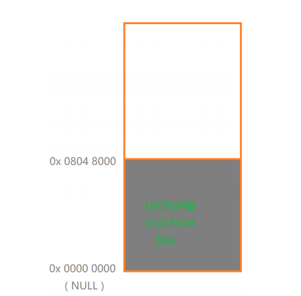
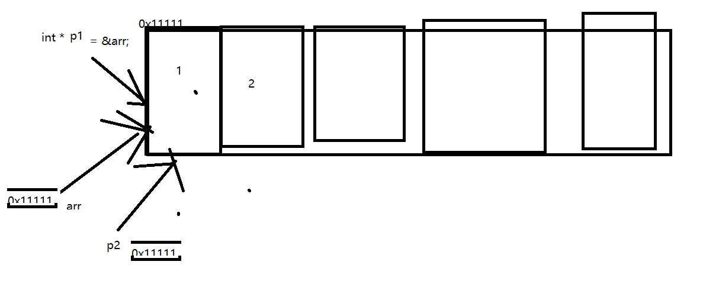

#  c语法基础-数组&字符串

## 一 课程简介

- 数组基础（重要）
- 字符数组与字符串（重要）
- 指针基础（重要）
- 指针与数组整合（重要）

## 二 数组基础

### 1 是什么？

C 语言支持**数组**数据结构，它可以存储一个固定大小的**相同类型**元素的**顺序集合**。数组是用来存储一系列数据，但它往往被认为是一系列相同类型的变量。



### 2 声明

在 C 中要声明一个数组，需要指定元素的类型和元素的数量，如下所示：

```c
type arrayName [ arraySize ];
```

这叫做一维数组。**arraySize** 必须是一个大于零的整数常量，**type** 可以是任意有效的 C 数据类型。例如，要声明一个类型为 double 的包含 10 个元素的数组 **balance**，声明语句如下：

```c
double balance[10];
```

现在 *balance* 是一个可用的数组，可以容纳 10 个类型为 double 的数字。

### 3 初始化  重点

一个一个的初始化

```c
#include <stdio.h>
int main(int argc, char const *argv[])
{
    // 一次性定义多个相同类型的变量，并且给他分配一片连续的内存
    //1 声明  type arr_name[size]
    int  ages[5]; //数组的索引是从0开始
    //2 初始化  一个一个的初始化：数组名[下标] = 值；
    ages[0] = 1;
    ages[1] = 2;
    ages[2] = 3;
    ages[3] = 4;
    ages[4] = 5;

   //3 获取数组元素: 数组名[下标]  ,如果超过定义的空间，随机返回了一个数回来
    printf("%d\n",ages[0]);
    printf("%d\n",ages[4]);
    printf("%d\n",ages[8]);


    return 0;
}

```


一把初始化很多

```c
#include <stdio.h>
int main(int argc, char const *argv[])
{
    // 一次性定义多个相同类型的变量，并且给他分配一片连续的内存
    //1 声明  type arr_name[size]
    //   //声明的同时可以使用初始化语句，一下初始化很多元素,如果你没有赋值以对应初始值来填充
   // int  ages[5]; //只什么未初始化，如果强行获取值，拿不到真实的值
    //int  ages[5] = {}; 
    // int  ages[5] = {1,2,3,4,5};  //全部元素初始化   用得多
    //int  ages[5] = {1,2,3}; //如果只赋值一部分，剩余的以默认初始值填充
   //int  ages[5] = {1,2,3,4,5,6,7};   //赋值多了，后面的给你忽略了
   //int  ages[] = {1,2,3,4,5,6,7};  //根据赋值来计算前面的长度。用得多
   //int length = sizeof(ages)/sizeof(ages[0]);  //能放多少个元素
       //printf("%d\n",length);

    // int  ages[];  //报错
   //3 获取数组元素: 数组名[下标]  ,如果超过定义的空间，随机返回了一个数回来
    printf("%d\n",ages[0]);
    printf("%d\n",ages[4]);
    printf("%d\n",ages[6]);


    return 0;
}

```


### 4 操作 重点

- 赋值

  arrary_name[下标] = 值； //值的类型要和数组的类型匹配，当然如果匹配不上，会自动转换类匹配。

- 取值

  arrary_name[下标] 

- 计算数组长度

  int length =  sizeof(arrayname)/ sizeof(arrayname[0]);

- 遍历数组： 从0.1,2.。。。length 全部取出来

  ```c
  #include <stdio.h>
  int main(int argc, char const *argv[])
  {
      //1 声明数组并初始化
      int  ages[] = {1,2,3,4,5,6,7,8};  //根据赋值来计算前面的长度。用得多
      // 2 遍历数组
      //for (int i = 0; i < 7; i++) //不能写死数组长度
      int length = sizeof(ages) / sizeof(ages[0]);
      for (int i = 0; i < length; i++)
      {
              printf("index=%d,elment value=%d\n",i,ages[i]);
      }
      return 0;
  }
  
  ```

  

  

## 三 字符数据与字符串

### 1 字符数组

```c
#include <stdio.h>
int main(int argc, char const *argv[])
{
    // 1 字符数组:可以一个一个的字符赋值给字符数据
    //char names[] = {'z','h','a','n','g','s','a','n'};
   //printf("%d\n", sizeof(names) /sizeof(names[0]));
   
   printf("%c\n",names[1]);
    return 0;
}

```

### 2 字符串

在 C 语言中，字符串实际上是使用空字符 **\0** 结尾的一维字符数组。因此，**\0** 是用于标记字符串的结束。

**空字符（Null character**）又称结束符，缩写 **NUL**，是一个数值为 **0** 的控制字符，**\0** 是转义字符，意思是告诉编译器，这不是字符 **0**，而是空字符。

```c
#include <stdio.h>
int main(int argc, char const *argv[])
{
    // 1 字符数组： 把整个字符串赋值给字符数据。会按照顺序来存储。并且最后以空字符 **\0** 结尾
    //char names[] = {"zhangsan"};
     char names[] = "zhangsan";
     printf("%d\n", sizeof(names) /sizeof(names[0]));
   printf("%c\n",names[1]);
    return 0;
}

```


## 四 指针基础

### 1 内存地址

#### 1.1 基地址

地址： 系统位了方便区分每一个字节的数据， 而对内存进行了逐一编号， 而该编号就是内存地址。




 基地址（首地址）:  **平时获取到的地址就是该数据在内存中存放的数据的首地址或者基地址。**

单字节的数据： char 它所在地址的编号就是该数据的地址

多字节的数据：int 它拥有4个连续的地址的编号 ， 其中地址值最小的称为该变量的地址




#### 1.2 取地址符

每一个变量其实都对应了一片内存， 因此都可以通过 & 取地址符号把其地址获得。

```c
#include <stdio.h>
int main(int argc, char const *argv[])
{
    
    char  a = 'a';
    int b = 1;

    //可以通过&变量名获取该变量值的地址。
    printf("a的基地址为：%p\n",&a);
    printf("b的基地址为：%p\n",&b);
    return 0;
}
```

- 虽然不同的数据类型所占用的内存空间不同， 但是他们的地址所占用的内

  存空间（地址的大小= 指针的大小）是恒定的， 由系统的位数来决定 32位 / 64位---存放的是基地址的编号

- 不同的地址他从表面上看似乎没有什么差别，但是由他们所代表的内存的尺寸是不一样的（由内存中所存放的数据类型相关），因此我们在访问这些地址的时候需要严格区分它们的逻辑关系。

### 2 指针的基础

#### 2.1 概念

指针的概念：

&a 就是a的地址（编号） ， 实质上也可以理解为他是一个 指向 a数据的存放的内存区域地址编号。

我们可以定义一个指针，把这个地址赋值给它，那么我们定义指针的值那个地址编号。指向的就是那个变量的值的资质。一个地址编号是恒定的由系统确定，不会应该数据类型不一样而改变。

#### 2.2 声明指针并赋值

- 语法  

  type *name =  地址；

​      *表示指针类型，name表示这个指针变量的名字，type是指针所对应数据的类型

```c++
#include <stdio.h>
int main(int argc, char const *argv[])
{
    int a = 1;
    //&a//a变量所对应数据的地址
   int  *ap = &a;  //申明指针并初始化

   float f = 1;
   float  *fp = &f; //申明指针并初始化
 
   double d;
   double * dp; //申明指针没有初始化
   dp = &d ; //初始化

    return 0;
}

```





#### 2.3 操作

##### 2.3.1 通过指针操作数据

*p =2;--p=&b

*p    %p,p

```c
    int a = 1;
    //&a//a变量所对应数据的地址
   int  *ap = &a;  //申明指针并初始化

  //ap = 200; //表示修改内存地址
  *ap = 200;//该地址里面存放空间存储的值
    printf("%d\n",*ap); //获取指针所对应存储空间里面存的值。
```


##### 2.3.2 **指针运算**

指针的加法：意味着地址向上移动若干个目标 （指针的类型）

指针的减法：意味着地址向下移动若干个目标 （指针的类型）



```c
 printf("=================\n");
    int aa=1;
    int *p1 = &aa;
    int bb=2;
    int *p2 = &bb;
    printf("p1:%p\n",p1);
    printf("p1+1:%p\n,%d\n",p1+1,*(p1+1));  //如果前后是相同的类型可以通过p1+1获取值，否则获取不到
    printf("p2:%p\n",p2);
    printf("p2+1:%p\n",p2+1);
```


#### 2.4 两种特征指针

##### 2.4.1 野指针

概念： 指向一块未知内存的指针， 被称为野指针。

int * p ;

- 危害：引用野指针的时候，很大概率我们会访问到一个非法内存，通常会出现段错

误（Segmentation fault (core dumped)）并导致程序崩溃。

更加严重的后果，如果访问的时系统关键的数据，则有可能造成系统崩溃

- 产生原因：

  定义时没有对他进行初始化

  指向的内存被释放，系统已经回收， 后该指针并没有重新初始化

指针越界

- 如何防止：

定义时记得对他进行初始化

绝对不去访问被回收的内存地址， 当我们释放之后应该重新初始化该指针。确认所申请的内存的大小，谨防越界

##### 2.4.2 空指针

在很多的情况下我们一开始还不确定一个指针需要指向哪里，因此可以让该指针先指向

一个不会破坏系统关键数据的位置， 而这个位置一般就是NULL （空）。因此指向该地址

的指针都称之为空指针




```c
#include <stdio.h>
int main(int argc, char const *argv[])
{
    //int *a; //野指针 避免野指针就是要给他赋值。 但是定义的时候还不知道。
    //可以定义null指针
    int *a =NULL; //0x00000,是一个不存在的地址。

    //*a = 200;//不能赋值

    //后面确定了就可以给他赋值
    int b = 1;
    a = &b;
    *a = 200;
     printf("%d\n",*a);
    return 0;
}
```


#### 3 总结

​    **声明并初始化**

   **通过指针设置值和获取值。**


## 五 指针与数组结合(有难度)

### 1 数组元素的指针 int * p

#### 1.1 直接赋值数据  就相当于把0号元素地址给他

```c
#include <stdio.h>
int main(int argc, char const *argv[])
{
    int arr[] = {1,2,3,4,5};  //数组是有地址,是第一个元素地址
    int *p1 = &arr; //gcc一些高版本会报错，用下面的这种就OK
    int *p2 = arr;  //数组变量本身值地址，其实就是第0个元素地址。数组变量本身就是一种指针。
    
    /**
     *  printf("%p\n",p1);
    */
    printf("%p\n",p1);
     printf("%p\n",p2);
    printf("%d\n",*p1);
     printf("%d\n",*p2);
    printf("%d\n",*(p1+1));
     printf("%d\n",*(p2+1));

    return 0;
}

```





#### 1.2 直接赋值某个元素的地址给他

```c
#include <stdio.h>
int main(int argc, char const *argv[])
{
    int arr[] = {1,2,3,4,5};  //数组是有地址,是第一个元素地址
    int *p1 = &arr[0];  //虽然可以a执行其他元素但是不建议
 
    
    /**
     *  printf("%p\n",p1);
    */
    printf("%p\n",p1);

    printf("%d\n",*p1);
    printf("%d\n",*(p1+1));

    return 0;
}

```

以上代码是通过指针p1 来访问数组中的元素。

一开始定义p1并初始化让指针p1指向数组中第0个元素的地址。

当我们使用p2 进行指针加减运算的时候 ，由于指针是整型的，可以访问到数组中的下一个

元素以及上一个元素。


### 2 数组的指针 int (*p)[]

​    指向数组的指针

   type *p [];

```c 
#include <stdio.h>
int main(int argc, char const *argv[])
{
    int * p1 ;  //这个指针指向一个int的类型
    int (*p2) [];//这个指针指向一个数组

    int arr[] = {1,2,3,4,5};
    p2 = arr;
    printf("%p\n",&arr);
     printf("%p,%d\n",p2,(*p2)[2]);
    // printf("%p,%d\n",p2+1,(*(p2+1))[2]);  //向上移动一个数组
    return 0;
}

```


### 3 指针数组 int * p[]

```
int[] int类型的数组，里面元素是int。
int (*p)[] ：  (*p)是指针，类型是int[],指向数组的指针
int * p[]： p[] 是数组，类型是int *.指针数组，数组元素是int指针
```

```c
#include <stdio.h>
int main(int argc, char const *argv[])
{
    int a = 1;
    int b =2;
    int * p[] = {&a,&b}; //p[]表示数组,里面是int类型指针，放int数据的地址。


   // p[0]是一个地址  *p[0]获取地址所对应值
    printf("%p,%d\n",p[0],*p[0]);
}

```


## 六.课程总结


### **1 重点**


### **2 难点**


## 七. **课后练习**

 


## 八. **面试题**


## **九. 扩展知识与课外阅读推荐**

## **十. 每日一练**