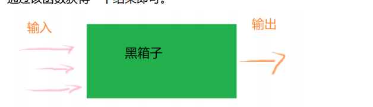
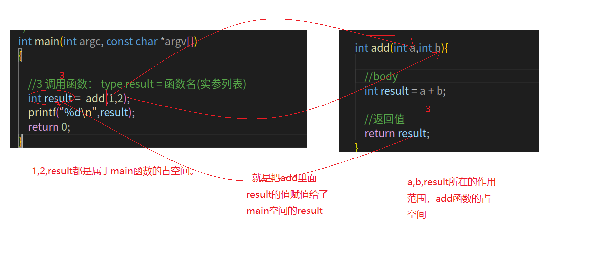
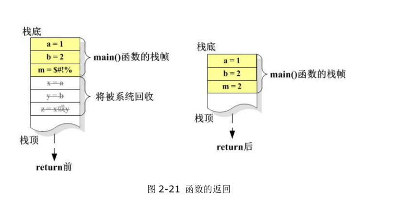
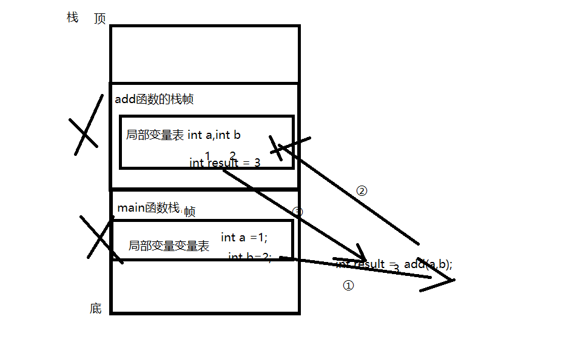
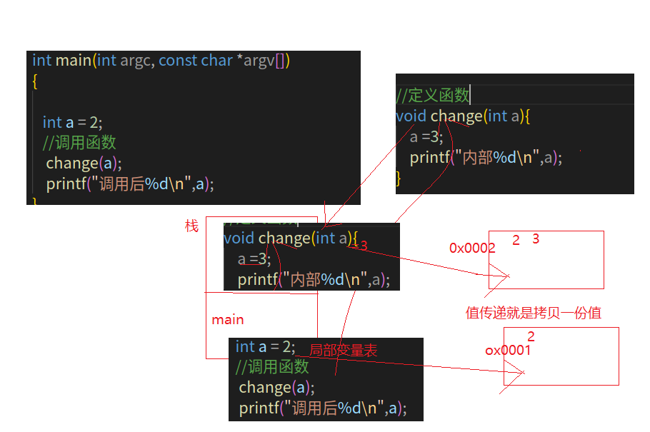
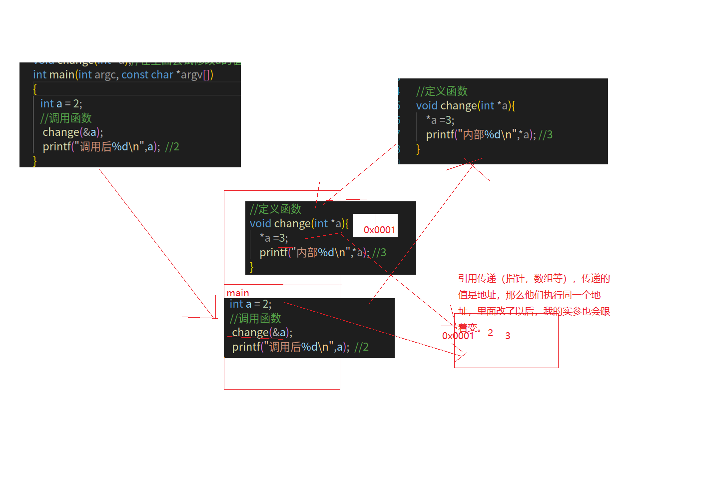
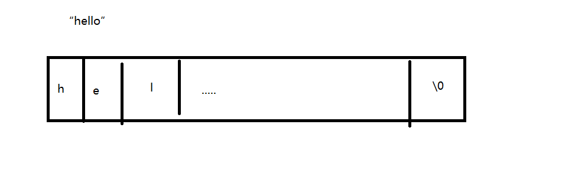
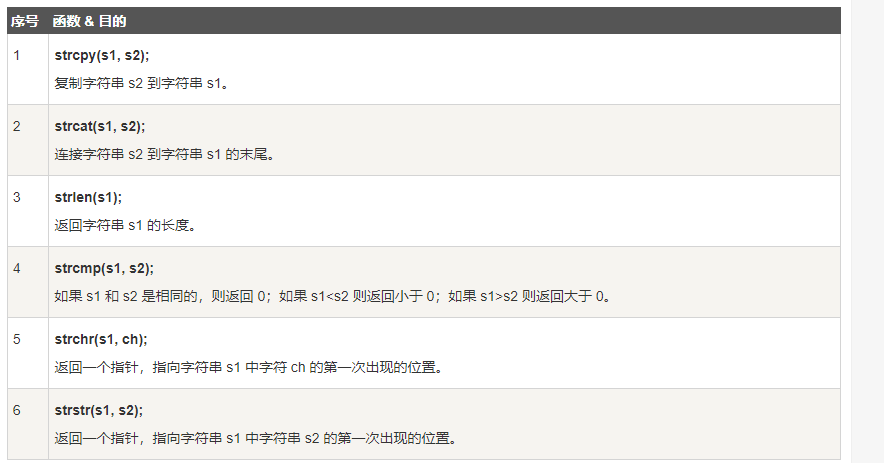

# c语法基础-函数基础&字符串函数&结构体

## 一 课程简介

- 函数基础（重要）定义 调用 值传递 指针传递
- 常用函数-printf sizeof 
- 常用函数-字符串函数（重要）
- 结构体（重要）

## 二 函数基础

### 1 为什么需要函数

#### 1.1 封装性

​      把多个地方需要调用的代码封装起来，其他地方调用一下就OK。  没有太多重复代码。

#### 1.2 模块化

​	通过函数进行模块化的编程。     是一个黑盒子，调用它以后能干嘛。里面具体怎么做的我不关心。

高内聚，低耦合。----不要调用太多全局变量。 



### 2 定义与声明

#### 2.1 定义

C 语言中的函数定义的一般形式如下：

```c
return_type function_name( parameter list )
{
   body of the function
   return 返回值；
}
```

在 C 语言中，函数由一个函数头和一个函数主体组成。下面列出一个函数的所有组成部分：

- **返回类型：**一个函数可以返回一个值。**return_type** 是函数返回的值的数据类型。有些函数执行所需的操作而不返回值，在这种情况下，return_type 是关键字 **void**。
- **函数名称：**这是函数的实际名称。函数名和参数列表一起构成了函数签名。
- **参数：**参数就像是占位符。当函数被调用时，您向参数传递一个值，这个值被称为实际参数。参数列表包括函数参数的类型、顺序、数量。参数是可选的，也就是说，函数可能不包含参数。
- **函数主体：**函数主体包含一组定义函数执行任务的语句。

#### 2.2  声明

函数**声明**会告诉编译器函数名称及如何调用函数。函数的实际主体可以单独定义。

函数声明包括以下几个部分：

```c
return_type function_name( parameter list );
```

### 3 调用（重要，好好理解）

#### 3.1 基础语法

创建 C 函数时，会定义函数做什么，然后通过调用函数来完成已定义的任务。

当程序调用函数时，程序控制权会转移给被调用的函数。被调用的函数执行已定义的任务，当函数的返回语句被执行时，或到达函数的结束括号时，会把程序控制权交还给主程序。

调用函数时，传递所需参数，如果函数返回一个值，则可以存储返回值。

 **type result = 函数名(实参列表);**

```c
#include <stdio.h>

//2申明函数：去掉函数的实现
int add(int a,int b);
/*

main函数也是一个特殊的函数（程序的入口），也遵循
 函数定义的规则。
 一般情况我们函数都要自己调用，但是main不会自己调用，会在程序执行的时候自动调用
*/
int main(int argc, const char *argv[])
{  //1,2在main函数的栈空间

    //3 调用函数： type result = 函数名(实参列表)
    int result =  add(1,2);
    printf("%d\n",result);
    return 0;
}

//1 定义函数
/*
return_type function_name( parameter list )
{
   body of the function
   return 返回值；
}

1 函数名是一个标识符 ，一般必须得有，后续要调用
     只能是数字字母加上下划线，首字母不能是数组，多个单词用下划线分隔。
2 参数列表（形参）：可以没有参数，也可以是一个或者多个
3 返回值： 通过return，返回值要和return_type
*/

int add(int a,int b){

    // a,b变量在add函数的栈空间
    //body
    int result = a + b;

    //返回值
    return result;
}

```

#### 3.2 形参与实参

概念：

​	函数调用的时候传递的值，称为实参 max(123.034 , 'C' , "87") ;

​	函数定义当中出现的参数列表，称为形参 max(float a , char b , char * c)

实参与形参的关系：

​	实参与形参应该是一一对应的。(顺序+类型)

​	形参的值是由实参进行初始化。

​	形参与实参是处于两个完全不相关的栈空间中。彼此是独立的

#### 3.3 调用细节




**局部变量与栈内存：**

**局部变量：** 被函数体的一对大括号所包含的变量，称为局部变量（在函数体内部定义）

**局部变量的特点：**

​	属于函数内部的变量， 所存储的位置是该函数所拥有的栈空间，

​	局部变量不会被其它函数所访问，因此不同的函数内部可以拥有完全一样的两个变量名字， 但是从内存来看它们是完全独立的。

​	当函数退出的时候， 局部变量所占用的内存，将会被系统回收，因此局部变量也称为临时变量。

​     形参当中的变量，虽然没有在大括号的范围内， 但是也是属于该函数的局部变量。

**栈内存的特点：**

​	当有一个函数被调用的时候，栈内存将会增长一段， 用来存放该函数的局部变量。

​	当函数退出时，他所占用的栈内存将会被释放回收。

​	系统分配栈空间遵循从上往下增长的原则。

​	栈空间的内存相对来说比较少， 不建议用来存放大量的数据





### 4 值传递与引用传递（重要，好好理解）

#### 4.1 值传递

​      基础数据类型传递参数使用的是值传递。其实就是把实参的值拷贝一份赋值给形参数。


```c
#include <stdio.h>
//1 值传递，不会实参的值
//申明函数
void change(int a);//在里面尝试修改a的值
int main(int argc, const char *argv[])
{

   int a = 2;
   //调用函数
    change(a);
    printf("调用后%d\n",a);  //2
}

//定义函数
void change(int a){
    a =3;
    printf("内部%d\n",a); //3
}

```





#### 4.2 引用传递

​    像指针，数组等有引用地址的传递的时候，会修改值。其形参和实参数指向的是同一个东西。

```c
#include <stdio.h>
//1 值传递，会实改参的值
//申明函数
void change(int *a);//在里面尝试修改a的值
int main(int argc, const char *argv[])
{
   int a = 2;
   //调用函数
    change(&a);
    printf("调用后%d\n",a);  //3
}

//定义函数
void change(int *a){
    *a =3;
    printf("内部%d\n",*a); //3
}

```




#### 4.3 小结

c中函数调用有两种传递方式，

​	对应基础数据类型（int，char。。。）使用的是值传递。拷贝两个新值赋值给形参。改变形参不会影响实参。

   对于指针，数组，结构体等有引用地址，使用的引用传递。传递的是地址，形参和实参指向同一个东西，修改了形参实参会修改。----如果想要降低耦合，可以使用克隆技术。就不会影响。

## 三 常用函数-printf sizeof getchar scanf

### 1 printf  stdio.h

​      printf 是stdio.h中定义一个函数。

​       声明:

```c
/*
  参数
 char *format:执行字符串所对应字符串数组的首元素指针
 	...： 可变参数，可以不输入，可以输入任何个数。
 返回值： 如果成功，则返回写入的字符总数，否则返回一个负数。
*/
int printf(const char *format, 
          ...： 可变参数，可以不输入，可以输入任何个数。)
```

​      调用：

​              printf("<格式化字符串>", <参量表>);    格式中一些特殊的占位。 %d,%c,%s,%p,%f,%lf......

### 2 sizeof 

​    sizeof不是函数？是个运算符

### 3 exit 退出进程 stdlib.h

```c
void exit(int status)
```

C 库函数 **void exit(int status)** 立即终止调用进程。**status**:进程退出时的状态值，即在使用时给它一个无符号的整型数，该数将会作为进程的退出状态；并且要在0-255范围内，否则将自动默认为未定义退出状态值


```c
#include <stdio.h>
#include <stdlib.h>
int main(int argc, char const *argv[])
{
    
    // 1 printf();
    // 2 sizeof 是一个运算符，不是函数。看着像函数.获取的是存储空间大小
    int i = 1; 
     printf("%ld\n", sizeof(i));
    //3 退出调用的进程程序 属于stdlib.h头文件中定义函数
    exit(1);  //我们现在在main函数中调用的，调用后把main函数锁在的进程干掉。也就是程序都结束了。后续的代码不会执行了
    
    printf("jjjjjjjjjjjjj");
    return 0;
}

```


### 4 getchar  stdio.h

```c
/**
 *  编写程序，使用 getchar接收用户输入的 字符 a 和回车符。
 * 只使用一个 prinf 函数打印 ‘a’ 和 回车符的 ASCII 值，使用 tab 符隔分数据。
*/
int main(int argc, char const *argv[])
{
    //1 define two viriable
    //2 recive user input，= two viriable
     printf("请输入字符后按回车键：");
    int  a = getchar(); //执行到这个函数调用，会在这儿阻塞登录用户输入！
    int  b= getchar();

    //3 use printf output ASCII  of tab sepretor
       printf("%c字符ASCII 为:%d,回车符字符ASCII 为:%d\n",a,a,b);

    return 0;
}
```


### 5 scanf stdio.h

```c
//参数1：格式字符串  1,2-->%d,%d
int scanf(const char *format, ...)
    
    
#include <stdio.h>

/**
 *  scanf(foarmat,变量地址1...)
*/
int main(int argc, char const *argv[])
{
    printf("请输入一个数字：");
    int num1 = 0;
    //&num1,&地址符号，整体标识num1这个变量的地址。
    scanf("%d",&num1);

    printf("这个数字为:%d\n",num1);

    printf("=============================================\n");
    printf("请输入2个数字，中间用逗号分隔：");
    int num2 = 0;
     int num3 = 0;
     scanf("%d,%d",&num2,&num3);//,好是分隔符 
     printf("2个数字之和为:%d.\n", num2+num3);

    return 0;
}

```

## 四 字符串函数

### 1 字符串的认识

​     字符串常量： 像“yaosang”用双引号引起来的这种字面量就是字符串常量。

​     字符串变量：  我们可以把字符串用char[]，来接收。

​           

​    **字符串变量的长度： sizeof(字符数组)/sizeof(一个字符)**   像这种计算字符串长度等常用的操作，其他已经封装为函数，直接调用就OK    定义到string.h这个头文件中。

### 2 字符串相关的函数  strlen strcmp

string.h 里面定义的，需要导入它



```c
#include <stdio.h>
#include <string.h>
int main(int argc, char const *argv[])
{
    char str1[] = "hello"; //\0
    char str2[] = "world";
    char str3[strlen(str1)+1];  //长度要给够，否则出很多问题

    //1 把字符串1拷贝给字符串3
    strcpy(str3,str1); //第一个参数是目标，第二个参数源
    printf("%s\n",str3);
    printf("%p,%s,%p\n",str1,str1,str3);

    //2 字符串1连接字符串2-->就是把2拼在一的后面
    strcat(str1,str2); //结果在1里面  替换了
    printf("%s\n",str1);

    //3 算出长度
    int len = strlen(str1);
    printf("%d\n",len);
    return 0;
}

```


```c
#include <stdio.h>
#include <string.h>
int main(int argc, char const *argv[])
{
    char str1[] = "hello"; //\0
    char str2[] = "hello";
    char str3[] = "world";

    //1 比较两个字符串是否相同，如果是0表示相同，非0不相同
    if (strcmp(str1,str2)==0)
    {
      printf("我们是相同的！\n");
    }

     if (strcmp(str1,str3)!=0)
    {
      printf("我们是不相同的！\n");
    }

    //2 获取.出现的位置。。。
    char str4[] = "yaosang.txt.txt";
    printf("%c\n",*(strchr(str4,'.')));

    printf("%s\n",strchr(str4,'.')+1); //只能打出来，还获取不到。c++库就i可以支持

    //2 获取子串
    char str5[] = "yaosang.txt";
    printf("%c\n",*(strstr(str5,"an")));
    
  
    
    return 0;
}

```


## 五 结构体

### 1 为什么需要结构体

​    add（char * username，char *password, int sex.......）,函数在传参数，有可能有很多参数，并且他们表示的都是同一个事物的一些特征。   学员：用户名，密码，性别，等。其实我们可以把一个事物的特征全部封装为一个结构体。整体传入就可以。 

### 2 使用

#### 2.1 定义结构体

```c
结构体定义由关键字 struct 和结构体名组成，结构体名可以根据需要自行定义。

struct 语句定义了一个包含多个成员的新的数据类型，struct 语句的格式如下：

struct tag {
    member-list
    member-list
    member-list  
    ...
} variable-list ;
tag 是结构体标签。

member-list 是标准的变量定义，比如 int i; 或者 float f;，或者其他有效的变量定义。

variable-list 结构变量，定义在结构的末尾，最后一个分号之前，您可以指定一个或多个结构变量。下面是声明 Book 结构的方式：
```

```c
//定义结构体
struct Student
{
    int id;
    char name[50];
    char password[50];
    int sex; //1表示男，0表示女
}; //s1={1,"zs","123",1};


int main(int argc, char const *argv[])
{

    return 0;
}
```


#### 2.2 使用结构体

​       定义完结构体，你可以忍它就是一种类型。可以直接使用。   

```c
  int i,int i[]  *p1;   --->struct Student s1,ss[],*p2;
```


```c
#include <stdio.h>
#include <string.h>

//定义结构体
struct Student
{
    int id;//属性
    char name[50];
    char password[50];
    int sex; //1表示男，0表示女
}; //s1={1,"zs","123",1};


int main(int argc, char const *argv[])
{
    //1 使用结构体定义变量   //初始化属性 {}
    struct  Student s1  = {1,"zs","123",1};
    //设置属性或者取属性
    printf("%s\n", s1.name);
     s1.id =2;
    strcpy(s1.name,"zs->edit"); //不能通过s1.name = "值"
    printf("%s\n", s1.name);

    printf("========\n");
    //2 定义数组
     struct  Student ss[] = { {1,"zs","123",1}, {2,"ls","123",1}};
    printf("%s\n", ss[0].name);

    //3 指针
     struct  Student *p1 = &ss[1];
    printf("%s\n", (*p1).name);

    return 0;
}

```


#### 2.3 结构题给函数传参

```c
#include <stdio.h>
#include <string.h>

//定义结构体
struct Student
{
    int id;//属性
    char name[50];
    char password[50];
    int sex; //1表示男，0表示女
}; //s1={1,"zs","123",1};


void print_student(struct Student stu);//申明函数

int main(int argc, char const *argv[])
{
    //1 使用结构体定义变量   //初始化属性 {}
    struct  Student s1  = {1,"zs","123",1};
    //设置属性或者取属性
    printf("%s\n", s1.name);
    s1.id =2;
    strcpy(s1.name,"zs1"); //不能通过s1.name = "值"
    printf("%s\n", s1.name);

    printf("========\n");
    //2 定义数组
     struct  Student ss[] = { {1,"zs","123",1}, {2,"ls","123",1}};
    printf("%s\n", ss[0].name);

    //3 指针
     struct  Student *p1 = &ss[1];
    printf("%s\n", (*p1).name);

    //4 调用函数
    print_student(s1);
    return 0;
}


//定义函数
void print_student(struct Student stu){
    //打出表头： id\tname\tpassword\sex
    printf("学号\t姓名\t密码\t性别\n");
    int id = stu.id;
    char * name = stu.name;
    char * password = stu.password;
     int sex = stu.sex;
     char *sex_str = sex==1?"男":"女";
    printf("%d\t%s\t%s\t%s\n",id,name,password,sex_str);

}
```


## 六.课程总结


### **1 重点**


### **2 难点**


## 七. **课后练习**

 


## 八. **面试题**


## **九. 扩展知识与课外阅读推荐**

## **十. 每日一练**