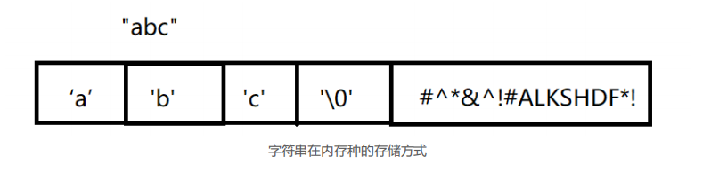

# c语法高阶-数组&指针加强

## 一 课程简介

- 数组加强

   申明与初始化  元素赋值取值 遍历数组     字符串数组与字符串

- 指针加强

   申明指针并赋值  根据指针设置值和获取   数组元素指针 数组指针 指针数组

- 函数加强

  申明 定义 调用（实参与形参，栈，值传递与引用传递） 特殊的函数

## 二 数组加强

### 1 数组名和下标详解 *****


```c
#include <stdio.h>

int main(int argc, char const *argv[])
{
    //1 申明数组但是不初始化
    int a[5]; //数组在申明的时候就要把空间开辟出来
     printf("%d",a[0]);
     // a 表示整个数组的首地址,可以看做是常量不能修改了
     // 如果之间用a，通过sizeof a,获取的是整个数组开辟空间 sizeof &a，计算地址的空间
    int xx =2;  //存值四个空间
     int len1 = sizeof(a); //4*5=20
     int len2 = sizeof(&a); //8,存地址用多少空间和平台有关系。
    printf("%d",len1,len2);
    //printf("%ld",sizeof(&xx));  //地址存放占了8个
    //2 申明的同时初始化
     int b[5] = {1,2,3,4,5};
      //int c[] = {1,2,3};
     int d[5] = {1};
    int e[5] = {}; //int a[5]; 
    
    //3 申明完了还能不能初始化，或者赋值呢？
    //a = {1,2,3,4,5}
     // =a b;
     a[0] =1;

    printf("=============");
     //4 数组指针
     int (* p) [10] = &a; //a 表示整个数组的首地址,相当于是常量，不可改变！p是一个指针变量可以重新指向其他的数组地址。
     p = b;

     printf("%d\n",(*p)[0]);

     //5 数组首元素的指针
     int *p1 = b ; // arr 表示数组的首元素的首地址

     //6 数组的下标实际上只是编译器提供一种简写，实际上如下：
     int aa [100] ;
    //  aa[10] = 250 ;  //加法交换律
    //  *(a+10) = 250 ;
    //*(10+a) = 250 ;
    10[aa] =566; //可以但是不建议
    printf("%d\n",10[a]);
    return 0;
}

```

### 2 字符串常量

字符串常量是一个被存放在常量区的字符串，实际上也可称为一个匿名数组。

匿名数组，同样满足数组名的含义



```c
#include <stdio.h>
#include <string.h>

int main(int argc, char const *argv[])
{
    //字符串常量是一个被存放在常量区的字符串，具有缓存效果（如果常量取有了就不会再存放一个了）的额。
    //可以看做是一个匿名数组
    char *str ="yaosang"; //y就是数组首指针指向的位置
    char *str1 ="yaosang"+1; //移动以一个字符

    printf("%c,%c\n",*str,*str1);

    printf("%s\n","yaosang");
     printf("%p,%p\n",&"yaosang",str); //同一个地址

    printf("%c\n","yaosang"[6]);

    //  r如果是字符数据，一般在申明的时候通过字符串初始化，后续如果先赋值字符串只能拷贝。
    char aa[5];
    //aa = "zs";
    strcpy(aa,"zs");
    printf("%s\n",aa);
    return 0;
}

```

### 3 零长数组

零长数组就是没有长度的数组。 用sizeof去输出的话为0

过这种灵活的动态内存申请方式，这个 buffer 结构体表示的一片内存缓冲区，就可以随时调整，可大可小。这个特性，在一些场合非常有用。

```c
#include <stdio.h>
#include <string.h>
#include <memory.h>

struct Student
{
    int id; //4--->8
    char *name;//8  
    int aa[0];
};


int main(int argc, char const *argv[])
{
        int a[0]; //没有长度数组
        printf("%ld\n",sizeof a);

        //有用吗？？ 可以实现不定长度结构体
        struct Student stu = {1,"zs",{1}};
        printf("%ld,%d\n",sizeof stu,(stu.aa)[0]);

        struct Student *p;
        //开辟空间：原有的大写的基础上+20
        p = malloc( sizeof(struct Student)+20);
        p->id=123;
        p->name = "zs";
        strcpy(p->aa,"yoasang");
        printf("%d,%s,%s\n",p->id,p->name,p->aa);
         //释放空间
         free(p);
        
       
    return 0;
}

```

### 4 不定长数组

概念： 定义是， 使用一个变量作为数组的长度（元素的个数）。

重点： 变长数组并不是说在任意时候他的长度可以随意变化， 实际上只是在定义之前

数组的长度是未知的有一个变量来决定， 但是定义语句过后变长数组的长度由定义那一刻变量的大小来决定

```c
#include <stdio.h>
#include <string.h>
#include <memory.h>


int main(int argc, char const *argv[])
{
       //不固定长度数组
        int arr_size = 0;
       scanf("%d",&arr_size);
       int a[arr_size];

       //使用场景，我们的不是一个具体数子，要通过计算出来。
       //用来节约空间，计算出来的空间刚好够，不多也不少。
        //不能直接赋值，需要拷贝
        /*
        char username_tmp[strlen(admin.username)+1];
        char password_tmp[strlen(admin.password)+1]; 
        strcpy(username_tmp,username);
        strcpy(password_tmp,admin.password);  
        */
       
    return 0;
}

```

注意：

1. 因为数组的长度未确定， 因此它不允许初始化。

2. 在使用的时候可以通过该变长数组来有限的节省内存空间。

###  5 多维数组

#### 5.1 定义

​    数组元素就是数组

#### 5.2 使用

​    定义，初始化，赋值和获取值。

```
int a[3][4],这个是一个二维数组，一维的长度为3，二维是4，最终放12
int a[3][4]={{1,2,3,4},{21,22,23,24},{31,32,33,34}}
int a[3][4]={1,2,3,4,21,22,23,24,31,32,33,34} //不要把它当做维，其实它初始化的时候和上面一样
//看起来简单
a[2][1] =33;
a[2][1]
*(*(a+2)+1) //多级指针
```

```c
#include <stdio.h>
#include <string.h>
#include <memory.h>


int main(int argc, char const *argv[])
{
       //定义并初始化
      int a[2][3] = {{1,2,3},{21,22,23}}; //00,01,02  10 11 12

      int * ccc = a;

    //赋值和获取值
     a[1][2] =88;
     *(*(a+1)+2)=99; //上面是下面的简写
       *(*(a+0)+0)=111; 
       *(*(a))=222;  //可以省，但是最好不要省，其实最好不要眼红指针的方式来访问
      for (int i = 0; i < 2; i++)
      {
            for (int j= 0; j < 3; j++)
            {
                //printf("%d\n",a[i][j]);
                printf("%d\n",  *(*(a+i)+j));
            }
      }

      printf("========================\n");

    for (int i = 0; i < 6; i++)
      {
             printf("%d\n",  *(*(a)+i));
      }

           printf("========================\n");
    //    for (int i = 0; i < 6; i++)
    //   {
        //// a 指的是首元素的首地址 {1,2,3} 的首地址 + 1则 + 3
    //          printf("%d\n",  *(*(a+i)));
    //   }
      
printf("========================\n");
      for (int i = 0; i < 6; i++)
      {
             printf("%d\n",  *(ccc+i));
      }
       
    return 0;
}

```


### 6 小结

## 三 指针加强

### 1 复习

```
int a =1;
int *p = &a;
//p =2;
*p=2;
*p
===============
int aa[2] = {1,2};
数组指针int *p1 = aa;   数组元素指针 int *p1 = &aa[0]  指针数组
```

### 2 加强

#### 2.1 多级指针

**级指针：**

如果一个指针p1 它所指向的是一个普通变量的地址，那么p1就是一个一级指针

如果一个指针p2 它所指向的是一个指针变量的地址，那么p2就是一个二级指针

如果一个指针p3 它所指向的是一个指向二级指针变量的地址，那么p3就是一个三级指针

```c 
#include <stdio.h>
int main(int argc, char const *argv[])
{
    //从本质上来看，字符指针其实就是一个指针而已， 只不过该指针用来指向一个字符串/
  //字符串数组。
    char *c = "yaosang";

    //二级，三级多级指针
    int a =1;
    printf("%p\n",&a);

    int *p1 = &a;
    printf("%p,%p\n",&p1,p1);

    int **p2 = &p1;
    printf("%p,%p\n",&p2,p2);

    int ***p3 = &p2;
    printf("%p,%p\n",&p3,p3);

    printf("%d,%d,%d",*p1,**p2,***p3);
    return 0;
}

```


**指针的万能拆解方法：**

对于任何的指针都可以分为两部分：

第一部分： 说明他是一个指针 （*p）

第二部分： 说用它所指向的内容的类型 （*p）以外的东西


#### 2.2 void 型指针

概念： 表示该指针的类型暂时是不确定

要点：

- ​	void 类型的指针，是没有办法直接索引目标的。必须先进行强制类型转换。

- void 类型指针，无法直接进行加减运算。

void关键字的作用：

​	修饰指针，表示该指针指向了一个未知类型的数据。

​	修饰函数的参数列表， 则表示该函数不需要参数。

​	修饰函数的返回值，则表示该函数没有返回值。

```c
#include <stdio.h>
#include <memory.h>
int main()
{
     //int float void
      int *p1;
    float *p2;
    /**
     * void关键字的作用：
修饰指针，表示该指针指向了一个未知类型的数据。
修饰函数的参数列表， 则表示该函数不需要参数。
修饰函数的返回值，则表示该函数没有返回值。
    */
    void * p3 = malloc(4); //表示该指针指向了一个未知类型的数据。
  
  * (int *)p3=4;
   // 会报错
    //*p3 = 1;
    // 会报错
   // printf("%d",*p3);

    printf("%d\n",* (int *)p3);

    * (float *)p3=3.14;
    printf("%f",* (float *)p3);
   free(p3);

    return 0;
}

```

#### 2.3 const 指针：

//const修改指针有两种方式
    //1   修饰的是指针本身， 表示该指针变量无法修改

   //2  修饰的是指针所指向的目标，表示无法通过该指针来改变目标的数据

   //3 两个都加上都不能改

   //4 两边都没有：都可以改（以前学的就是这种）

```c
#include <stdio.h>
#include <memory.h>
int main()
{
  //const修改指针有两种方式
    //1   修饰的是指针本身， 表示该指针变量无法修改
    int a[] = {1,2,3};
    int b[] = {12,22,32};

    int * const p1 = a; 
    //p1 = b; 

  // 可以修改指针指向的数组里面的内容
    *(p1+1) = 2222;
    printf("%d\n",a[1]);

    //2  修饰的是指针所指向的目标，表示无法通过该指针来改变目标的数据
    int aa[3] = {1,2,3};
    int bb[3] = {21,22,23};
     const int *  p2 = aa; 
     p2 = bb;
     //*(p2+1)=2222;
     printf("%d\n",*(p2+1));


    //3 两个都加上都不能改
     const int *  const p3 = aa; 
     //p3 =bb;


    return 0;
}

```


## 四 小结