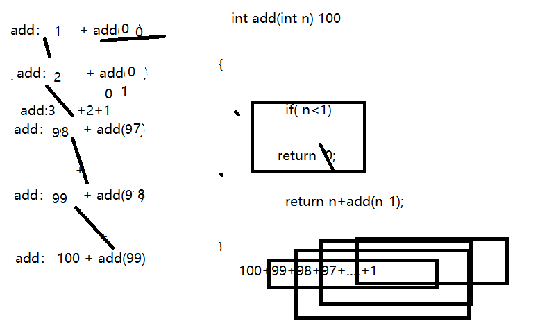
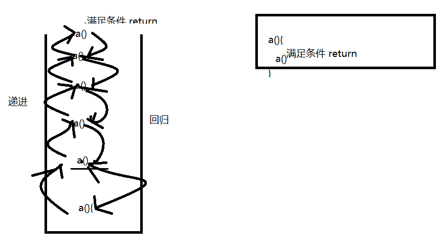
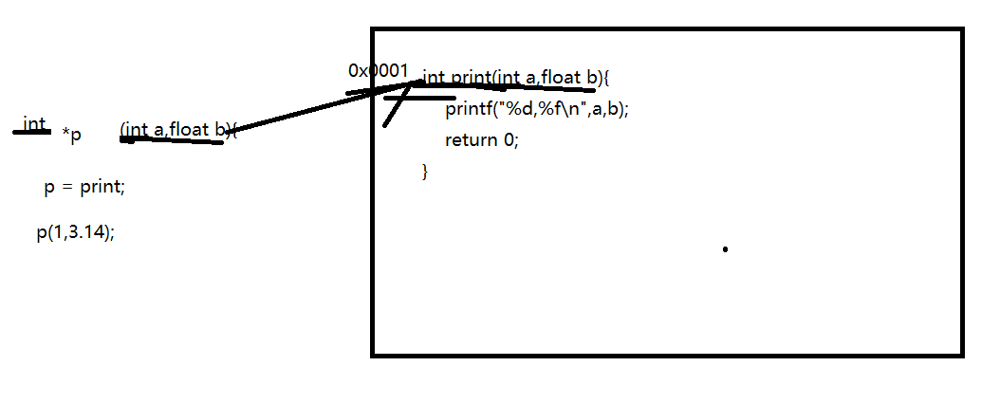
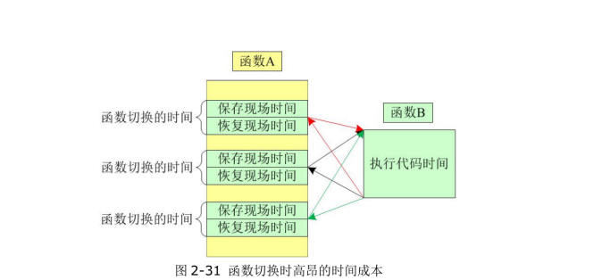
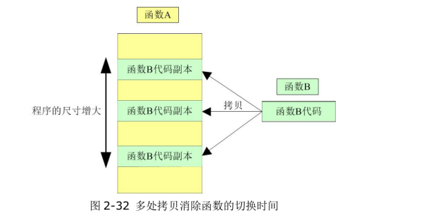

# c语法高阶-函数加强&结构体尺寸&联合体&枚举

## 一 课程简介

- 函数加强(重要)

   函数申明与定义  函数调用（形参与实参，栈）

- 结构体尺寸（重要）

- 联合体（重要）

- 枚举（重要）

## 二 函数加强

### 1 static函数

  非static函数：都是跨文件可见的，也就是比如a.c里面有个函数swap(), 在b.c中也可以调用该函数。

  静态函数：只能够在当前定义的文件中使用，称为静态函数

```c
1 static int func (int , int b )
2 {
3 // 函数体
4
5 }
```

​	**静态函数用来缩小可见范围，减少与其它文件中同名函数冲突的问题**

​	**静态函数一般会定义在头文件中， 然后被需要使用该函数的源文件包含即**

**可。**   #include <stdio.h>


   **我们写的函数如果要给别人调用，不要加上static！！！！**

   **一些多个模块都要用的函数，封装到头文件中，并且用static。  只有导入这个头文件才能调用。**

### 2 递归函数

​		递归函数的概念： 如果一个函数的内部，包含了对自己的调用则称为递归函数.

​      案例： 1+2+3+....+100 要使用递归   100  99

     ```c
#include <stdio.h>
int add(int n);

//递归相加
int add(int n){ //100+99+..+1
    //要有出口
    if (n<1)
    {
      return 0;
    }
    
    //自己调用自己
    return n + add(n-1);
}
int main(int argc, char const *argv[])
{
    //使用递归实现1+2+3+...+100
    int result = add(100);
    printf("%d\n",result);

    return 0;
}

     ```



- 只有可以被递归的问题，才可以使用递归函数来实现。-自己调用自己

- 递归函数必须有一个可以直接退出的条件，否则会进入无限递归，最后导致栈溢出。

- 递归函数包含了两个过程： 逐渐递进 ， 逐步回归。




练习1： 阶乘

练习2： 字符反转（有点难度）

### 3 函数指针与指针函数

#### 3.1 函数指针

​     是一个指针，但是指向的是函数。  函数也是要存放到内存中，也有地址。       int *p = &a；把变量的地址赋值给一个指针，通过指针就可以操作变量。同样可以把函数的地址赋值给一个指针（函数指针），通过这个函数指针就可以操作函数（调用---）。



```c
#include <stdio.h>
//申明函数
int print(int a,float b);

//定义函数
int print(int a,float b){
    printf("%d,%f\n",a,b);
    return 0;
}
int main(int argc, char const *argv[])
{
    //1 调用函数-通过函数名
    int result01 = print(1,3.14);
    printf("%d\n",result01);

    //2 通过在指针调用
    //定义了一个函数指针，这个函数有两个参数int a,float b，有一个int返回值
    int  (*p) (int a,float b); 
    //让指针指向函数
    p = print;
   int result02 =  p(1,3.14);
   printf("%d\n",result02);
    return 0;
}

```

#### 3.2 指针函数

​	返回指针的函数叫做指针函数。   第一种，可以直接返回一个地址。  第二直接返回一个指针

```c
#include <stdio.h>
int bb =2;
//申明函数
//返回值是一个指向int类型的指针
int * print(int a);


//定义函数
int  * print(int a){
    return &bb; //把地址直接返回
}
int main(int argc, char const *argv[])
{
    //用一个指针来接收
    int *p = print(1);

    //我们就可以通过指针来操作指针所指向的东西了
    printf("%d\n",*p);//1
    return 0;
}

```


### 4 回调函数

​     函数提供方不方便调用函数，而由接口提供方来调用该函数， 函数提供方的这个函数就叫回调函数。

 yaosang：定义一个函数，通过函数指针传递到另一个函数的内部来完成调用。  做了某些事情后需要做什么，不要写死，通过函数封装传入。进最大努力实现高内聚。

```c
#include <stdio.h>


void foot_one();
void foot_one(){
    printf("我被踢一脚！\n");
    printf("哎呀好球痛！\n");//做出反应，做了事情才返回
}

void foot_one_1();
void foot_one_1(void (*p)(void)){
    printf("我被踢一脚！\n");
    p();//反应通过函数指针传入
}

void foot_one_r();
void foot_one_r(){
    printf("哎呀好球痛.......！\n");
}
int main(int argc, char const *argv[])
{
    //foot_one(); //方案1
    void (*p)(void) = foot_one_r;
    foot_one_1(p); //方案2
    return 0;
}

```


就一个函数：

   1 踢一脚

   2 大叫一声---改一个函数

回调的方案：

​          实现一个函数大叫一声。

​          另一个函数实现踢一脚，里面回调打搅一声的函数。给别人用的函数，可以不改。


**使得不同软件模块的开发者的工作进度可以独立出来，不受时空的限**

**制，需要的时候通过约定好的接口（或者标准）相互契合在一起**------和直接调用，最大的好处就是不需要知道函数名。

### 5 内联函数

#### 5.1 为什么需要

​	如果不使用内联函数的情况下，有可能某一个函数被多次重复调用则会浪费一定的时间在调用的过程中（现场保护+恢复）



​	如果使用内联函数就相当与把需要调用的函数的内容（指令）拷贝到需要调用的位置，

可以节省函数调用的过程中浪费的时间，



#### 5.2 使用

   申明并定义函数

   调用

```c
#include <stdio.h>

//其实可以不申明，原理上来说，此事已经不是函数的调用
 inline void foot_one();

 //如果没有static是会报错
 static inline void foot_one(){
    printf("我被踢一脚！\n");
    printf("哎呀好球痛！\n");
}

int main(int argc, char const *argv[])
{
    foot_one();  // 当前这一行代码在编译完成后
    //会被该函数实际的代码进行替换
    foot_one();  // 内联函数在提高运行效率的过程中，
    //消耗了更多的内存空间。
    return 0;
}

```


### 6 变参函数-可变参数

#### 6.1 为什么需要？  

指参数的个数以及类型是可以根据实际y应用有所变化的。

​     一个函数可以代替N个函数

​     类型也可以随意  	printf（format,3，“jfjfj”） 

#### 6.2  基础用法

使用 **stdarg.h** 头文件，该文件提供了实现可变参数功能的函数和宏。具体步骤如下：

- 定义一个函数，最后一个参数为省略号，省略号前面可以设置自定义参数。

- 在函数定义中创建一个 **va_list** 类型变量，该类型是在 stdarg.h 头文件中定义的。

- 使用 **int** 参数和 **va_start()** 宏来初始化 **va_list** 变量为一个参数列表。宏 **va_start()** 是在 stdarg.h 头文件中定义的。

- 使用 **va_arg()** 宏和 **va_list** 变量来访问参数列表中的每个项。

- 使用宏 **va_end()** 来清理赋予 **va_list** 变量的内存。

  

- `**va_start(ap, last_arg)**`：初始化可变参数列表。`ap` 是一个 `va_list` 类型的变量，`last_arg` 是最后一个固定参数的名称（也就是可变参数列表之前的参数）。该宏将 `ap` 指向可变参数列表中的第一个参数。
- `**va_arg(ap, type)**`：获取可变参数列表中的下一个参数。`ap` 是一个 `va_list` 类型的变量，`type` 是下一个参数的类型。该宏返回类型为 `type` 的值，并将 `ap` 指向下一个参数。
- `**va_end(ap)**`：结束可变参数列表的访问。`ap` 是一个 `va_list` 类型的变量。该宏将 `ap` 置为 `NULL`。

```c
#include <stdio.h>
#include <stdarg.h>


int sum(int num,...);

int sum(int num,...){ //2（有几个参数）,1,2
    //定义一个参数列表的变量
    va_list list; //

    //参数列表赋值  2 12
    va_start(list,num); //list表示前面参数，
    //num最后一个参数，在这个位置以最后一个参数代表传入数量  2 12

    //把每一个都读出来
    int sum = 0;
    for (int i = 0; i < num; i++)
    {
        sum = sum + va_arg(list,int);
    }

    //释放list
    va_end(list);
    return sum;

}


int main(int argc, char const *argv[])
{
    printf("%d\n",sum(2,1,2)); //3
    printf("%d\n",sum(4,1,2,3,4)); //0
    return 0;
}


#include <stdio.h>
#include <stdarg.h>

void my_printf(const char* format, ...) {
    va_list args;
    va_start(args, format);

    while (*format != '\0') {
        if (*format == '%') {
            format++; // 移动到占位符的下一个字符

            if (*format == 'd') {
                int value = va_arg(args, int);
                printf("%d", value);
            } else if (*format == 'f') {
                double value = va_arg(args, double);
                printf("%f", value);
            } else if (*format == 's') {
                char* value = va_arg(args, char*);
                printf("%s", value);
            } else if (*format == 'c') {
                int value = va_arg(args, int);
                printf("%c", value);
            } else {
                printf("Unsupported format specifier: %c", *format);
            }
        } else {
            printf("%c", *format);
        }

        format++; // 移动到下一个字符
    }

    va_end(args);
}

```


​	

### 7 小结

​      static  递归 函数指针 指针函数 回调函数 内联函数 可变函数

## 三 结构体尺寸

C 语言中，我们可以使用 **sizeof** 运算符来计算结构体的大小，**sizeof** 返回的是给定类型或变量的字节大小。

对于结构体，**sizeof** 将返回结构体的总字节数，包括所有成员变量的大小以及可能的填充字节。

```c
struct Admin{ //24
	int id; //4 
	char * username; //8
	char * password; //8
}
```


结构体的大小可能会受到编译器的优化和对齐规则的影响，编译器可能会在结构体中插入一些额外的填充字节以对齐结构体的成员变量，以提高内存访问效率。因此，结构体的实际大小可能会大于成员变量大小的总和，如果你需要确切地了解结构体的内存布局和对齐方式，可以使用 **offsetof** 宏和 **__attribute__((packed))** 属性等进一步控制和查询结构体的大小和对齐方式。

## 四 共用体

共用体从表面上看与结构体非常类似，但是他们的本质完全不同。结构体每一个成员都有一个独立

的内存空间， 但是联合体的每一个成员公用同一个内存空间因此联合体也被称为共同体。

```c
#include <stdio.h>
#include <string.h>

//什么是共用体。  可以定义多个成员，但是同一个只有一个有值。
// 一块空间可以放多中值。  不同人发通的烟 子云 1   华子5
union Gift
{
  int smok; //4
  float money; //4
  char girl[20]; //20
} ;

int main(int argc, char const *argv[])
{
    union  Gift gift;
   printf("%ld\n",sizeof gift);// 里面成员所需的最大空间

   gift.smok = 50;
   gift.money = 28.888;
   strcpy(gift.girl,"川岛.英子");

    //共用体前面的被覆盖了
   printf("%d,%f,%s\n",  gift.smok,  gift.money,gift.girl);

   gift.smok = 501;
   printf("%d\n",  gift.smok);
   gift.money = 288.888;
    printf("%f\n",  gift.money);
   strcpy(gift.girl,"川岛.英子1");
   printf("%s\n",  gift.girl);
    
    return 0;
}

```


## 五 枚举

### 5.1 什么情况使用

  某一个变量只有几个值。 能够枚举罗列出来。  星期 ，月份，男女，状态。。。

### 5.2 使用细节

```c
#include <stdio.h>
// 方案1：用宏定义
// #define MON  1
// #define TUE  2
// #define WED  3
// #define THU  4
// #define FRI  5
// #define SAT  6
// #define SUN  7

//方案2： 申明枚举类型
enum Day  {
    //枚举值必须是int类型，如果不赋值第一个默认为0，后面的依次加一。
    //如果赋值第一个，后面的继续加1
    //里面的值可以随便赋值，如果某一个没有赋值就是用前一个+1

     MON=1, TUE, WED, THU=7, FRI, SAT=11, SUN
};
int main(int argc, char const *argv[])
{
    //申明枚举类型
    //定义枚举变量
    enum Day day1 = SUN;
    //使用枚举变量
      printf("%d\n",day1);
         printf("=============\n");
    //   for (day1 = MON; day1 <=SUN; day1++)  //如果是连续的可以变量，如果不是连续的遍历没有意义
    //   {
    //         printf("%d\n",day1);
    //   }
      
    return 0;
}

```


## 六总结

