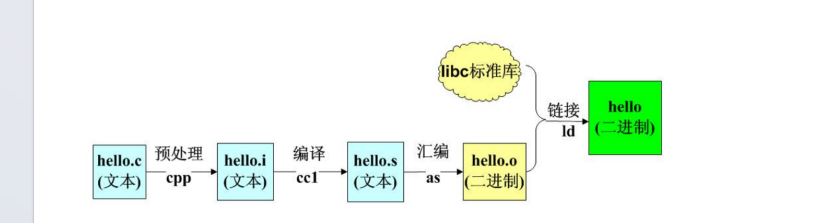
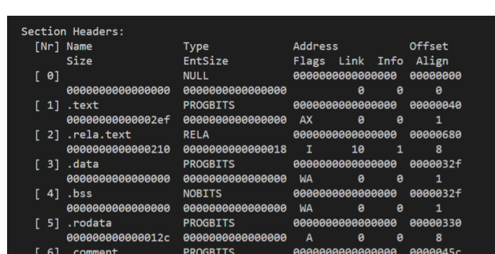
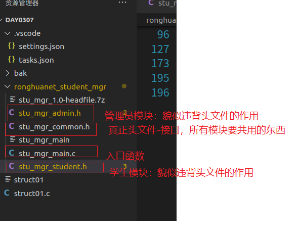
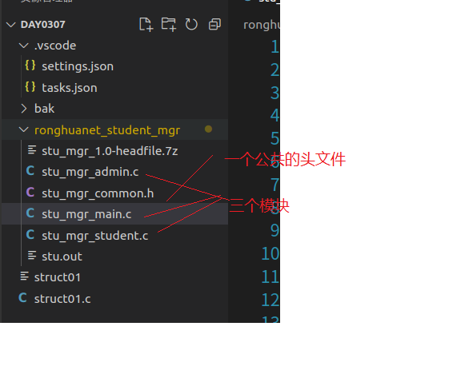

# c语法高阶-位域&编译器&宏定义&条件编译&头文件

## 一 课程简介

- 位域（了解）

- 编译器（重要）
- 宏定义加强（重要）
- 条件编译（重要）
- 头文件（重要）

## 二 位域

### 1 为什么需要？

```c
struct
{
  unsigned int widthValidated;
  unsigned int heightValidated;
} status;
```

变量值为 **TRUE/FALSE**

这种结构需要 8 字节的内存空间，但在实际上，在每个变量中，我们只存储 0 或 1，在这种情况下，C 语言提供了一种更好的利用内存空间的方式。如果您在结构内使用这样的变量，您可以定义**变量的宽度**来告诉编译器，您将只使用这些字节

### 2 是什么？

​	C 语言的位域（bit-field）是一种特殊的结构体成员，允许我们按位对成员进行定义，指定其占用的位数。

### 3  使用


```c
struct
{
  unsigned int widthValidated : 1;
  unsigned int heightValidated : 1;
   ....
} status;
```


现在，上面的结构中，status 变量将占用 4 个字节（32位）的内存空间，但是只有 2 位被用来存储值。如果您用了 32 个变int成员，每一个成员宽度为 1 位，那么 status 结构将使用 4 个字节，但只要您再多用一个成员，如果使用了 33 个成员，那么它将分配内存的下一段来存储第 33 个成员，这个时候就开始使用 8 个字节。


```c
#include  <stdio.h>

//浪费大量的空间
struct State01
{
  unsigned int width_validated;//只有0和1两个值，所有用无符号unsigned
  unsigned int height_validated;
} state01;

struct State02
{
  unsigned int width_validated:1; //申明成员的时候告诉他占多少空间
  unsigned int height_validated:1; //单位是位，总和没有超过32位就是4，超过以后就在用一个4来装
   unsigned int width_validated2:1; 
  unsigned int height_validated2:1;
  unsigned int width_validated3:31;   //长度不能超过类型大小
  unsigned int height_validated3:31;
  
} ;


int main(int argc, char const *argv[])
{

    printf("%ld\n",sizeof state01); //8

    struct State02  state02;
    state02.width_validated =1;
    state02.height_validated =1;

    printf("%ld\n",sizeof state02); //12  66/32+1=3*4=12
  
}

```

- 定义位域时，可以指定成员的位域宽度，即成员所占用的位数。
- 位域的宽度不能超过其数据类型的大小，因为位域必须适应所使用的整数类型。
- 位域的数据类型可以是 `int`、`unsigned int`、`signed int` 等整数类型，也可以是枚举类型。
- 位域可以单独使用，也可以与其他成员一起组成结构体。
- 位域的访问是通过点运算符（`.`）来实现的，与普通的结构体成员访问方式相同。


## 三 编译器

### 1 是什么？

​	 编译器是一个用来帮助我们把原码.c翻译成计算机能够之直接识别的二进制编码。使用不同

的编译器可以翻译出来不同机器的二进制编码。 常用的由 gcc 编译器

### 2 编译详解

```
 gcc hello.c -o hello
 gcc --> C语言编译器
 hello.c --> 需要编译的原码
 -o --> 指定输出文件名
 hello --> 可执行文件的名字
```



#### 2.1 预处理

```
 gcc hello.c -o hello.i -E
 加上一个编译选项 -E 就可以使得 GCC 在进行完第一阶段的预处理之后停下来，生成
 一个默认后缀名为.i 的文本文件
```

预处理是指在编译代码之前先进行预先的处理工作，这些工作包含哪些内容：

```\
头文件被包含进来（复制）： #include
宏定义会被替换：#define
取消宏定义： #undef
条件编译： #if #ifdef #ifndef #else #elif #endif
修改行号以及文件名： #line 998 "Hello.c"
清除注释
```

预处理大部分的工作是在处理以 # 开头的一些语句，从严格意义来讲这些语句并不属于C语言的范

畴， 它们在编译的第一个阶段被所谓的 预处理器 来处理。

#### 2.2 编译

```
gcc hello.c -o hello.s -S
gcc hello.i -o hello.s -S
```

加上一个编译选项 -S 就可以使得 gcc 在进行完第一和第二阶段之后停下来，生成一

个默认后缀名为.s 的文本文件。打开此文件看一看，你会发现这是一个符合 x86 汇编语言

的源程序文件。

经过预处理之后生成的.i 文件依然是一个文本文件，不能被处理器直接解释，我们需要

进一步的翻译。接下来的编译阶段是四个阶段中最为复杂的阶段，它包括词法和语法的分析，

最终生成对应硬件平台的汇编语言（不同的处理器有不同的汇编格式）。

汇编文件取决于所采用的编译器，如果用的是 GCC，那么将会生成 x86 格式的汇编文件，

如果用的是针对 ARM 平台的交叉编译器，那么将会生成 ARM 格式的汇编文件。

#### 2.3 汇编

```
 gcc hello.s -o hello.o -c
 -c 则是让编译器在对汇编语言文件进行编译后停下来，
 这里会生成一个待链接的可执行文件
```

则会生成一个扩展名为.o 的文件，这个文件是一个 ELF 格式的可重定位(relocatable)文件，所谓

的可重定位，指的是该文件虽然已经包含可以让处理器直接运行的**指令流**，但是程序中的所有的全局

符号尚未定位，所谓的全局符号，就是指函数和全局变量，函数和全局变量默认情况下是可以被外部

文件引用的，由于定义和调用可以出现在不同的文件当中，因此他们在编译的过程中需要确定其入口

地址，比如 a.c 文件里面定义了一个函数 func( )，b.c 文件里面调用了该函数，那么在完成第三阶段

汇编之后，b.o 文件里面的函数 func( )的地址将是 0，显然这是不能运行的，必须要找到 a.c 文件里

面函数 func( )的确切的入口地址，然后将 b.c 中的“全局符号”func重新定位为这个地址，程序才能

正确运行。因此，接下来需要进行第四个阶段：链接。可以尝试使用命令readelf 来查看这个可重定位文件

```
$ readelf demo.o -a
```



#### 2.4 链接

```
1 gcc hello.c -o hello -lc -lgcc
2 gcc .....
3 hello.o ....
4 -o ......
5 hello .....
6 -lc --> -l 链接 c 标准C库
7 -lgcc --> -l 链接 gcc 链接GCC 的库
```

有两个很重要的工作没完成，首先是重定位，其次是合并相同权限的段

一个可执行镜像文件可以由多个可重定位文件链接而成，比如 a.o，b.o，c.o 这三个可重定位文件

链接生成一个叫做 x 的可执行文件，


###  3 小结

​     编写c文件-预处理-编译-汇编-链接----可执行文件（windows.exe）

## 四 宏定义   

### 1 概念

宏（macro）其实就是一个特定的字符串，用来直接替换。  在预处理阶段就会别贴换。

### 2 作用

使得程序的可读取有所提高，使用一个又有意义的单词来表示一个无意义数字（某个值）

方便对代码进行迭代更新， 如果代码中有多处使用到该值， 则只需要修改一处即可（定义）

提高程序的执行效率，可以使用宏来实现一个比较简单的操作。用来替代函数的调用-有点儿类似内联函数。

### 3 使用细节

#### 3.1 无参宏

   意味着我们在使用该宏的时候不需要携带额外的参数 。其实就是定义常量

```c
1 #define PI 3.14 //定义常量
int main(int argc, char const *argv[])
 {
 printf("%f\n" , PI );
 printf("%f\n" , PI ); 	
 return 0;
 }
```

#### 3.2 有参数的宏

```c
#include  <stdio.h>

//定义有参数宏
#define MAX(a,b) a>b?a:b


int main(int argc, char const *argv[])
{

  int  a=1,b=2;
  int c=3,d=5; 

  // int max1 = a>b?a:b;
  // printf("%d\n",max1);
  // int max2 = c>d?c:d;
  // printf("%d\n",max2);

 printf("%d\n", MAX(a,b));

 printf("%d\n", MAX(c,d));
  
}

```

宏只是直接文本替换，没有任何的判断以及语法检查的操作甚至运算

宏在编译的第一个阶段(预处理)， 被处理完成，运行的过程中不占用时间（宏已经不存在）

宏在预处理的时候直接展开。


1. 有参宏： 只是文本替换，复杂的运算在里面可能出现问题。

2. 宏只能写在同一行中（逻辑行），如果迫不得已需要使用多行来写一个宏则可以使用转义字符\把

   换行符转义掉


```c
#include  <stdio.h>

//定义有参数宏
#define MAX(a,b) a>b?a:b 
#define MAX1(a,b,c)    (a>b?a:b)> \
c?(a>b?a:b):c


int main(int argc, char const *argv[])
{

  int  a=1,b=2;
  int c=3,d=5; 

  // int max1 = a>b?a:b;
  // printf("%d\n",max1);
  // int max2 = c>d?c:d;
  // printf("%d\n",max2);

 printf("%d\n", MAX(a,b));
 //printf("%d\n" , 1>2? 1:2 ); --> 预处理后

 printf("%d\n", MAX(c,d));

 printf("%d\n",MAX1(2,3,5));
  
}

```

### 4 小结

定义常量  一些操作封装一下，多个地方替换。

## 

## 五 条件编译

### 1 是什么？

​    满足条件才编译有效。

### 2 使用

#### 2.1 简单使用-无值宏

​        代码定义宏或者通过命令（-D -U）   

除了打开代码进行修改宏的值或者重新定义或删除宏的定义，还可以通过编译命令来定义宏

```c
#include <stdio.h>
//#define  DEV_MODE //是否是开发模式
int main(int argc, char const *argv[])
{

gcc demo01.c -DDEV_MODE
```

  

​     通过有没有宏定义做条件编译

```c
int main(int argc, char const *argv[])
{

    //在开发模式才有可能通过printf输出一些信息做调试
    #ifdef DEV_MODE
        printf("老夫是开发大佬！");
    #endif
     #ifndef DEV_MODE
        printf("老夫才不是开发大佬！");
    #endif
    return 0;
}

```


#### 2.2  简单使用-有值宏

​       true：非0，false：0   ----》‘A’


```c
#include <stdio.h>
#define  DEV_MODE01 1  //true
#define  DEV_MODE02 0 //fasle
#define  DEV_MODE03 3  //true
#define  DEV_MODE04 'A' //true
#define  DEV_MODE05 "true" //? 不能这样定义，没法判断是true还是false
int main(int argc, char const *argv[])
{

   
   // #是判断它的值是否为true
    #if DEV_MODE01
        printf("我是01！");
    #endif
     #if DEV_MODE02
        printf("我是02！");
    #endif
     #if DEV_MODE03
        printf("我是03！");
    #endif
     #if DEV_MODE04
        printf("我是04！");
    #endif
     /*#if DEV_MODE05
        printf("我是05！");
    #endif*/
    return 0;
}

```


在使用有值宏进行条件编译的时候， 宏的值只允许出现整型/字符

多路分支可以根据自己的需求继续延续下去  if  ifesle ifelseif else

使用条件编译必须有结束的语句 #endif 与开头进行对应


### 3 小结

 可以用来区分系统平台？？？  有可能相同的操作在不同平台调用的函数不一样，可以通过条件判断是那个平台在编译那些代码。

用来区分是否安装了什么？  


## 六 头文件

### 1 什么头文件

*头文件是扩展名为* **.h** *的文件，包含了 C 函数声明和宏定义，被多个源文件中引用共享。有两种类型的头文件：程序员编写的头文件和编译器自带的头文件*

在程序中要使用头文件，需要使用 C 预处理指令 **#include** 来引用它。前面我们已经看过 **stdio.h** 头文件，它是编译器自带的头文件。引用头文件相当于复制头文件的内容。


头文件内部放：

​	1) 普通函数声明

​	2) 宏定义

​	3) 结构体、共用体模板定义 （声明）

​	4) 枚举常量列表

​	5) static 函数和 inline 函数定义

​	6) 其他头文件

### 2 为什么需要？  

共用代码.比如printf如果没有通过头文件定义，所有用到的地方都要定义这个函数

​	当某一些公共的资源需要在各个源文件中使用的时候，就可以把它写在头文件中，被其它的.c文件包含，可以避免编写同样的代码。

模块化编程？把一些定义相关的抽出去，让代码可读性变高

### 3 使用

```c
common.h
#ifndef COMMON_DEF
#define COMMON_DEF;
//1) 普通函数声明-接口
void test();
//2) 宏定义
#define PI 3.14
//3) 结构体、共用体模板定义 （声明）
typedef struct Students
{
    int id;
    char * name;
    char  * password;
} Student;

typedef union Gifts
{
  int smoking;
  float money;
  char * girl;
} Gift;

//4) 枚举常量列表
//5) static 函数和 inline 函数定义
//6) 其他头文件
//#include <stdio.h>;

void test(){
    printf("test");
}

#endif


test.c
#include <stdio.h>
#define yaosang_true 1
#if  yaosang_true
    #include "common.h" //引入自己头文件
    #include "common.h" //引入自己头文件
#endif


int main(int argc, char const *argv[])
{
    
    printf("%f\n",PI);
    test();
    Student stu;
    return 0;
}

```


- 基本使用x.h，里面写头文件的内容，多个c文件 #include这个预编译指令来导入

- 防止重复导入 

  #ifndef COMMON_DEF
  	#define COMMON_DEF;

  #endif

- 条件引入：满足条件才引入

  #define yaosang_true 1
  #if  yaosang_true
      #include "common.h" //引入自己头文件
      #include "common.h" //引入自己头文件
  #endif


### 4 项目实战

#### 4.1 抽出来模块全部是头文件



​             模块的东西不应该用头文件。  只能用.c


#### 4.2   c和头文件双管齐下

​     common.h

​     admin.c

​    student.c

   main.c


  怎么编译链接到一起呢？   gcc   **admin.c    student.c   main.c**  -o stu.out

​    



## 七  typedef（类型定义）

​         int 。。。    yaosangInt

### 1 是什么？

C 语言提供了 **typedef** 关键字，您可以使用它来为类型取一个新的名字。

### 2 基础类型的定义 -- 没啥卵用

### 3 自定义类型的使用--挺好用

```c
#include <stdio.h>

#define yaosangint1 int
//基础数据类型
typedef int yaosangint;

//自己定义的类型：结构体，共用体，位域，枚举
typedef struct Books
{
   char  title[50];
   char  author[50];
   char  subject[100];
   int   book_id;
} Book;

typedef union Gifts
{
    int smoking;
    float money;
    char girs[20];
} Gift;

typedef enum Weeks{
    MON=1,FULK
} Week;

int main(int argc, char const *argv[])
{
    int a = 2;
    yaosangint  b  = a;
    yaosangint1 c =a;
    printf("%d,%d",a,b);

    struct Books book01; //每次都要输入一个struct
     Book book02;//不用struct

     union Gifts gift01;
     Gift gift02; //不用union

     enum Weeks monday01 = MON;
     Week monday02 = MON; //不用enum

    return 0;
}

```

```
## typedef vs #define

**#define** 是 C 指令，用于为各种数据类型定义别名，与 **typedef** 类似，但是它们有以下几点不同：

- **typedef** 仅限于为类型定义符号名称，**#define** 不仅可以为类型定义别名，也能为数值定义别名，比如您可以定义 1 为 ONE。
- **typedef** 是由编译器执行解释的，**#define** 语句是由预编译器进行处理的。


```


## 八 总结

