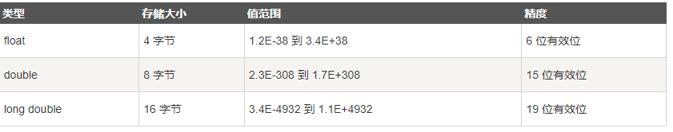
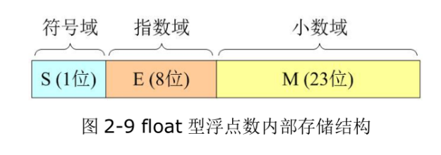

# C基础-基础语法&数据类型&常量&变量

## 一 课程简介

- 基本语法-注释，分隔符，关键字，标识符
- 数据类型
- 常量
- 变量

## 二 基本语法

### 1 c注释【掌握】

#### 1.1 **注释概念**

​	**注释**：标注说明，写在c源文件中不同的位置，旨在帮助开发人员理解代码含义，对程序运行没有影响，提高代码可读性；

#### 1.2 分类

##### 1.1 单行注释

- 语法：// 待注释的内容
- 位置：可放在代码后，称之为行尾注释； 也可放代码上一行，称作行上注释。

```c
// 这是单行注释文字
```

##### 1.2 多行注释

- 语法：/* 待注释的内容 */
- 注意：多⾏注释内，可以嵌套单⾏注释。 多⾏注释之间不能嵌套。

```c
/*
这是多行注释文字
这是多行注释文字
这是多行注释文字
*/
注意：多行注释不能嵌套使用。
```

#### 1.3 示例

```c
#include <stdio.h> 
/*
这里
是多行
注释
书写的内容
*/
int main(void) {
    printf("HelloWorld\n");	// 这是单行注释，此行为输出 HelloWorld
    
    // 单行注释，可以放在代码行尾，也可以放在行上
	return 0; 
}
```

#### 1.4 注释的小扩展

- 注释的快捷键：Ctrl + /，ctrl+shift+a
- 注释擦除：注释的内容，不参与运行
- 注释的嵌套：不管是单行还是多行，最好都不要嵌套

#### 1.5 **使用场景**

1. 目前学习阶段写注释：

   ​	(1)函数前面写概念，主要演示的知识点，实现思路

   ​	(2)具体代码处，写对于知识点的理解【注释标记】

   ​	(3)在当前代码中对前段知识回顾【注释标记说明】

2. 日后工作中写注释

   ​	(1)写代码时候养成写注释的习惯－－>　代码的可读性增强

   ​	(2)功能实现思路　　流程　    

   ​	(3)解释关键代码


### 2  分隔符【了解】

分隔符：语句与代码之间的分割

1. 分号（;）：语句的分割，表示一句话结束，好比咱们使用的句号。
2. 花括号（{}）：表示一个代码块，是一个整体，花括号要成对使用。
3. 圆括号（()）：使用很广泛，具体用到细讲。
4. 方括号（[]）：定义数组和访问数组元素时使用。
5. 圆点（.）：类和对象访问它的成员时使用，指针。（的） 
6. .空格[ ]：把一整条语句分割成几段，空格的次数不限制。
7. ，逗号：表示多个

 

​	**注意：必须都是半角下的英文符号。**

​	**注意：有时候写的代码其实并没有问题，可能是工具，文件目录的路劲存在特殊符号中文等等情况导致代码运行不正确  C盘也操作不了【权限】**

### 3  关键字【了解】

#### 3.1 **关键字概念**

关键字： 其实就是在设计c语言的时候赋予特殊意义的单词

#### 3.2 **关键字认识及特点**

 关键字：在C语言中被赋予了特定含义的英文单词，一共有32个关键字

但是不需要背，后面会挨个讲解，现在只要只有关键字的两个特点即可：

- 关键字全部小写

- 在特定的编译器中，关键字是高亮显示的

  vs：蓝色或者紫色

  vs：蓝色

```c
auto  break  case  char  const  continue  default  do  double else  enum 
extern float  for  goto  if  int  long  register   return  short  signed
sizeof  static struct  switch  typedef union  unsigned  void  volatile  while
```

现在知道两个关键字即可：

int：表示整数

return：表示程序结束了


​	

### 2. 标识符

#### 2.1 什么是标识符？

​	程序中，我们自己起的名字统称为标识符。  int i =3；

#### 2.2 标识符的硬性要求

- 以数字、字母、下划线组成
- 不能以数字开头
- 不能是**关键字**
- 区分大小写  I i是两个不同标识符

#### 2.3 标识符的软性建议

​	用英文单词，见名知意  cat

​	变量名：全部小写，过个单词用下划线

​	文件名：全部小写，单词之间用下划线隔开


## 三. 数据类型【掌握】-笔记本记下来背住

### 1 概念

​	数据类型就是数据的类型。就是用来保存数据的一个类型。一种数据类型，只能保存该类型数据值。

比如我们定义数字类型年龄，只能放数字。   也就是说定了一种类型，只能放这种类型的值。

### 2 有什么用

​	只有了解数据类型，才能选择合适的类型存放数据，才能更好的利用计算机硬件资源(内存和硬盘等)。

不同的数据类型存放数据大小是不同的。    ----知道类型，防止以后放错值。

### 3 数据类型分类

​	计算机能处理的数据是多种多样的，所以需要使使用不同的数据类型，来处理对应的数据。所以接下来我们

 

> 目标：会查看变量、类型占用内存大小

​		每种数据类型，都有自己固定的占用内存大小和取值范围。具体展开讲解前，我们先来看下，C 语言提供的查看变量或类型占用内存大小的运算符，sizeof。

- **语法 1：sizeof(变量名)**

  ```c
  int a = 10;
  printf("%llu\n", sizeof(a));//sizeof(a) 获取 a 变量占用内存大小。可以用 printf 显示出来
  // 查看 sizeof 返回的占用内存大小，需要使用 %llu 格式符
  ```

- **语法 2：sizeof(类型名)**

  ```c
  printf("%llu\n", sizeof(double)); // 也可以使用 sizeof 直接查看某种类型占用的内存大小
  ```

​     我们先将基础数据类型，其他的后面再讲


逻辑类型。只有两个量true和false，表示逻辑真值和逻辑假值。
整数类型。包括char, short, int和long。
浮点类型。包括float和double。
void类型。主要用于说明不返回值的函数或指向任一类型的指针等。

#### 3.1 数值类型

##### 3.1.1 整型

> 目标：选用不同类型存整数  

- #### 详解

| 数据类型                              | 字节数       | 格式符 | 数据范围                                                     | 最小值宏  | 最大值宏   |
| ------------------------------------- | ------------ | ------ | ------------------------------------------------------------ | --------- | ---------- |
| short（短整型）                       | 2            | %hd    | -2<sup>15</sup> ~ 2<sup>15</sup>-1 (-32768 ~ 32767)          | SHRT_MIN  | SHRT_MAX   |
| **int（整型）**                       | **4**        | **%d** | **-2<sup>31</sup> ~ 2<sup>31</sup>-1 (-2147483648 ~ 2147483647)** | INT_MIN   | INT_MAX    |
| long（长整型）                        | 4            | %ld    | -2<sup>31</sup> ~ 2<sup>31</sup>-1 (-2147483648 ~ 2147483647) | LONG_MIN  | LONG_MAX   |
| long long（长长整型）                 | 8            | %lld   | -2<sup>63</sup> ~ 2<sup>63</sup>-1                           | LLONG_MIN | LLONG_MAX  |
| unsigned short（无符号 短整型）       | 同 short     | %hu    | 0 ~  2<sup>16</sup>-1 (0 ~ 65535)                            | 0         | USHRT_MAX  |
| unsigned int（无符号 整型）           | 同 int       | %u     | 0 ~  2<sup>32</sup>-1 (0 ~ 4294967295)                       | 0         | UINT_MAX   |
| unsigned long（无符号 长整型）        | 同 long      | %lu    | 0 ~  2<sup>32</sup>-1 (0 ~ 4294967295)                       | 0         | ULONG_MAX  |
| unsigned long long（无符号 长长整型） | 同 long long | %llu   | 0 ~  2<sup>64</sup>-1                                        | 0         | ULLONG_MAX |

上表中列出的占用字节数和取值范围，是大多数情况下各种类型的取值。

由于，C 标准没有具体规定以上各类数据所占用的字节数。因此，在不同系统、编译器下，数据类型占用的字节数会有所不同。

> 比如：int 类型，在 Turbo C 环境占 2 字节，取值范围与 short 相同。 而在 Visual C 环境下是 4 字节。
>
> 再如：long 类型，相同的 gcc 编译器下，在 Windows 系统中占 4 字节，而在 Linux 系统中占 8 字节。

可以使用 sizeof 查看 数据类型 占用内存的大小。

可以引入头文件 #include <limits.h> 借助宏来查看 数据类型 在当前平台上 对应的最小、最大值。

```c
#include <stdio.h>
#include <limits.h>

int main(void)
{
    printf("short 大小 = %llu\n", sizeof(short));
	printf("short 最小值 = %hd， 最大值 = %hd\n", SHRT_MIN, SHRT_MAX);
	printf("unsigned short 最小值 = 0 最大值 = %hu\n", USHRT_MAX);
	printf("\n");
    
	printf("int 大小 = %llu\n", sizeof(int));
	printf("int 最小值 = %d，最大值 = %d\n", INT_MIN, INT_MAX);
	printf("unsigned int 最小值 = 0, 最大值 = %u\n", UINT_MAX);
	printf("\n");

	printf("long 大小 = %llu\n", sizeof(long));
	printf("long 最小值 = %ld， 最大值 = %ld\n", LONG_MIN, LONG_MAX);
	printf("unsigned long 最小值 = 0 最大值 = %lu\n", ULONG_MAX);
	printf("\n");

    
	printf("long long 大小 = %llu\n", sizeof(long long));
	printf("long long 最小值 = %lld， 最大值 = %lld\n", LLONG_MIN, LLONG_MAX);
	printf("unsigned long long 最小值 = 0, 最大值 = %llu\n", ULLONG_MAX);
	printf("\n");

	return 0;
}
```

- #### 测试案例

编写程序，选择合适的类型 定义变量 存储：人类年龄、中国人口数量 和 地球年龄（约45.5 亿）， 并借助宏 打印 选用的类型对应无符号数 最大值，证明你的选择无误。

##### 3.1.2 bool型

> 目标：知道 bool 类型两种取值

​		C语言在设计之初是没有布尔类型的，使用 非0 和 0，对应表示真、假。

​         if(2){

​          }

​        if(0){

}


​		但，其他编程语言像 C++、java 都设计有布尔数类型。 C语言在1999 年推出的新标准（C99）中，也加入了 布尔类型。用 true 来代表 1，为真；用 false 来代表 0，为假。使用时，需要引入头文件 #include <stdbool.h>

```c
#include <stdbool.h>  true=1 false=0

int main(void)
{
	printf("%d, %d\n", true, false); // 1, 0
    return 0;
}

数字判断
```

​		虽然语法上与其他语言一致，但 C 语言每次在使用时需先引入头文件，较为麻烦。 因此，一些老 C 工程师还是喜欢直接在程序中用 1 和 0 来表示 真和假。


​      整数在内存中怎么存？  无论你表示的时候，用10进制，8，或者16进制。最终都要转换为2进制。一堆位组成。    先普及几个概念。

​        原码：将最高位作为符号位（0表示正，1表示负），其它数字位代表数值本身的绝对值的数字表示方式。

​                100:       0....1100100

​                 -100：  1....1100100

​        反码：如果是正数，则表示方法和原码一样；如果是负数，符号位不变，**其余各位取反，则得到这个数字的反码表示形式。**

​                 100:       0....1100100

​                 -100：  1.111...0011011

​        补码：如果是正数，则表示方法和原码一样；如果是负数，则将数字的反码加上1（相当于将原码数值位取反然后在最低位加1）。


​         **正整数使用原码存放，负数使用补码存。**


##### 3.1.3 实型（浮点型）

> 目标：会选用浮点型变量存小数

​		实型表示有符号（正负）的十进制小数，在计算机内部以浮点方式表示（小数点是浮动的），因此也叫浮点型。

​		常见实型有两种： float (单精度)、 **double** (双精度),

​		实型数据没有八、十六进制，也没有 unsigned 无符号形式。在计算机底层采用的是近似计算，实现比较复杂，且不同平台处理方式不同。我们这里只学习它基本的知识。

- #### 基础信息

  

我们直接书写的小数常量，如 6.23，系统默认看做 double 类型。如想指明为 float 类型，需加后缀 f，6.23f。

- 6~7：
  - 整数部分 + 小数部分 <= 6 位， 准确。 3.1415926
  - 整数部分 + 小数部分 == 7 位，可能准确，也可能不准确。
  - 整数部分 + 小数部分 > 7位。大多不准确。
- 15~16：
  - 整数部分 + 小数部分 <= 15 位， 准确。
  - 整数部分 + 小数部分 == 16 位，可能准确，也可能不准确
  - 整数部分 + 小数部分 > 16位。大多不准确。

显示小数时，%f 和 %lf 默认保留 6 位小数。 

如需指定小数位数，使用格式符 %.nf ，n 为几，表示精确到小数点后几位，会对 n+1 位做 4 舍 5 入。

```c
#include <stdio.h>

int main(void)
{
	float f = 1.23456789101112131415f; // 定义有 20 位小数的 float 变量
	double d = 1.23456789101112131415; // 定义有 20 位小数的 double 变量

	printf("f=%.20f\n", f);
	printf("d=%.20lf\n", d);

	return 0;
}
```



- #### 验收案例

​              已知 圆周率π的值为3.14159265358979323846。选择一种浮点数类型定义变量保存π值，并打印输出变量，要求正确保留小数点后 8 位数据。

#### 3.2字符型

> 目标：会在程序中使用字符型数据

##### 3.2.1基础信息

​		C 语言定义 char 类型来表示字符数据。 其本质依然是存储数值，因此与数值型类似，也有有符号、无符号之分。占用 1 个字节内存大小。

| 类型          | 字节数 | 格式符 | 数据范围                                      | 最小值宏 | 最大值宏  |
| ------------- | ------ | ------ | --------------------------------------------- | -------- | --------- |
| char          | 1      | %hhd   | -2<sup>7</sup> ~ 2<sup>7</sup>-1 (-128 ~ 127) | CHAR_MIN | CHAR_MAX  |
| unsigned char | 1      | %hhu   | 0~2<sup>8</sup>-1 (0 ~ 255)                   | 0        | UCHAR_MAX |


##### 3.2.2 ASCII 码

​		char 类型在程序中，最常用来表示字符。其本质依然是一个数字，但每个值都对应一个固定的字符，共定义了128个字符。称之为 ASCII 码 (American Standard Code for Information Interchange) 美国信息交换标准代码。

| **ASCII值** | **控制字符** | **ASCII值** | **字符**    | **ASCII值** | **字符** | **ASCII值** | **字符** |
| ----------- | ------------ | ----------- | ----------- | ----------- | -------- | ----------- | -------- |
| **0**       | **NUL**      | **32**      | **(space)** | 64          | @        | 96          | 、       |
| 1           | SOH          | 33          | !           | **65**      | **A**    | **97**      | **a**    |
| 2           | STX          | 34          | "           | 66          | B        | 98          | b        |
| 3           | ETX          | 35          | #           | 67          | C        | 99          | c        |
| 4           | EOT          | 36          | $           | 68          | D        | 100         | d        |
| 5           | ENQ          | 37          | %           | 69          | E        | 101         | e        |
| 6           | ACK          | 38          | &           | 70          | F        | 102         | f        |
| 7           | BEL          | 39          | ‘           | 71          | G        | 103         | g        |
| 8           | BS           | 40          | (           | 72          | H        | 104         | h        |
| 9           | HT           | 41          | )           | 73          | I        | 105         | i        |
| **10**      | **LF**       | 42          | *           | 74          | J        | 106         | j        |
| 11          | VT           | 43          | +           | 75          | K        | 107         | k        |
| 12          | FF           | 44          | ,           | 76          | L        | 108         | l        |
| 13          | CR           | 45          | -           | 77          | M        | 109         | m        |
| 14          | SO           | 46          | .           | 78          | N        | 110         | n        |
| 15          | SI           | 47          | /           | 79          | O        | 111         | o        |
| 16          | DLE          | **48**      | **0**       | 80          | P        | 112         | p        |
| 17          | DCI          | 49          | 1           | 81          | Q        | 113         | q        |
| 18          | DC2          | 50          | 2           | 82          | R        | 114         | r        |
| 19          | DC3          | 51          | 3           | 83          | S        | 115         | s        |
| 20          | DC4          | 52          | 4           | 84          | T        | 116         | t        |
| 21          | NAK          | 53          | 5           | 85          | U        | 117         | u        |
| 22          | SYN          | 54          | 6           | 86          | V        | 118         | v        |
| 23          | TB           | 55          | 7           | 87          | W        | 119         | w        |
| 24          | CAN          | 56          | 8           | 88          | X        | 120         | x        |
| 25          | EM           | 57          | 9           | 89          | Y        | 121         | y        |
| 26          | SUB          | 58          | :           | 90          | Z        | 122         | z        |
| 27          | ESC          | 59          | ;           | 91          | [        | 123         | {        |
| 28          | FS           | 60          | <           | 92          | \        | 124         | \|       |
| 29          | GS           | 61          | =           | 93          | ]        | 125         | }        |
| 30          | RS           | 62          | >           | 94          | ^        | 126         | ~        |
| 31          | US           | 63          | ?           | 95          | _        | 127         | DEL      |

​		上表中有 6 个字符对应的 ASCII 较为常见，建议大家记下，会为后续写代码提供很多方便。

| 字符     | ASCII 码 | 字符     | ASCII 码 |
| -------- | -------- | -------- | -------- |
| **空**   | **0**    | **‘\n’** | **10**   |
| **空格** | **32**   | **0**    | **48**   |
| **A**    | **65**   | **a**    | **97**   |

​		需注意的是，我们从键盘键入的所有内容都是字符。如，键入数字 7，实际是字符 ‘7’，真正存储在计算机内的是 55（字符 7 的 ASCII 码值），而如果我们键入了 35，实际上这是两个字符。真正存储在计算机内的是 51 和 53（字符 3 和 字符 5 的 ASCII 码值）。

​		我们可以用 printf 结合 格式符 %c，显示字符。 如果用 %d，就显示 其 ASCII 值了。

```c
#include <stdio.h>

int main(void)
{
	char ch = 53;
	printf("ASCII为：%d, 字符为：%c\n", ch, ch);
    return 0;
}
```


##### 3.2.3 转义字符

C 语言提供了一类特殊的字符，是由 \ 和特定字符组合而成，称之为 转义字符。他们都是 **==一个==** 字符，如：

- ‘\n’ 这是 1 个字符。 代表 回车换行（回车键）。
- ‘\t’ 也是 1 个字符。代表 制表符 （Tab键）。
- ‘\b’ 同样是 1 个字符。 代表 退格符（Backspace 键）。
- ‘\0’ 是一个字符。代表 空。对应 ASCII 值 0。
- ‘\ddd’ 是一个字符。ddd 对应 3 个八进制数（没有用 0 开头）。 如：\141 对应 ASCII 值为 97，代表 ‘a’。
- ‘\xhh’ 是一个字符。x 表十六进制，hh 对应 2 个十六进制数。 如：\x41 对应 ASCII 值为 65，代表 ‘A’。

\ 还可以在特定环境下，将一个字符还原其本身意。

比如，现在想在 printf(“%d\n”，10)；输出 10 的时候，用 “” 把 10 包裹住。 如果直接写 printf(“  “%d” \n”，10)；是会报错的。这时，可以使用 `\"` 将 “ 进行转义，还原其本身意。

```c
printf("\"%d\"", 10);  // 这里的 \" 看做一个双引号字符。
```

类似的还有：

- `\'` 代表 单引号。
- `\\` 代表 反斜杠。


### 5  小结

## 四 常量

### 1 什么是常量

​	常量是固定值，在程序执行期间不会改变。这些固定的值，又叫做**字面量**。

​          常量可以是任何的基本数据类型，比如整数常量、浮点常量、字符常量，或字符串字面值，也有枚举常量,常     量可以直接在代码中使用，

也可以通过定义常量来使用。

### 2 字面量常量

#### 2.1 常量的常用分类

 


```c
 //1 常量概念：固定值。   
    // 2 分类1： 字面量（直接写）  ，标识常量（自己定义的常量）
     // 分类2（根据数据类型分）：整数：short,int,long,long lang，浮点，字符，字符串
     //整数有三种表示方式：1（10进制）  022（8进制） 0x222（16进制）
     //=================字面量===================//
     printf("%d\n",2);  //int类型的常量
     printf("%d\n",2u);
      printf("%d\n",02u);
      printf("%d\n",0x2u);
      printf("===================\n");
      printf("%ld\n",2l);   //long类型常量
      printf("%ld\n",2ul);
      printf("%ld\n",02ul);
      printf("%ld\n",0x2ul);
      printf("===================\n");
      printf("%lf\n",3.14);  //double常量
      printf("%f\n",3.14f);//float常量
      printf("===================\n");
      printf("%c\n",'b'); //字符常量
        printf("===================\n");
        printf("abc"); //字符串常量
      //=================字面量===================//
```


实型常量的小细节：

* 小数点前后，如果只有0，可以省略不写

```c
0.93 可以写成 .93
18.0 可以写成 18.
```

* 科学计数法是实型常量，但是要写E

```c
12340000 可以写成 1.2340000E7
但是写成 1.234 * 10的7次方就错误了，因为这是一个计算过程，不是最终的数字
```

#### 2.2 练习

1. 选择题：

```c
1. 以下选项中正确的整型常量是：B
A） 12.		B) -20		C)  1,000		   D) 4 5 6
```

2. 选择题：

```c
2.以下选项中正确的实型常量是：D
A） 0		B) -31		C)  0.329×102	  D) .871
```

3. 选择题

```c
3.以下选项中不正确的实型常量是:B
A） 2.607E-1	B) 0.8103e 2	C)  -77.77	 D) 456e-2
```

4. 选择题

```c
4. 想要进行数学计算，下面正确的写法是： C
A）“12”+ 13	B)“23”+“13” 	C) 13 + 23 	D)“1.2”+ 3.7
```

### 3 标识常量

在 C 中，有两种简单的定义常量的方式：

1. 使用 **#define** 预处理器： #define 可以在程序中定义一个常量，它在编译时会被替换为其对应的值。

2. 使用 **const** 关键字：const 关键字用于声明一个只读变量，即该变量的值不能在程序运行时修改。

   ```c
   #include <stdio.h>
   //#define 常量名 常量值 
   #define YAOSANG_NAME "yaosang"
   int main(int argc, char const *argv[])
   {
       //1 常量概念：固定值。   
       // 2 分类1： 字面量（直接写）  ，标识常量（自己定义的常量）
        // 分类2（根据数据类型分）：整数：short,int,long,long lang，浮点，字符，字符串
       
          //=================标识常量（自定义常量）===================//
            printf(YAOSANG_NAME); 
             printf("\n");
            const int AGE = 18;
            printf("%d\n",AGE);
             //=================标识常量（自定义常量）===================//
       return 0;
   }
   ```

   

### 4 输出函数常量

#### 4.1 输出常量

利用printf集合占位符的方式可以输出常量

**格式：**

​	printf（参数1，参数2。。。。。。）；

​	参数1：输出内容的最终样式，以字符串的形式体现 **（必填）**

​	参数2：填补的内容 **（选填）**

**占位符：**

| 占位符 | 说明     |
| ------ | -------- |
| 整形   | %d       |
| 实型   | %f   %lf |
| 字符   | %c       |
| 字符串 | %s       |

举例1：

​	输出一个整数

```c
#include <stdio.h>
int main()
{
    printf("%d", 10);
    return 0;
}
```

举例2：

​	输出一个小数

```c
#include <stdio.h>
int main()
{
    printf("%f", 1.93);
    return 0;
}
```

举例3：

​	输出一个字符

```c
#include <stdio.h>
int main()
{
    printf("%c", 'A');
    return 0;
}
```

举例4：

​	输出一个字符串

```c
#include <stdio.h>
int main()
{
    // 第一种方式:
    printf("Hello World!");
    // 第二种方式：
    printf("我的名字为：%s","尼古拉斯·纯情·暖男·天真·阿玮");
    return 0;
}
```

举例3：

​	输出一段话

```c
#include <stdio.h>
int main()
{
    printf("阿玮的身高为：%f米", 1.93);
    return 0;
}
```

```c
#include <stdio.h>
int main()
{
    printf("阿玮的年龄为：%d岁", 1.93);
    return 0;
}
```

**作业练习：**

按照要求输出以下内容：

1，我学校的名字为：XXXXX

​      要求：学校的名字需要结合占位符的形式进行输出

2，我高考的总分为：XXX分

​       要求：总分需要结合占位符的形式进行输出

3，我亲亲女朋友的名字是：XXX

​       要求：女朋友的名字需要结合占位符的形式进行输出

```c
#include <stdio.h>
int main()
{
    // 练习1：打印学校的名字
    printf("我学校的名字为:%s","珞珈山职业技术学院");

    // 练习2：打印高考的成绩
    printf("我高考的总分为：%f分", 666.0);
    return 0;
}
```


#### 4.2 输出多个常量

一个printf中可以同时输出多个数据，占位符和后面的数据要一一对应

练习：输出以下内容：

​	我亲亲女朋友的姓名是：小诗诗。性别：女。年龄：18岁。身高：1米82。体重：110斤。

​	要求：女朋友的姓名，性别，年龄，身高，体重等信息需要结合占位符的形式进行输出

```c
#include <stdio.h>
int main()
{
    printf("我亲亲女朋友的姓名是：%s。性别：%s。年龄：%d岁。身高：%f。体重：%d斤", "小诗诗","女",18,1.82,110);
    return 0;
}
```

#### 4.3 输出并换行

| 操作系统 | 换行符 |
| -------- | ------ |
| windows  | \r\n   |
| mac      | \r     |
| Linux    | \n     |

平时写代码的时候，想要换行直接写\n即可，C语言会根据不同的操作系统解析成对应的换行符

练习：输出以下内容

​	我亲亲女朋友的姓名是：小丹丹。性别：女。年龄：19岁。身高：1米63。体重：90斤。

要求1：女朋友的姓名，性别，年龄，身高，体重等信息需要结合占位符的形式进行输出

要求2：每一个数据单独成一行

```c
#include <stdio.h>

int main()
{
	printf("我亲亲女朋友的姓名是：%s\n", "小丹丹");
	printf("性别：%s\n", "女");
	printf("年龄：%d岁\n", 19);
	printf("身高：%f\n", 1.63);
	printf("体重：%d斤\n", 90);
	return 0;
}
```

### 5 小结

## 五，变量

  可以用变量来存某个值，这个值还能改变。！    百度搜索关键字，发票金额可以变量。

### 1 变量的三要素

1. 变量名：用来在程序中使用。

   C语言中的类型名全部小写，变量名由大小写字母、下划线、数字组成，首字符不能是数字。同时，变量名不能重复。

2. 变量类型（数据类型）：限定能存什么值，开辟内存空间大小。

3. 变量值：存储的实际数据

 

### 2 变量定义

​	类型名 变量名 =(赋值) 变量值（一般都这么写）

​	举例：

​	int m = 57;

会开辟内存空间给变量。变量声明不会开辟内存空间。

代码演示：

```c
#include <stdio.h>
int main(int argc, char const *argv[])
{
    // 定义变量     赋值
    //1 先定义变量 后面在赋值 也可以改值   使用变量名就可以使用变量了
   int stu_age;
   stu_age = 18;
   printf("学生的年龄为:%d\n",stu_age); //不是输出字面量常量，输出的变量里面存放的值。
    stu_age = 20;
    printf("修改后学生的年龄为:%d\n",stu_age); //不是输出字面量常量，输出的变量里面存放的值。
    // 12定义变量时就赋值 后续也可以改值   使用变量名就可以使用变量了
    int stu_sex  = 1;
   printf("学生的性别为:%d\n",stu_sex); //不是输出字面量常量，输出的变量里面存放的值。
    stu_sex  =  0;
    printf("修改后学生的性别为:%d\n",stu_sex); //不是输出字面量常量，输出的变量里面存放的值。
    return 0;
}
```

**变量的练习**

1. 两数相加

```c
#include <stdio.h>

int main()
{
	//定义两个变量相加并求和
    int a = 10;
    int b = 20;
    printf("%d\n", a + b);
    return 0;
}
```

2. 微信余额

   用一个变量表示微信的余额需求:一开始微信的余额为100元，

   收到了一个2元的红包

   经常发生改变的数据，我们可以用变量来表示

```c
#include <stdio.h>

int main()
{
	//定义变量表示余额
    int money = 100;
    money = money + 2;
    printf("%d\n", money);
    return 0;
}
```


### 3 变量的注意事项

* 只能存一个值 
* 变量名不允许重复定义
* 一条语句可以定义多个变量 
* 变量在使用之前一定要进行赋值
* 变量的作用域范围 

```c
#include <stdio.h>
int main(int argc, char const *argv[])
{
    // 定义变量     赋值
    //1 先定义变量 后面在赋值 也可以改值   使用变量名就可以使用变量了
   int stu_age;
   stu_age = 18;
   printf("学生的年龄为:%d\n",stu_age); //不是输出字面量常量，输出的变量里面存放的值。
    stu_age = 20;
    printf("修改后学生的年龄为:%d\n",stu_age); //不是输出字面量常量，输出的变量里面存放的值。
    // 12定义变量时就赋值 后续也可以改值   使用变量名就可以使用变量了
    int stu_sex  = 1;
   printf("学生的性别为:%d\n",stu_sex); //不是输出字面量常量，输出的变量里面存放的值。
    stu_sex  =  0;
    printf("修改后学生的性别为:%d\n",stu_sex); //不是输出字面量常量，输出的变量里面存放的值。
    

    //注意事项
    // 1只能存一个值 
    //2 变量名字不能重复
     // int stu_sex  = 20;
     //3 相同类型多个变量 可以使用一条语句来定义
     int i,j;
     double z ;
     char  a;
    int k=0,y=1;
    //3 使用前要赋值。如果没有赋值会有默认值   整型默认值为0  浮点型0.0 字符'' 
     printf("%d,%d,%d,%d\n",i,j,k,y); //不是输出字面量常量，输出的变量里面存放的值。
     printf("================="); 
     printf("%lf,%c,%d\n",z,a,a); 
    return 0;
}

```


## 六 课程总结

​	今天知识点较多，但是内容比较简单。只需要掌握老师要求掌握的知识点即可。多动手，多操作。

### 1 重点知识

​	ubuntu安装

### 2 难点知识

​	windows命令

## 八 课后练习

安装好windows常用的工具

打一下windows常用的dos命令

安装好Ubuntu并配置好共享目录何vmtools

## 九 面试题


